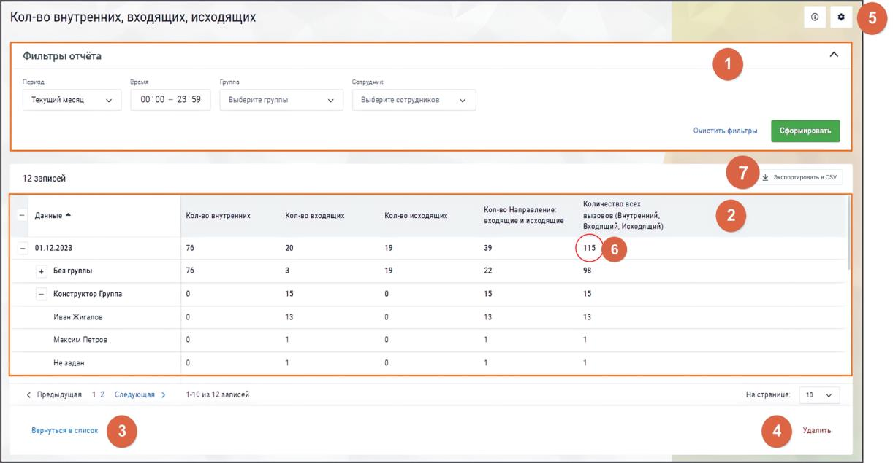
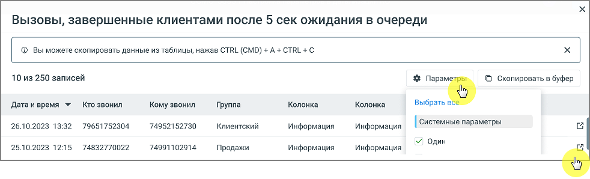

# 17.2.2. Просмотр отчета

> Трассировка: PDF §17.2.2 · сквозные стр. 522-523 · источники: ч.6 `kb/sources/mango-cc-manual/CC_manual_1.26.23-part-6.pdf` с.17-18.

На вкладке "Отчеты" Конструктора отчетов выберите строку отчета, который необходимо просмотреть, и нажмите на его название или на пиктограмму просмотра "глаз" .

Для каждого отчета пользователям доступна фильтрация. 1) Блок фильтров: • Период – текущий день, вчерашний день, последние два дня, текущая неделя, текущий месяц или произвольный период (продолжительностью до 12 месяцев). • Время – временной отрезок в течение одного дня. • Сотрудники – список всех сотрудников ВАТС в алфавитном порядке. При выборе "не задан" система фильтрует вызовы, в которых не было распределения на сотрудника. При выборе сотрудника в фильтре в отчет попадут только персональные звонки сотрудника и групповые плечи, распределенные на него. • Группы – список всех групп сотрудников в алфавитном порядке, а также вариант "без группы". При выборе группы в отчет попадут только групповые звонки, распределенные на указанную группу и не будет персональных звонков. Также блок фильтров содержит кнопки: • "Очистить фильтр" – по клику по кнопке происходит сброс всех выбранных фильтров, возврат к изначальным параметрам отчёта.

• "Сформировать отчет" – клик по кнопке запускает процесс создания отчёта на основе выбранных параметров фильтрации, формируя и отображая результат. 2) Блок таблицы: Колонки таблицы состоят из заданных пользователем показателей. Строки таблицы зависят от заданной пользователем группировки. 3) Кнопка "Вернуться в список" – клик по кнопке возвращает пользователя на страницу списка отчетов. 4) Кнопка "Удалить" – клик по кнопке удаляет отчет (с подтверждением удаления) и возвращает пользователя на страницу списка отчетов.

5) Пиктограмма – клик по пиктограмме открывает отчет в режиме редактирования. 6) Значение показателя отчета – при нажатии на значение открывается детализация по показателю. Детализация доступна при нажатии на любой количественный показатель в отчете, отличный от нуля. В детализации отображаются: • Системные или пользовательские параметры отчета. Выбор отображаемых параметров доступен по нажатию на кнопку "Параметры" в окне детализации.

• Пиктограмма Клик по пиктограмме открывает модуль "Контроль качества" MANGO OFFICE. Здесь можно посмотреть детальную информацию по вызовам, попадающим в отчет Конструктора отчетов, прослушать их, поставить оценку, провести полноценную аналитику по вызовам и использовать ее в работе. Для работы этой функциональности в ЛК ВАТС должен быть подключен модуль "Контроль качества". Функциональность доступна только для успешных вызовов, которые имеются в модуле "Контроль качества".

• 7) Пользователь может скачать собранный отчет кликом на кнопку "Экспортировать в CSV". Название файла соответствует названию отчета плюс заданные в фильтрах даты отчета. Например "Отчет по пропущенным 12.01.-15.01".
