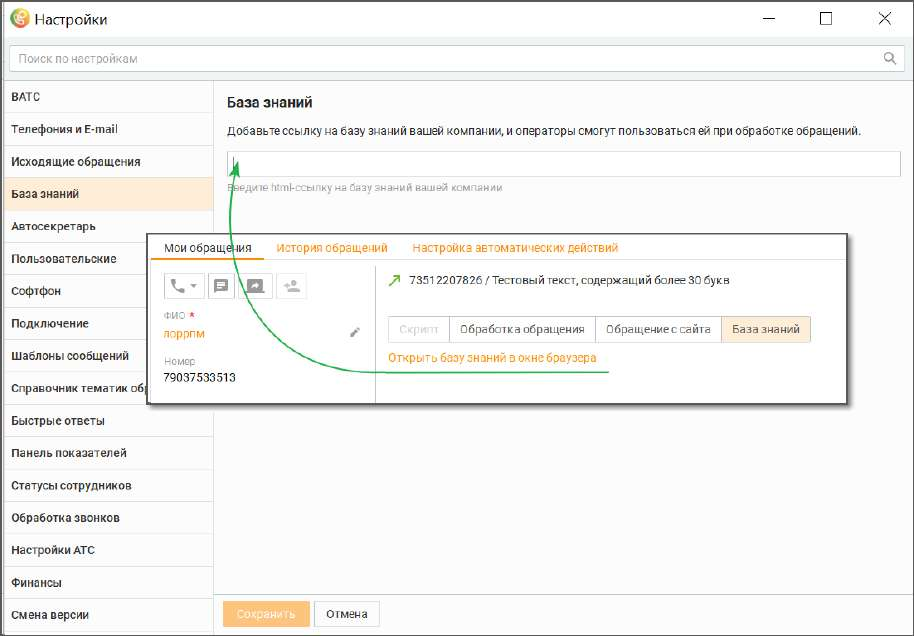

# 2.5.1.3.3. База знаний

В этом поле можно добавить ссылку на базу знаний вашей компании. При наличии ссылки в окне обращения оператора отобразится сообщение "Открыть базу знаний". Клик на сообщение откроет базу знаний.

