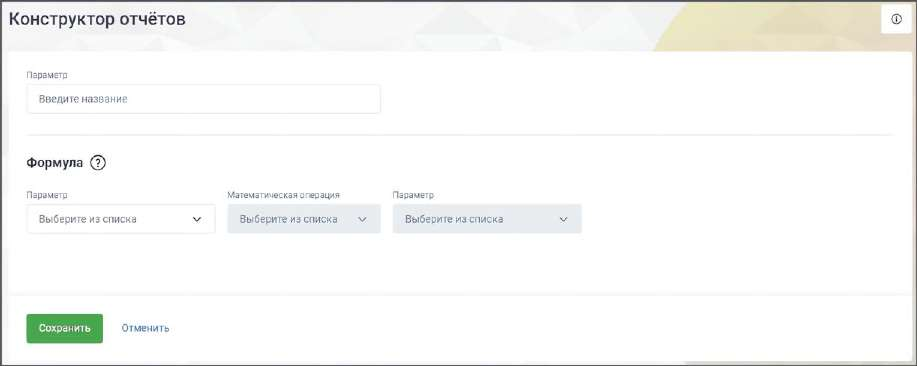

# 17.3.1.3. Создание пользовательского параметра

На вкладке "Параметры" раздела "Данные" Конструктора отчетов нажмите кнопку Добавить параметр.

На открывшейся странице заполните поля: • Параметр (Введите название) – название параметра, уникальное в рамках Конструктора. Формула: • Параметр – первый системный параметр, на основании которого будет создан пользовательский параметр. • Математическая операция – варианты: сложение, вычитание, деление, умножение. • Параметр – второй системный параметр, на основании которого будет создан пользовательский параметр. Сохраните внесенные изменения кнопкой Сохранить. Созданный параметр отобразится в списке пользовательских параметров.

| ПРИМЕР |  |  |
| --- | --- | --- |
| Пользовательский параметр "Длительность вызова" настраивается следующим образом: |  |  |
| Параметр 1 | Математическая операция | Параметр 2 |
| Время завершения звонка (системный) | Вычитание | Время начала разговора (системный) |

Доступные комбинации системных параметров при создании пользовательских параметров:

|  |  |
| --- | --- |
| Параметр 1 | Параметр 2 |
| Количество групп, участвовавших в вызове | Количество попыток распределения |
| Количество попыток распределения | Количество групп, участвовавших в вызове |
| Время завершения звонка Время начала дозвона Время начала разговора Время первого распределения звонка на группу Время попадания вызова в IVR Время распределения на оператора Время создания вызова | Время начала дозвона Время начала разговора Время первого распределения звонка на группу Время попадания вызова в IVR Время распределения на оператора Время создания вызова |

Параметр 1 не может быть равен Параметру 2, и наоборот.

