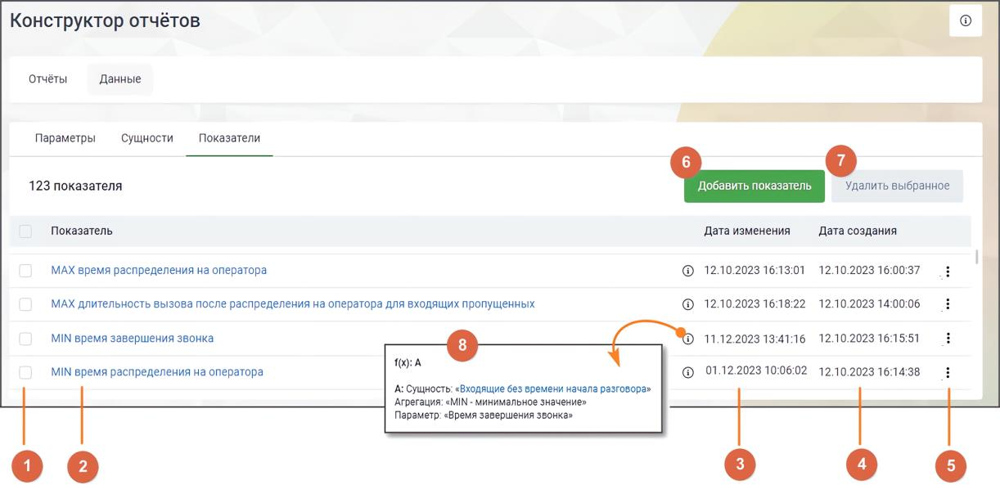

# 17.3.3. Показатели

> Трассировка: PDF §17.3.3 · сквозные стр. 535-544 · источники: ч.1 `kb/sources/mango-cc-manual/CC_manual_1.26.23_compressed.pdf` с.535-544.

Показатели в Конструкторе отчетов представляют собой сущности, которые проходят обработку (агрегацию) по заданным параметрам. Показатели отображаются в отчетах в виде колонок и предоставляют сводную информацию о различных аспектах данных. Каждая агрегирующая функция имеет свое назначение: • SUM (сумма) – вычисляет общую сумму значений определенного показателя. Например, общая продолжительность всех разговоров за определенный период времени. • AVG (среднее значение) – определяет среднее значение показателя из набора данных. Например, среднее время разговора за день или месяц. • COUNT (количество значений) – подсчитывает количество значений определенного параметра или событий. Например, количество пропущенных вызовов за определенный период.

| Для функции COUNT недоступна возможность выбора параметра, по которому будет |
| --- |
| происходить агрегация. |

• MIN (минимальное значение) – определяет наименьшее значение показателя из набора данных. Например, минимальное время дозвона. • MAX (максимальное значение) – вычисляет наибольшее значение показателя из набора данных. Например, максимальное время разговора. На вкладке размещается список показателей.

Элементы вкладки: 1) Выбор показателей для проведения операции удаления – общий чекбокс позволяет выбрать все показатели, а чекбоксы в каждой строке позволяют выбрать конкретные показатели для действий. 2) Название показателя – уникальное название показателя, которое идентифицирует или описывает его содержание. 3) Дата изменения показателя – дата и время последнего изменения данного показателя. 4) Дата создания показателя – дата и время создания данного показателя.

5) Клик по пиктограмме открывает контекстное меню действий с показателем. Варианты: копировать, редактировать. 6) Кнопка "Добавить показатель" – клик по кнопке открывает страницу добавления показателя. 7) Удалить выбранное – клик по кнопке открывает окно подтверждения удаления. После подтверждения выбранные показатели удаляются из списка. Показатели, используемые в других разделах, недоступны для удаления. В случае попытки удаления таких показателей выводится информационное сообщение. 8) Пиктограмма "i" – клик по пиктограмме открывает окно с формулой показателя. Клик по названию сущности открывает страницу редактирования сущности. В Конструкторе отчетов имеются следующие предустановленные показатели:

Показатели, доступные для пользователей, зарегистрированных до 1.01.2025 года

| Название | Сущность | Агрегац | Параметр | Операци | Сущность | Агрегац | Форму |
| --- | --- | --- | --- | --- | --- | --- | --- |
| показателя | А | ия А | А | я | B | ия B | ла |
|  |  |  |  |  |  |  | итогова |
|  |  |  |  |  |  |  | я |
| Количество входящих вызовов с SL 20 | SL 20 секунд | COUNT – количест во значений |  |  |  |  |  |
| Количество принятых персональных вызовов | Принятый персональн ый вызов | COUNT – количест во значений |  |  |  |  |  |
| Количество успешных исходящих вызовов | Успешный исходящий вызов | COUNT – количест во значений |  |  |  |  |  |
| Общее количество принятых эффективных вызовов | Эффективн ый вызов персональн ый | COUNT – количест во значений |  | + (сложени е) | Эффективн ый вызов групповой | COUNT – количест во значений | A + B |
| Средняя продолжительно сть разговора с клиентом (все вызовы) | Принятый вызов | AVG – среднее значение | Длительнос ть разговора |  |  |  |  |
| Уровень обслуживания SL 20 | SL 20 секунд | COUNT – количест во значений |  | / (деление) | Принятый групповой вызов | COUNT – количест во значений | A / B * 100 |

Показатели, доступные для пользователей, зарегистрированных после 1.01.2025 года

| № | Наименование | Формула расчета | Источник данных |
| --- | --- | --- | --- |
|  | показателя |  |  |
| Общие |  |  |  |
| 1 | Общее количество пропущенных вызовов | A + B + C Сущность: «Групповые вызовы, пропущенные всеми» Агрегация: «COUNT – количество значений» B: Сущность: «Персональные пропущенные вызовы» | История вызовов в разрезе по сотруднику: пропущенные входящие вызовы. (Внутренние вызовы в показателе не учитываются) |

|  |  | Агрегация: «COUNT – количество значений» C: Сущность: «Групповые вызовы, пропущенные сотрудником» Агрегация: «COUNT – количество значений» |  |
| --- | --- | --- | --- |
| 2 | Общее количество принятых вызовов | Сущность: «Принятые вызовы (обычные)» Агрегация: «COUNT – количество значений» | История вызовов в разрезе по сотруднику: принятые входящие вызовы. (Внутренние вызовы в показателе не учитываются) |
| 3 | Общее количество принятых эффективных вызовов | A + B A: Сущность: «Принятые групповые эффективные вызовы» Агрегация: «COUNT – количество значений» B: Сущность: «Принятые персональные эффективные вызовы» Агрегация: «COUNT – количество значений» | История вызовов в разрезе по сотруднику: принятые входящие вызовы длительностью 30 и более секунд (Внутренние вызовы в показателе не учитываются) |
| 4 | Количество пропущенных персональных вызовов | Сущность: «Персональные пропущенные вызовы» Агрегация: «COUNT – количество значений» | История вызовов в разрезе по сотруднику: пропущенные персональные входящие вызовы. (Внутренние вызовы в показателе не учитываются) |
| 5 | Максимальная продолжительность разговора | Сущность: «Все принятые вызовы» Агрегация: «MAX – максимальное значение» Параметр: «Длительность разговора» | История вызовов в разрезе по сотруднику: принятые входящие вызовы. (Внутренние вызовы в показателе не учитываются) |
| 6 | Количество внутренних вызовов | Сущность: «Внутренние вызовы» Агрегация: «COUNT – количество значений» | История вызовов в разрезе по сотруднику: внутренние вызовы. |
| 7 | Средняя продолжительность разговора (Все принятые вызовы) | Сущность: «Принятые вызовы (обычные + автоперезвон + обратный звонок) для средних» Агрегация: «AVG – среднее | История вызовов в разрезе по сотруднику: принятые входящие вызовы. |

|  |  | значение» Параметр: «Длительность разговора» | (Внутренние вызовы в показателе не учитываются) |
| --- | --- | --- | --- |
| 8 | Средняя скорость ответа | Сущность: «Принятые вызовы (обычные + автоперезвон + обратный звонок) для средних» Агрегация: «AVG – среднее значение» Параметр: «Скорость ответа оператора» | История вызовов в разрезе по сотруднику: принятые входящие вызовы (групповые и персональные) |
| Обслуживание вызовов, распределенных из группы |  |  |  |
| 9 | Количество принятых групповых вызовов | Сущность: «Принятые групповые вызовы(обычные)» Агрегация: «COUNT – количество значений» | История вызовов в разрезе по группе: Принятые входящие вызовы. Фильтруется по сотруднику. |
| 10 | Количество пропущенных групповых вызовов | A+B A: Сущность: «Групповые вызовы, пропущенные всеми» Агрегация: «COUNT – количество значений» B: Сущность: «Групповые вызовы, пропущенные сотрудником» Агрегация: «COUNT – количество значений» | История вызовов в разрезе по сотруднику: пропущенные входящие вызовы, только групповые звонки Фильтруется по сотруднику. |
| 11 | Количество принятых автоперезвонов | Сущность: «Автоперезвоны принятые» Агрегация: «COUNT – количество значений» | История вызовов в разрезе по группе: принятые звонки с типом "автоперезвон". Фильтруется по сотруднику. |
| 12 | Средняя продолжительность разговора (групповые вызовы) | Сущность: «Принятые групповые вызовы (обычные + автоперезвон + обратный звонок)» Агрегация: «AVG – среднее значение» Параметр: «Длительность разговора» | История вызовов в разрезе по группе: принятые входящие вызовы. Фильтруется по сотруднику. |
| 13 | Процент обслуженных вызовов | A / (B + C + D) * 100 A: Сущность: «Принятые групповые вызовы(обычные)» Агрегация: «COUNT – количество значений» |  |

|  |  | B: Сущность: «Принятые групповые вызовы(обычные)» Агрегация: «COUNT – количество значений» C: Сущность: «Групповые вызовы, пропущенные всеми» Агрегация: «COUNT – количество значений» D: Сущность: «Групповые вызовы, пропущенные сотрудником» Агрегация: «COUNT – количество значений» |  |
| --- | --- | --- | --- |
| 14 | Процент потерянных групповых вызовов | (A + B) / (C + D + E) * 100 A: Сущность: «Групповые вызовы, пропущенные всеми» Агрегация: «COUNT – количество значений» B: Сущность: «Групповые вызовы, пропущенные сотрудником» Агрегация: «COUNT – количество значений» C: Сущность: «Принятые групповые вызовы(обычные)» Агрегация: «COUNT – количество значений» D: Сущность: «Групповые вызовы, пропущенные всеми» Агрегация: «COUNT – количество значений» E: Сущность: «Групповые вызовы, пропущенные сотрудником» Агрегация: «COUNT – количество значений» |  |
| 15 | Суммарное время принятых групповых вызовов | A + B A: Сущность: «Принятые групповые вызовы(обычный + обратный звонок + ИО)» Агрегация: «SUM – сумма значений» Параметр: «Длительность разговора» | История вызовов в разрезе по группе: суммарное время разговоров по каждому сотруднику, включая входящие и обратные звонки. |

|  |  | B: Сущность: «Автоперезвоны принятые» Агрегация: «SUM – сумма значений» Параметр: «Длительность разговора» |  |
| --- | --- | --- | --- |
| 16 | Количество принятых обратных звонков | Сущность: «Обратные звонки принятые» Агрегация: «COUNT – количество значений» | История вызовов в разрезе по группе с фильтром по сотруднику. Учитываются принятые обратные звонки, выполненные в автоматическом режиме. |
| 17 | Количество входящих вызовов с SL 10сек | Сущность: «Входящие вызовы с SL 10сек» Агрегация: «COUNT – количество значений» | История вызовов в разрезе по сотруднику: принятые входящие звонки |
| 18 | Количество входящих вызовов с SL 20сек | Сущность: «Входящие вызовы с SL 20сек» Агрегация: «COUNT – количество значений» | История вызовов в разрезе по сотруднику: принятые входящие звонки |
| 19 | Количество входящих вызовов с SL 30сек | Сущность: «Входящие вызовы с SL 30сек» Агрегация: «COUNT – количество значений» | История вызовов в разрезе по сотруднику: принятые входящие звонки |
| 20 | Уровень обслуживания SL 10сек | A / B * 100 A: Сущность: «Входящие вызовы с SL 10сек» Агрегация: «COUNT – количество значений» B: Сущность: «Принятые групповые вызовы(обычные)» Агрегация: «COUNT – количество значений» | История вызовов в разрезе по сотруднику: принятые входящие звонки |
| 21 | Уровень обслуживания SL 20сек | A / B * 100 A: Сущность: «Входящие вызовы с SL 20сек» Агрегация: «COUNT – количество значений» B: Сущность: «Принятые групповые вызовы(обычные)» Агрегация: «COUNT – количество значений» | История вызовов в разрезе по сотруднику: принятые входящие звонки |
| 22 | Уровень обслуживания SL 30сек | A / B * 100 A: Сущность: «Входящие вызовы с SL 30сек» | История вызовов в разрезе по сотруднику: принятые входящие звонки |

|  |  | Агрегация: «COUNT – количество значений» B: Сущность: «Принятые групповые вызовы(обычные)» Агрегация: «COUNT – количество значений» |  |
| --- | --- | --- | --- |
| 23 | Среднее время поствызывной обработки (входящие вызовы) | Сущность: «Принятые групповые вызовы (обычные) для поствызывной обработки» Агрегация: «AVG – среднее значение» Параметр: «Время поствызывной обработки» |  |
| Обслуживание вызовов распределенных персонально на сотрудника |  |  |  |
| 24 | Количество принятых персональных вызовов | Сущность: «Принятые персональные вызовы» Агрегация: «COUNT – количество значений» | История вызовов в разрезе по сотруднику, принятые входящие вызовы. История вызовов в разрезе по группе с фильтром по сотруднику, принятые входящие вызовы. |
| 25 | Средняя продолжительность разговора (Персональные вызовы) | Сущность: «Принятые персональные вызовы» Агрегация: «AVG – среднее значение» Параметр: «Длительность разговора» | История вызовов в разрезе по сотруднику, принятые входящие вызовы. (Внутренние вызовы в показателе не учитываются) История вызовов в разрезе по группе с фильтром по сотруднику, принятые входящие вызовы. |
| Совершение исходящих вызовов |  |  |  |
| 26 | Количество совершенных вызовов | Сущность: «Совершенные вызовы» Агрегация: «COUNT – количество значений» | История вызовов в разрезе по сотруднику: исходящие вызовы и исходящий обзвон (за исключением внутренних и несостоявшихся вызовов). |
| 27 | Средняя продолжительность | (A + B) / (C + D) A: Сущность: «Исходящие вызовы общие» | История вызовов в разрезе по сотруднику: исходящие вызовы, |

|  | разговора (Исходящие вызовы) | Агрегация: «SUM – сумма значений» Параметр: «Длительность разговора» B: Сущность: «Автоперезвоны принятые (для средней продолжительности)» Агрегация: «SUM – сумма значений» Параметр: «Длительность разговора» C: Сущность: «Автоперезвоны принятые (для средней продолжительности)» Агрегация: «COUNT – количество значений» D: Сущность: «Исходящие вызовы общие» Агрегация: «COUNT – количество значений» | исходящий обзвон и успешные автоперезвоны |
| --- | --- | --- | --- |
| 28 | Суммарное время совершенных вызовов | A + B A: Сущность: «Исходящие вызовы общие» Агрегация: «SUM – сумма значений» Параметр: «Длительность разговора» B: Сущность: «Автоперезвоны принятые» Агрегация: «SUM – сумма значений» Параметр: «Длительность разговора» | История вызовов в разрезе по сотруднику: исходящие вызовы, исходящий обзвон и успешные автоперезвоны |
| 29 | Количество попыток дозвона | A + B + C A: Сущность: «Попытки дозвона (ИО + обычные)» Агрегация: «COUNT – количество значений» B: Сущность: «Автоперезвоны, пропущенные всеми» Агрегация: «COUNT – количество значений» | История вызовов в разрезе по сотруднику: исходящие вызовы (состоявшиеся и несостоявшиеся), исходящий обзвон (состоявшиеся и несостоявшиеся), автоперезвоны (принятые и пропущенные). |

<!-- изображение на стр. 544: байты не извлечены (PyMuPDF недоступен) -->

|  |  | C: Сущность: «Попытки дозвона (автоперезвоны)» Агрегация: «COUNT – количество значений» | (Внутренние вызовы в показателе не учитываются) |
| --- | --- | --- | --- |
| 30 | Среднее время поствызывной обработки (исходящий обзвон) | Сущность: «Исходящий обзвон для поствызывной обработки» Агрегация: «AVG – среднее значение» Параметр: «Время поствызывной обработки» |  |
| 31 | Среднее время поствызывной обработки (исходящие вызовы) | Сущность: «Исходящие вызовы для поствызывной обработки» Агрегация: «AVG – среднее значение» Параметр: «Время поствызывной обработки» |  |
| Использование рабочего времени |  |  |  |
| 32 | Суммарное время внешних разговоров | A + B A: Сущность: «Внешние разговоры» Агрегация: «SUM – сумма значений» Параметр: «Длительность разговора» B: Сущность: «Автоперезвоны принятые» Агрегация: «SUM – сумма значений» Параметр: «Длительность разговора» | История вызовов в разрезе по сотруднику: все внешние разговоры, обратные звонки и исходящий обзвон. |
| 33 | Суммарное время внутренних разговоров | Сущность: «Внутренние вызовы» Агрегация: «SUM – сумма значений» Параметр: «Длительность разговора» | История вызовов в разрезе по сотруднику: все внутренние разговоры |
| 34 | Суммарное время поствызывной обработки вызова | Сущность: «Состоявшиеся вызовы для поствызывной обработки» Агрегация: «SUM – сумма значений» Параметр: «Время поствызывной обработки» | Отчет "Рабочее время сотрудника" |

Предустановленные показатели доступны для изменения или удаления.
