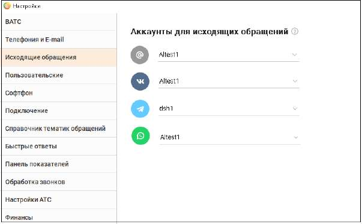

# 2.5.1.3.4. Исходящие обращения

> Трассировка: PDF §2.5.1.3.4 · сквозные стр. 59-60 · источники: ч.1 `kb/sources/mango-cc-manual/CC_manual_1.26.23_compressed.pdf` с.59-60.

Вкладка Исходящие обращения предназначена для настройки аккаунтов, через которые оператор обращается к клиенту при инициации исходящего текстового обращения.

Вкладка отображается в случае, если в ЛК ВАТС подключен хотя бы один канал из следующих возможных: E-mail, VK, Telegram, WhatsApp, Max. В списке отображаются все аккаунты, подключенные по соответствующему каналу. Если для канала не настроен аккаунт, то канал не отображается На вкладке можно выбрать любой из активных каналов, подключенных и настроенных в Личном кабинете ВАТС. Сотрудник не может осуществить отправку исходящего текстового обращения клиенту по каналу, который не подключен, или если по каналу не настроено ни одного аккаунта.

| Настройки на вкладке требуют сохранения для применения (перезапуск приложения не |  |  |
| --- | --- | --- |
|  | требуется). Настройка аккаунтов хранится на сервере для каждой учетной записи |  |
| пользователя (для обеспечения доступа к настройке с других устройств). |  |  |

