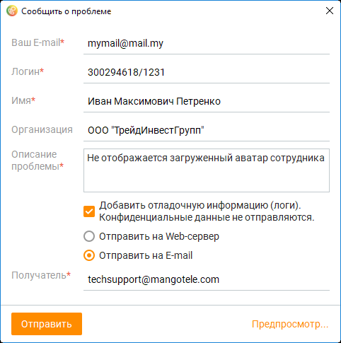
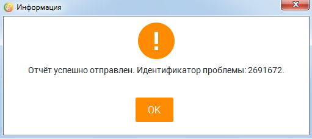

# 20. Приложение 3: Отчеты об ошибках

> Трассировка: PDF §20 · сквозные стр. 595-597 · источники: ч.6 `kb/sources/mango-cc-manual/CC_manual_1.26.23-part-6.pdf` с.90-92.

Вы можете отправлять отчеты о проблемах и ошибках, возникающих при использовании Контакт-центра MANGO OFFICE, сотрудникам отдела технической поддержки. Для отправки отчета об ошибке или проблеме 1. Щелкните правой кнопкой манипулятора по значку программы в области системных уведомлений (трее). 2. Выберите пункт меню Отправить отчет об ошибке. После этого на экране отображается окно Сообщить о проблеме.

3. Введите в соответствующие поля нужную контактную информацию и описание возникшей ошибки или проблемы. Поля, отмеченные звездочкой (*), являются обязательными для заполнения. 4. При необходимости отключите отправку вместе с отчетом логов (журналов работы) приложения, убрав соответствующий флажок.

| Логи включают только технические данные о работе Контакт-центра MANGO OFFICE и |  |  |
| --- | --- | --- |
|  | не содержит никакой конфиденциальной информации. Рекомендуется не отключать отправку |  |
|  | логов — содержащиеся в них данные помогут нашим специалистам в решении вашей |  |
| проблемы. |  |  |

5. Выберите способ отправки отчета, используя переключатель: • Отправить на Web-сервер — отчет о проблеме отправляется непосредственно из Контакт- центра MANGO OFFICE; • Отправить на E-mail — отчет о проблеме отправляется на указанный вами адрес электронной почты с использованием протокола SMTP:

| Если ваш сервер исходящей почты требует при отправке писем авторизации с вводом |  |  |
| --- | --- | --- |
|  | пароля (например, пароля вашей учетной записи электронной почты, используемого при |  |
|  | получении почты), вы не сможете отправить письмо непосредственно из Контакт-центра |  |
|  | MANGO OFFICE, поскольку из соображений конфиденциальности Контакт-центра MANGO |  |
|  | OFFICE не позволяет вводить пароль от вашей учетной записи электронной почты. В этом |  |
|  | случае для отправки отчета о проблеме воспользуйтесь вашим почтовым клиентом с |  |
|  | настроенной учетной записью электронной почты. |  |
|  |  |  |
|  | Если для соединения с вашим сервером исходящей почты нужно использовать |  |
|  | нестандартный порт (не порт 25), вы не сможете отправить письмо непосредственно из |  |
|  | Контакт-центра MANGO OFFICE. В этом случае для отправки отчета о проблеме |  |
|  | воспользуйтесь вашим почтовым клиентом с настроенной учетной записью электронной |  |
| почты |  |  |

6. При необходимости нажмите ссылку Предпросмотр для чтобы просмотра содержимого отправляемого отчета о проблеме. При этом отчет открывается в используемом в системе по умолчанию браузере. 7. Нажмите кнопку Отправить. При успешной отправке отчета на Web-сервер на экране отображается соответствующее информационное сообщение.

8. Если вы хотите отслеживать решение вашей проблемы, запишите идентификатор проблемы и указывайте его специалистам отдела технической поддержки при последующих обращениях.

