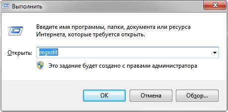
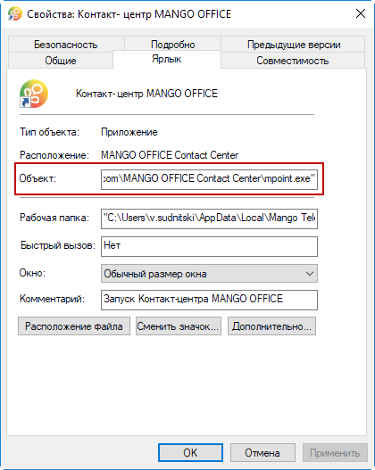

# 21. Приложение 4: Ассоциация со ссылками «callto» и «tel»

> Трассировка: PDF §21 · сквозные стр. 597-601 · источники: ч.1 `kb/sources/mango-cc-manual/CC_manual_1.26.23_compressed.pdf` с.597-601.

Вы можете настроить Контакт-центр MANGO OFFICE для совершения исходящих вызовов при нажатии на ссылки callto и tel в браузере. Для этого потребуется внести изменения в реестр Windows.

| Эта функциональная возможность поддерживается в операционных системах Windows 10, |  |  |
| --- | --- | --- |
| Windows 8.1, Windows 7 c пакетом обновления 1 (SP1) и Windows XP с пакетом обновления |  |  |
| 3 (SP3). |  |  |
| На данный момент в Windows 8.1 вследствие ограничений Microsoft работает только |  |  |
| ассоциация callto. |  |  |
|  | Описанные далее действия рекомендуется выполнять с использованием учетной записи |  |
| пользователя, имеющей права администратора на локальном ПК. |  |  |
| При выполнении этих действий в Windows 10, Windows 8.1 и Windows 7 система может |  |  |
| отображать сообщения, количество и содержание которых зависит от установленных |  |  |
| параметров контроля учетных записей пользователей. |  |  |
| Для обеспечения корректной работы необходимо подтвердить все выдаваемые системой |  |  |
| запросы на выполнение тех или иных действий. |  |  |

Создайте резервную копию соответствующих веток реестра с использованием Редактора реестра (regedit). Запустите программу с помощью поля Найти программы и файлы или формы Выполнить (вызывается сочетанием клавиш Win+R)

Затем экспортируйте (Файл / Экспорт) в файлы с расширением .reg следующие ветки реестра:

| HKEY_CLASSES_ROOT/callto/ |
| --- |
| HKEY_CLASSES_ROOT/tel/ |

| Экспорт в файлы с расширением .reg необходимо выполнить, чтобы обеспечить |  |
| --- | --- |
| возможность восстановления ранее заданных соответствий для ссылок callto и tel — |  |
| например, после деинсталляции Контакт-центра MANGO OFFICE. |  |

Экспортированные файлы можно объединить. При объединении следует проследить, чтобы в итоговом файле не повторялся заголовок «Windows Registry Editor Version 5.00». После этого создайте файл с расширением .reg (например, mpoint.reg), который будет использоваться для ассоциации Контакт-центра MANGO OFFICE со ссылками callto и tel.

Файл должен иметь содержание как в приведенном далее примере. Путь к исполняемому файлу Контакт-центра MANGO OFFICE (mpoint.exe) следует заменить на путь, по которому приложение установлено в целевой системе.

| При замене заданного в примере пути к исполняемому файлу на путь, существующий в |  |
| --- | --- |
| целевой системе, необходимо использовать двойную косую черту (\\) вместо |  |
| одинарной — так, как указано в примере ниже. |  |

Для того, чтобы узнать путь установки , щелкните правой кнопкой по ярлыку программы на рабочем столе и выберите команду Свойства. См. пример для ОС Windows 7 на рисунке ниже.

Пример файла для ассоциации Контакт-центра MANGO OFFICE со ссылками callto и tel Для Windows 10 и Windows 8.1

| Windows Registry Editor Version 5.00 |
| --- |
| [HKEY_CLASSES_ROOT\callto] |
| @="URL: CallTo Protocol" |
| "EditFlags"=hex:02,00,00,00 |
| "URL Protocol"="" |
| [HKEY_CLASSES_ROOT\callto\DefaultIcon] |

| @="\"C:\\Users\\user\\AppData\\Local\\Mango Telecom\\MANGO OFFICE Contact |
| --- |
| Center\\mpoint.exe\",0" |
| [HKEY_CLASSES_ROOT\callto\shell] |
| [HKEY_CLASSES_ROOT\callto\shell\open] |
| [HKEY_CLASSES_ROOT\callto\shell\open\command] |
| @="\"C:\\Users\\user\\AppData\\Local\\Mango Telecom\\MANGO OFFICE Contact |
| Center\\mpoint.exe\" \"-%1\"" |

Для Windows 7 и Windows XP

| Windows Registry Editor Version 5.00 |
| --- |
| [HKEY_CLASSES_ROOT\callto\DefaultIcon] |
| @="\"C:\\Users\\user\\AppData\\Local\\Mango Telecom\\MANGO OFFICE Contact |
| Center\\mpoint.exe\",0" |
| [HKEY_CLASSES_ROOT\callto\shell\open\command] |
| @="\"C:\\Users\\user\\AppData\\Local\\Mango Telecom\\MANGO OFFICE Contact |
| Center\\mpoint.exe\" \"-\"\"%l\"\"\"" |
| [HKEY_CLASSES_ROOT\tel] |
| @="URL:MyProgram Protocol" |
| "URL Protocol"="" |
| [HKEY_CLASSES_ROOT\tel\shell] |
| [HKEY_CLASSES_ROOT\tel\shell\open] |
| [HKEY_CLASSES_ROOT\tel\DefaultIcon] |
| @="\"C:\\Users\\user\\AppData\\Local\\Mango Telecom\\MANGO OFFICE Contact |
| Center\\mpoint.exe\",0" |
| [HKEY_CLASSES_ROOT\tel\shell\open\command] |
| @="\"C:\\Users\\user\\AppData\\Local\\Mango Telecom\\MANGO OFFICE Contact |
| Center\\mpoint.exe\" \"-\"\"%l\"\"\"" |

После создания файла с расширением .reg необходимо произвести его слияние с текущим реестром. Для этого запустите созданный файл двойным щелчком и при необходимости ответьте утвердительно на выдаваемые системой запросы.

| При работе в операционной системе Windows 10 в дополнение к .reg файлу также |  |
| --- | --- |
| необходимо скачать скрипт и запустить его от имени администратора компьютера. |  |
| При первом нажатии на callto/tel в верхней части экрана отобразится меню, в котором |  |
| необходимо выбрать пункт "Контакт-центр MANGO OFFICE". |  |

Чтобы убедиться в корректности внесенных в реестр изменений, вы можете вызвать командную строку Windows ([Win + R]) и набрать callto:номер или tel:номер Также для проверки можно создать тестовую страницу в виде файла с расширением .html (например, testpage.html), и открыть его двойным щелчком по названию файла. Пример содержания файла тестовой страницы приведен ниже; замените номер телефона 5555555 на нужный. После этого в браузере по умолчанию открывается соответствующая тестовая страница. При нажатии на ссылку callto или tel Контакт-центр MANGO OFFICE осуществляет исходящий вызов по указанному в ссылке номеру.

| Для осуществления исходящих вызовов при выборе ссылок callto / tel должен быть |
| --- |
| запущен Контакт-центр MANGO OFFICE и выполнен вход пользователя в систему. |

Пример содержания файла тестовой страницы

| <HTML> |
| --- |
| <HEAD>Test Page</HEAD> |
| <BODY> |
|   |
| <TD><a href="callto:55555555"> Test (callto)</a></TD> |

<!-- изображение на стр. 600: байты не извлечены (PyMuPDF недоступен) -->

|   |
| --- |
| <TD><a href="tel:5555555"> Test (tel)</a></TD> |
| </BODY> |
| </HTML> |

| В некоторых случаях при попытке осуществления исходящего вызова на экране |  |
| --- | --- |
| отображается ошибка вида: "Не удалось запустить новый экземпляр приложения. Запрещено |  |
| в настройках". Для устранения ошибки необходимо скачать скрипт и запустить его от имени |  |
| администратора компьютера. |  |

<!-- изображение на стр. 600: байты не извлечены (PyMuPDF недоступен) -->

<!-- изображение на стр. 601: байты не извлечены (PyMuPDF недоступен) -->
