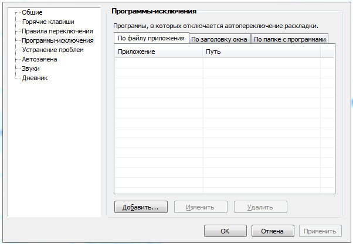

# 24. Приложение 7. Взаимодействие КЦ со сторонними программами

Punto Switcher Если на компьютере пользователя Контакт-центра установлена программа Punto Switcher, то для корректной работы необходимо внести Контакт-центр в список программ-исключений Punto Switcher. Для этого выполните следующие действия: 1. Нажмите правой кнопки мыши на значок Punto Switcher (на панели задач, в правом нижнем углу экрана). 2. Перейдите в меню Настройки → Программы-исключения.

3. Выберите способ указания программы: • По файлу приложения — нажмите кнопку "Добавить" и выберите программу mpoint.exe из списка запущенных приложений. Или найдите нужный файл через диалоговое окно Обзор. • По заголовку окна — дважды нажмите кнопку "Добавить" и введите в открывшееся поле mpoint.exe. Когда окно с таким заголовком станет активным, функция автопереключения выключится автоматически.

В заголовке окна учитывается регистр символов. • По папке с программами — нажмите кнопку "Добавить" и выберите папку MANGO Office Contact Center в диалоговом окне. Автопереключение Punto Switcher перестанет работать в программах, находящихся в указанной папке. 4. Нажмите кнопку ОК.

Чтобы отредактировать или удалить программу из исключений, выберите пункт в списке и нажмите кнопку Изменить или Удалить. Примечание. Если вы заметили, что даже при выключенном автопереключении Punto Switcher сильно нагружает процессор, включите опцию "Не взаимодействовать с программами-исключениями". Однако в этом случае "горячие клавиши" для конвертации текста работать не будут.
