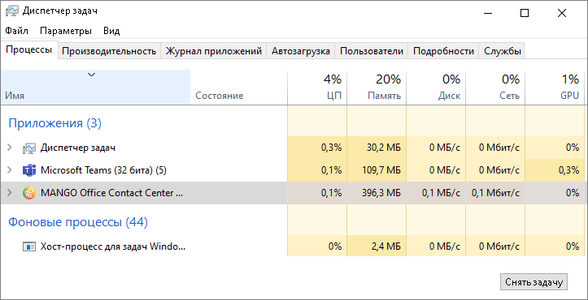
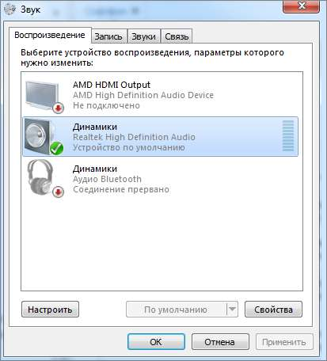
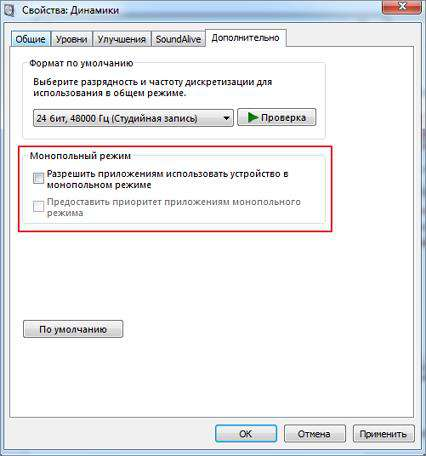
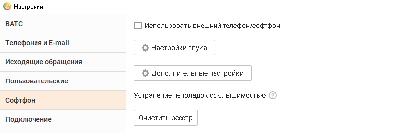
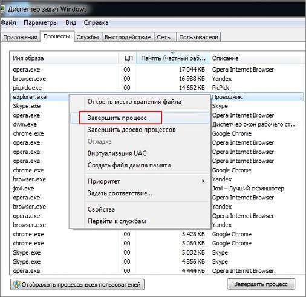
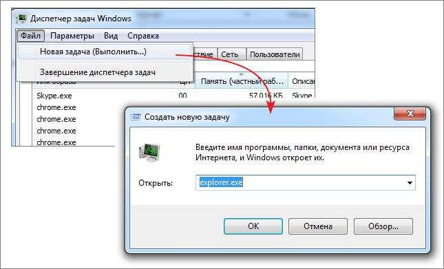
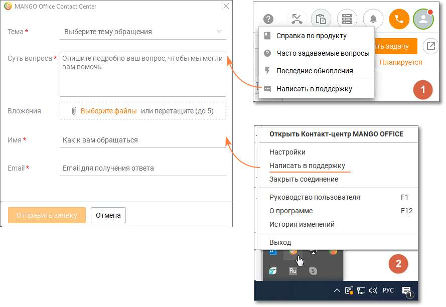

# 25. Приложение 8. Устранение неполадок

Помощь в устранении неполадок доступна в окне Меню справочной системы. Устранение неполадок со слышимостью Для устранения неполадок со слышимостью необходимо произвести очистку реестра. Действуйте в следующей последовательности: 1. Закройте все программы, которые имеют доступ к микрофону. Для этого откройте Диспетчер задач Windows, выберите необходимое приложение и нажмите кнопку Снять задачу.

2. Отключите монопольный режим для ввода и вывода звука. Для этого откройте Панель управления компьютера, выберите раздел Звук.

рис.1 Пример окна "ЗВУК" для Windows 7 Перейдите в свойства подключенных Динамиков, кликнув по наименованию устройства. Во вкладке Дополнительно уберите галочки настроек Монопольного режима. Нажмите кнопку Применить.

рис.2 Пример окна "Свойства: Динамики" для Windows 7 3. Запустите скрипт очистки реестра Контакт-центра MANGO OFFICE. Для этого запустите Контакт-центр, откройте Настройки/Софтфон и нажмите кнопку Очистить реестр.

4. Перепустите процесс explorer.exe. Для этого в Диспетчере задач завершите процесс explorer.exe.

Далее в меню Файл Диспетчера задач кликните строку подменю Новая задача. В открывшейся командной строке введите explorer.exe и нажмите кнопку ok. Перезагружать ПК необязательно.

Если эти действия не помогли устранить проблему слышимости, обратитесь в службу технической поддержки MANGO OFFICE. Ошибка "Не удалось совершить вызов. Возможно проблема со звуковым устройством" При возникновении ошибки "Не удалось совершить вызов. Возможно проблема со звуковым устройством" в первую очередь следует проверить настройки гарнитуры. Если гарнитура подключена корректно, для диагностики причины неполадок попробуйте временно отключить антивирус "Касперский". Далее обратитесь в службу технической поддержки. Обращение в службу технической поддержки MANGO OFFICE Пользователь может обратиться в службу технической поддержки одним из указанных способов: 1. С помощью нажатия на иконку вопросительного знака в главном меню программы. В открывшемся списке следует выбрать "Написать в поддержку". 2. С помощью вызова меню в трее, и нажатию на кнопку "Написать в поддержку".

| Указанные способы инициации заявки работают только при наличии соединения с |
| --- |
| сервером. |

