# 4.3. Мои обращения

> Трассировка: PDF §4.3 · сквозные стр. 133-159 · источники: ч.1 `kb/sources/mango-cc-manual/CC_manual_1.26.28.1.pdf` с.133-159.

Инструмент Мои обращения предназначен для обработки обращений, поступающих в Контакт-центр MANGO OFFICE посредством голосовых и текстовых обращений, получаемых при помощи мультиканальных виджетов, а также обратных звонков. Также сотрудник может создать входящее обращение вручную, и заполнить его необходимой информацией. Каждое обращение может быть связано: • с одной сделкой • с одним клиентом • с одной организацией Приём обращений в обработку осуществляется при помощи панели очереди обращений.

| Помимо входящих обращений, в этом разделе создаются и обрабатываются исходящие |
| --- |
| обращения сотрудника. |
| Функции инструмента: |

• Создавать исходящие обращения; • Обрабатывать обращение клиента; • Создавать новый контакт клиента в адресной книге; • Присваивать обращение существующему контакту; • Получать и отправлять во всех текстовых каналах присоединенные к обращению файлы, включая аудио/видео/изображения; • Просматривать открытые обращения контакта (при их наличии); • Приглашать контакт к участию в видеоконференции; • Указывать тему обращения, используя справочник тематик обращений (для быстрого выбора доступен поиск по тематикам Справочника); • Переводить обращение на другого сотрудника Контакт-центра MANGO OFFICE;

• Возвращать обращение в Исходящий обзвон; • Переносить задание на обзвон вручную оператором на конкретное время; • Добавлять задачу или сделку, закрепляя их за контактом; • Отправлять ссылку на оплату сделки, просматривать статус платежа (если подключена интеграция с ЮKassa); • Отправлять клиенту форму для сбора контактов; • Присваивать обращению статус СПАМ; • Закреплять обращение за сделкой.

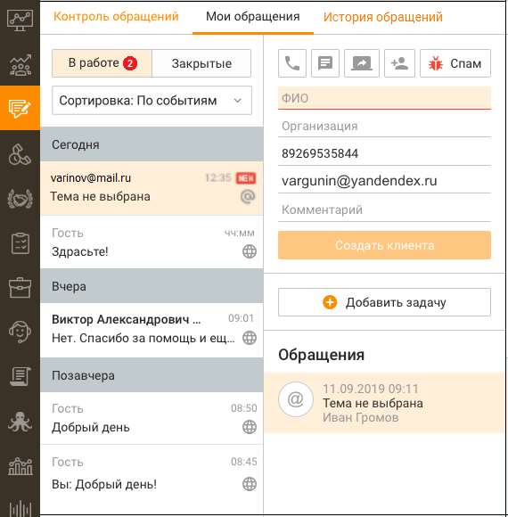

В левой части отображается список входящих и исходящих обращений (текстовых и звонковых), распределенных по группам: В работе и Закрытые. Обращения отсортированы по времени последнего действия с обращением, и делятся на подгруппы: Сегодня, Вчера, Позавчера, Ранее.

| Клик по ссылке "История обращений" переводит в подраздел |
| --- |
| установленным фильтром по сотруднику. |

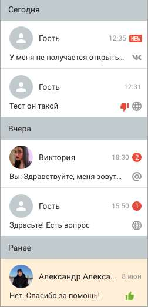

Для каждой записи указывается следующая информация: Для звонков: • Аватар в виде стрелки: o зеленая стрелка вверх для исходящих вызовов; o зеленая стрелка вниз для входящих вызовов; o синяя стрелка вверх для исходящего обзвона. • номер телефона с которого поступил вызов или СМС. При поступлении вызова с

| признаком сокрытия номера вместо номера отображается "Номер скрыт"; |
| --- |
| Время поступления вызова. |

Для текстовых обращений:

| Аватар. В случае, когда обращение поступает от контакта адресной книги, запись |
| --- |
| содержит аватар с инициалами контакта и его ФИО. При получении обращения из |
| социальной сети или мессенджера (Telegram, Max, VK, WhatsApp, |

в качестве имени отображается имя аккаунта контакта. При отсутствии имени аккаунта отображается аватар серого цвета с именем "Гость"; • Статус собеседника в чате на сайте – отображается в случае присутствия собеседника в чате на сайте в статусе Online;

• Последнее сообщение в обращении; • Время последнего сообщения; • Счетчик не просмотренных сообщений. При переключении на данное обращение счетчик обнуляется; • Иконка, соответствующая каналу поступления обращения. • Иконка оценки обращения клиентом. Отображается, если проставлена.

| Любая часть сообщения может быть выделена и скопирована в буфер обмена стандартными |
| --- |
| средствами копирования/выделения Windows. |

В Контакт-центре MANGO OFFICE отображаются все сообщения, получаемые при помощи омниканальных виджетов, подключенных социальных сетей или мессенджеров (Telegram, VK, WhatsApp, Авито, Авито Работа, Клиентское приложение, Max). При этом если сотрудник отвечает на сообщение непосредственно в мессенджере и социальной сети, ответ сотрудника в Контакт-центре не сохраняется. В Контакт-центре MANGO OFFICE предусмотрена функция изменения размера шрифта для повышения удобства чтения и написания сообщений. Размер шрифта регулируется путем зажатия клавиши Ctrl и прокрутки колесика мыши. Настройки сохраняются для всех новых сообщений и остаются активными при переключении между диалогами.

| При использовании данной функции имеется следующее ограничение: чтобы изменить |
| --- |
| шрифт, сначала необходимо нажать левой кнопкой мыши на область сообщений чата, чтобы |
| данная область стала активной для ввода. |

Функция направлена на улучшение условий работы операторов, позволяя снизить нагрузку на зрение и поддерживать продуктивность в течение рабочего дня. Общее количество обращений, содержащих не просмотренные сообщения, указывается на переключателе модуля.

| В окне обращения сотрудник может пригласить абонента к участию в видеоконференции, |
| --- |
| сгенерировав ссылку-приглашение кнопкой . |

Далее: • Исходящие обращения; • Обработка обращения, • Перевод обращения, • Завершение обработки. 4.3.1. Исходящие обращения Чтобы создать исходящее сообщение на вкладке Обращения/Мои обращения нажмите кнопку "Создать обращение". Далее из выпадающего списка выберите требуемый тип создаваемого обращения.

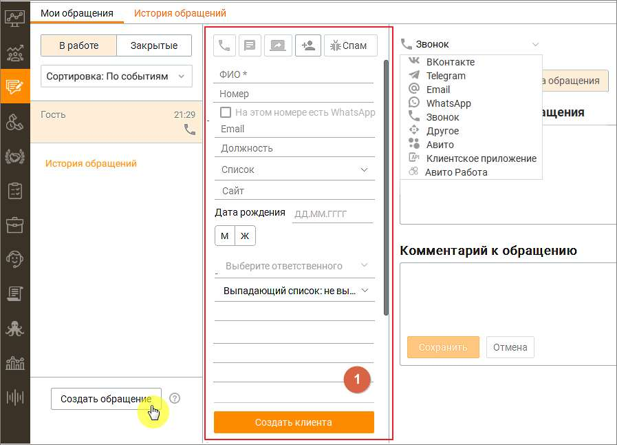

При создании исходящего текстового обращения к клиенту проверяется наличие открытых обращений: Если открытое обращение с данным клиентом уже имеется, но находится в работе у другого оператора, то проверяется наличие других аккаунтов по выбранному каналу, доступных текущему пользователю. О наличии либо отсутствии аккаунтов пользователь уведомляется соответствующими системными сообщениями. Если открытое обращение с данным клиентом отсутствует, в блоке 1 создается единичное исходящее текстовое обращение, которое отображается в блоке "В работе" пользователя. Исходящее текстовое обращение имеет статус В работе и создается со следующими атрибутами (часть атрибутов содержат значения по умолчанию): • Тема обращения – "тема не выбрана"; • Назначенный на обработку обращения пользователь – пользователь, инициировавший исходящее обращение; • Клиент – адрес клиента (аккаунт соц. сетей, мессенджеров, e-mail); • Точка входа – адрес компании, выбранный оператором для инициации исходящих обращений по определенному каналу; • Коммуникации; • Результат; • Комментарий; • Оценка; • Тип обращения – исходящее; • Группа, на которую было распределено обращение; • Время создания обращения – дата и время инициации создания исходящего обращения;

• Время распределения обращения на группу; • Время распределения обращения на сотрудника; • Время первого ответа пользователя в обращении – дата и время отправки первой коммуникации оператором в обращении; • Время закрытия обращения; • ID обращения, которое было переведено; • Кто перевел обращение. Если сообщение не может быть отправлено по любой причине (чат-бот заблокирован пользователем, обращение запрещено пользователем, запрещено каналом, не существует пользователя и т. д.), обращение переходит в статус "Закрыто" с результатом "Запрещена отправка". О запрете отправки пользователь уведомляется системным сообщением. Исходящие SMS-сообщения

Исходящие СМС-обращения могут быть инициированы сотрудником кликом по пиктограмме (при наличии в карточке клиента/организации телефонного номера с типом "Мобильный"): • в списке контактов; • в карточке контакта с указанным номером мобильного телефона; • в карточке контакта из закрытого СМС-обращения; • из карточки обращения в Моих обращениях; • в списке организаций; • в карточке организации; • из софтфона. Также исходящие СМС-обращения могут быть инициированы сотрудником: • из карточки обращения в Моих обращениях, если обращение от Гостя и обращение голосовое; • в списке контактов с помощью массовой отправки СМС на несколько адресатов; Исходящие звонковые сообщения Исходящие звонковые обращения также могут быть инициированы сотрудником кликом по

пиктограмме или : 1. Со стартовой страницы раздела Мои обращения в блоках В работе или Закрытые, при отсутствии в этих блоках обращений. 2. Из "шапки" обращения, в ответ на входящие сообщения. 3. Из карточки обращения завершенного входящего или исходящего вызова. 4. Из списка вкладки Контакты в разделе Клиенты. 5. Из карточки клиента, вкладки "Контакты", "Задачи и обращения". 6. Из карточки сделки, вкладки "Информация", "Задачи и обращения". 7. Из списка задач в Панели задач.

| Создание исходящего звонкового сообщения возможно только при наличии в карточке |
| --- |
| клиента телефонного номера. |

Если для клиента указан добавочный номер, то при звонке набор номера клиента происходит с учётом добавочного номера. Исходящие текстовые сообщения по каналам ВКонтакте, Telegram, Max. Исходящие текстовые обращения по каналам ВКонтакте, Max и Telegram также могут быть

инициированы сотрудником кликом по пиктограмме :

1. Из карточки клиента, вкладки "Контакты", "Задачи и обращения" 2. Из списка на вкладке Контакты в разделе Клиенты. 3. Из списка задач в Панели задач. 4. Из карточки сделки, вкладки "Задачи и обращения". 5. Из закрытого текстового обращения.

| Создание исходящего текстового обращения к клиенту по какому-либо каналу возможно, |
| --- |
| если канал подключен (настроен аккаунт) хотя бы в одном виджете на продукте. |

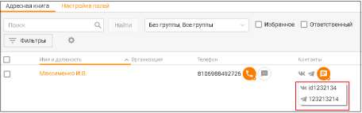

После клика по пиктограмме отображается выпадающий список с указанием всех доступных каналов коммуникации. Клик по одному из каналов приводит к созданию единичного текстового обращения в редакторе писем Контакт-центра Mango Office.

В качестве исходящих контактных данных обращения будет указан аккаунт, настроенный во вкладке Настройки/Исходящие обращения. Исходящие текстовые сообщения по каналу WhatsApp Чтобы инициировать отправку сообщений по каналу WhatsApp, в MANGO Диалогах должны быть созданы и активны HSM-шаблоны. В противном случае сотрудник Контакт-центра сможет только отвечать на входящие сообщения клиентов. Инструкция по созданию HSM- шаблона. Для отправки сообщений по каналу WhatsApp могут использоваться шаблоны, настроенные в Личном кабинете пользователя ВАТС:

| После инициации WhatsApp-сообщения отправка контакту других сообщений недоступна |
| --- |
| до получения ответа от собеседника. |

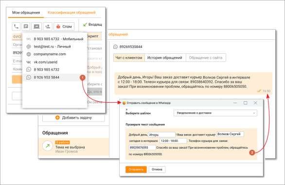

1. В списке контактных данных адресата выбирается канал WhatsApp; 2. В списке доступных шаблонов выбирается соответствующий шаблон. При ответе клиенту в поля подставляются данные клиента и сотрудника, установленные в настройках шаблона.

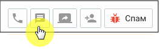

Исходящие текстовые обращения по каналу WhatsApp могут быть инициированы

сотрудником кликом по пиктограмме : • из карточки клиента, вкладки "Контакты", "Задачи и обращения" • из "быстрой" карточки клиента на вкладке "Мои обращения" • из списка на вкладке Контакты в разделе Клиенты. • из списка задач в Панели задач • из карточки сделки, вкладки "Задачи и обращения" • из закрытого текстового обращения • из модуля «Роботы» MANGO OFFICE (при подключенном в Текстовых коммуникациях чат-боте) При входящем звонковом обращении от нового клиента в выпадающем списке "Создать текстовое обращение" доступна возможность написать в WhatsApp.

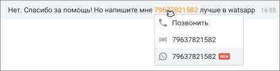

При подключенном в разделе ЛК ВАТС «Текстовые комуникации» чат-боте в WhatsApp можно переводить звонковые обращения из модуля «Роботы» MANGO OFFICE robot.mango- office.ru, используя настроенные шаблоны WhatsApp HSM. При этом в Контакт-центре будет создано закрытое обращение с параметром: "Сотрудник": "имя чат-бота". Также инициировать исходящее обращение можно из текста в чате с клиентом, кликом по номеру телефона:

Если клиент отвечает на сообщение, отправленное через WhatsApp, автоответчик и настройки нерабочего времени не будут применяться. Чат-бот сработает лишь в том случае, если он был установлен в качестве оператора во время начала рассылки; в противном случае работать не будет. Исходящие e-mail сообщения Исходящие e-mail обращения также могут быть инициированы сотрудником кликом по

пиктограмме из карточки клиента, вкладки "Контакты". Исходящие e-mail обращения могут отправляться: • в почтовом клиенте Mango OFFICE – если подключен хотя бы один виджет с каналом

коммуникации – E-mail. • в стороннем почтовом клиенте: если ни один виджет с каналом коммуникации e-mail не подключен, в операционной системе запускается зарегистрированный по умолчанию почтовый клиент, где создается новое письмо. В поле Кому автоматически подставляется соответствующий адрес электронной почты. Больше информации узнайте в подразделе справки Переписка с клиентом по e-mail. Входящие обращения, созданные вручную Сотрудник может создать входящее обращение вручную, нажав на кнопку Создать обращение в подразделе "Обращения/Мои обращения". В списке обращений "В работе" создается обращение от клиента Гость. Отредактируйте созданное обращение, заполнив данные о клиенте. Укажите тему, канал обращения, комментарий. Сохраните внесенные изменения кнопкой Сохранить. Клик по кнопке Завершить закрывает сообщение. Автоматически обращение закрывается через 4 дня с момента создания.

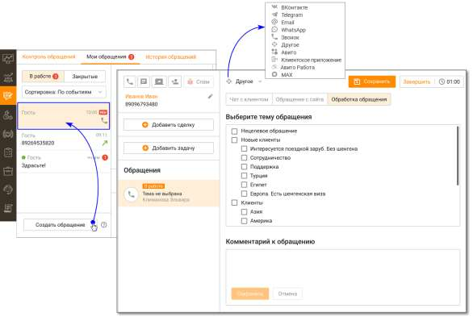

Обращение, созданное вручную, нельзя перенаправить на другого сотрудника. Точка входа такого обращения указывается, как "Создано сотрудником".

4.3.2. Обработка обращений Шапка обращения Шапка как голосового, так и текстового обращения содержит элементы:

• Кнопка инициации исходящего вызова – Кнопка отображается в случае, когда для контакта адресной книги указан хотя бы один номер телефона. При нажатии кнопки отображается меню выбора телефона для совершения вызова. При щелчке по номеру телефона выполняется дозвон. • Кнопка создания текстового обращения – Пользователь может создать исходящее текстовое обращение для следующих контактных данных: номер мобильного телефона, E-mail, VK, Telegram, WhatsApp, СМС, Max. Кнопка отображается в случае, когда для контакта адресной книги указан хотя бы один способ коммуникации. При нажатии кнопки отображается меню выбора адреса для отправки сообщения. При щелчке по E-mail выполняется открытие переписки с клиентом (редактора писем) с подставленным почтовым адресом. Все электронные письма, в адресатах которых (поля "кому" / "копия" / "скрытая копия") указан адрес компании, создают новое обращение или распределяются в уже существующее обращение в статусе "В Работе". • Кнопка "Создать видеоконференцию" – Сотрудник может пригласить абонента к участию в видеоконференции, сгенерировав ссылку-приглашение.

• Кнопка "Привязать к существующему контакту" – При нажатии кнопки выберите контакт, к которому необходимо привязать текущее обращение. При привязке обращения в карточку

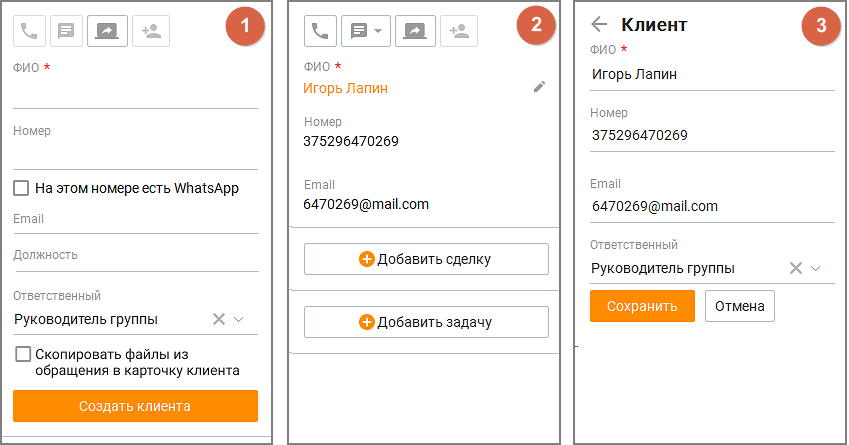

существующего клиента добавляется номер телефона или другой адрес Гостя, а также история обращений Гостя по данному номеру телефона или адресу. Если у контакта уже есть история обращений по другому адресу, то обращения (включая закрытые) с только что привязанного адреса "встраиваются" в историю обращений контакта. • Кнопка "Спам" – щелчок по кнопке закрывает обращение с результатом "Спам", а в случае звонкового обращения – завершает вызов. Не отображается у клиентов из адресной книги.

Закрытое кнопкой "спам" обращение помечается пиктограммой . В закрытом сообщении сохраняется история переписки. Блок информации о клиенте (быстрая карточка клиента) Блок информации о клиенте содержит элементы:

рис. 1 – Контакт отсутствует в адресной книге. рис. 2 – Контакт имеется в адресной книге. По клику на пиктограмме "карандаш" открывается форма редактирования контакта. Щелчок по ФИО открывает карточку клиента. рис. 3 – Форма редактирования контакта. Список полей в блоке информации о клиенте соответствует полям, отмеченным в столбце "Показывать в быстрой карточке" таблицы во вкладке Клиенты/Настройка полей. Если обращение создано в рамках кампании Исходящего обзвона, в быстрой карточке клиента отображается информация пользовательских полей, собранная в процессе обзвона. Чтобы ее просмотреть, кликните на ссылку "Информация о клиенте". Кнопки "Добавить сделку" и "Добавить задачу"

| Кнопка "Добавить сделку" доступна, если у клиента нет сделок "в работе", а поле ФИО |
| --- |
| содержит данные о клиенте. Щелчок по кнопке открывает форму создания/редактирования |
| сделки. |

статусом "в работе", автоматически привязывается к открытой сделке. Если открытых сделок больше, то обращение привязывается к последней по дате создания сделке.

| Кнопка "Добавить задачу" доступна, если у контакта нет открытых задач, а поле ФИО и/или |
| --- |
| Телефон содержит данные о клиенте. Щелчок по кнопке открывает форму |
| "Создания/редактирования задачи у клиента". |

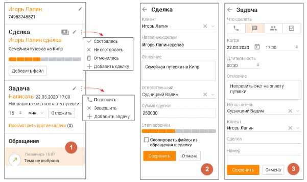

Для контакта, не указанного в адресной книге, кнопка "Добавить сделку" не отображается

| рис. 1 Форма просмотра клиента, данные которого имеются в адресной книге, а также его задач |
| --- |
| и сделок. Форма содержит базовый набор функций и элементов, что и формы карточки задачи и |
| карточки сделки. |
| рис. 2 Форма создания/редактирования сделки. Форма содержит стандартный набор функций и |
| элементов, что и формы создания/редактирования сделки. |
| рис. 3 Форма создания/редактирования задачи. Форма содержит стандартный набор функций и |
| элементов, что и формы создания и редактирования задачи. |

Кнопки статуса оплаты

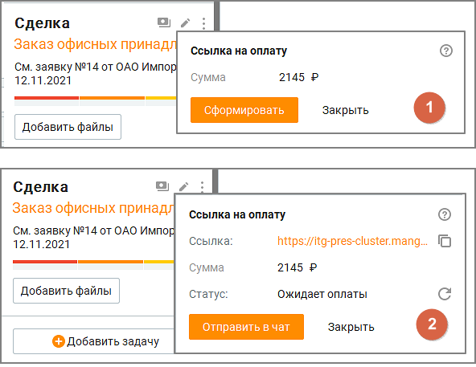

Клик по пиктограмме открывает окно информации о статусе платежа по сделке:

• рис. 1 Ссылка на оплату в сервисе ЮKassa не сгенерирована. • рис. 2 Ссылка на оплату сгенерирована, ожидается платеж. Блок обращений Блок обращений по умолчанию включает в себя 5 последних обращений клиента, отсортированных по дате создания, от новых сообщений к старым. Каждое обращение содержит: • Иконка обращения – значок соответствующего канала обращения; • Дата создания обращения – дата, когда обращение было создано. Если обращение в работе, то вместо даты создания отображается "В работе"; • Тема обращения – если тема не проставлена, то отображается надпись "Тема не выбрана". Выбор темы осуществляется во вкладке Обработка обращения.

| Если у сотрудника нет доступных для выбора тематик, в карточке оператора для |
| --- |
| сообщений с сайта кнопка выбора темы недоступна. |

• ФИО сотрудника, обработавшего обращение;

• Оценка обращения клиентом, если она проставлена – пиктограммы или ; • Кнопка "Загрузить ещё" – отображается, если у клиента больше обращений, чем отображается в данный момент. Щелчок по кнопке загружает еще 5 последних по дате создания обращений; • Значок "Спам" – отображается, если обращение было закрыто кнопкой спам. Блок информации о выбранном обращении

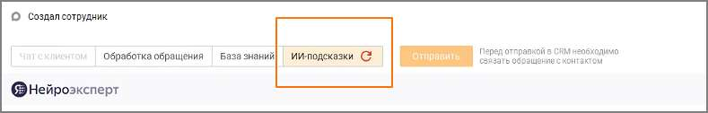

Блок информации о выбранном обращении содержит: • общую информацию об обращении

| номер обращения - только для текстовых обращений: Чат на сайте, VK, Telegram, WhatsApp, |
| --- |
| Авито, Авито Работа, Max, Клиентское приложение |

• раздел "Скрипт" • раздел "История обращений клиента" • раздел "Чат на сайте" • раздел "Обращение с сайта" • раздел "Обработка обращения" Если в разделе ЛК ВАТС/Номера, подключенные к АТС поле "Комментарий" к номеру телефона или SIP-Trunk, на который пришло обращение, заполнено, то в общей информации об обращении комментарий отображается вместо номера. При подключенной интеграции в блоке доступна кнопка "Отправить" для передачи оператором данных об обращении в CRM-систему.

Отправка обращения в CRM возможна, только если обращение привязано к контакту Адресной книги. Чтобы иметь возможность получать подсказки от Искусственного интеллекта, обратитесь к персональному менеджеру за подключением соответствующей услуги.

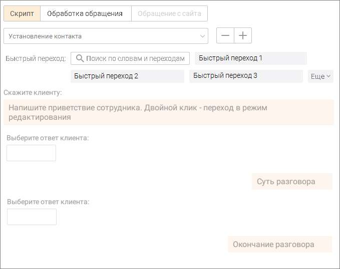

Скрипт Вкладка "Скрипт" отображается только при обработке голосовых вызовов. Вкладка доступна при наличии хотя бы одного доступного скрипта. Выбор скрипта осуществляется из выпадающего списка. После выбора любого из ответов клиента, а также при вводе ответа, выбор скрипта блокируется. Если в скрипте используются переменные из данных контакта в Адресной книге и пользователь заполняет соответствующие поля в Быстрой карточке клиента, внесенные данные автоматически подставляются в скрипт. Карточка контакта при этом не создается, данные о клиенте не сохраняются.

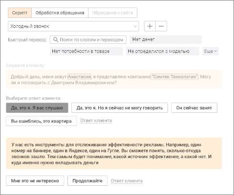

Быстрый переход На вкладке также отображается список быстрых переходов для прохода скрипта. Список не отображается, если одновременно нет быстрых переходов и в скрипте не используются переменные. Имеется поле поиска по словам в тексте ответа сотрудника и в названии быстрого перехода. Клик по кнопке Еще открывает полный список быстрых переходов. После клика по быстрому переходу ответ сотрудника и соответствующие ему ответы клиента, установленные выбранным переходом, отображаются в ленте диалога, как очередной шаг скрипта. Если шаг, соответствующий быстрому переходу, в текущем диалоге уже был пройден 10 раз, то в перечне быстрых переходов этот переход виден, но недоступен для клика.

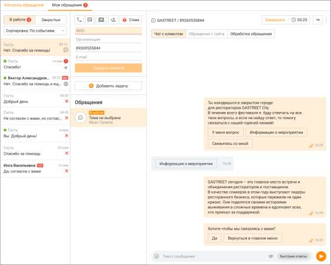

Действия в скрипте доступны только до завершения прохождения скрипта. После завершения прохождения скрипта, доступен только просмотр прохождения скрипта. Ответ клиента После ответа клиента сотрудник выбирает из вариантов, предложенных скриптом, соответствующий "ответ клиента". Далее скрипт предлагает сотруднику текст "скажите клиенту" для продолжения диалога с клиентом. Также сотрудник может самостоятельно прописать ответ клиента в поле диалога. Кнопка "Ответ клиента" отображается только в случае, если для текущего ответа сотрудника предусмотрен хотя бы один ответ клиента. Завершить работу со скриптом Клик по кнопке "Завершить работу со скриптом" завершает диалог с клиентом и блокирует возможность внесения изменений в прохождение скрипта. Чат с клиентом Вкладка "Чат с клиентом" отображается только при обработке текстовых обращений. В чатах предусмотрена проверка орфографии с помощью стандартного контекстного меню, вызываемого в любом месте поля ввода сообщения чата кликом по правой кнопке мыши.

Список текстовых сообщений, получаемых, отправляемых сотрудником Контакт-центра MANGO OFFICE в рамках обращения, отображается в ленте обращения. Если канал обращения поддерживает кнопки быстрых ответов для пользователя, они также отображаются в ленте.

| Если в ленте переписки более 100 сообщений, остальные доступны по клику на кнопке |
| --- |
| Показать еще. |

Программа автоматически распознает ссылки и 11-значные номера телефонов. При нажатии на ссылку открывается браузер по умолчанию, и в нем в новой вкладке открывается соответствующая ссылке страница. При нажатии на номер выполняется инициация исходящего вызова на указанный номер телефона. При получении слишком длинного текстового сообщения последние несколько символов заменяются на текст "Читать полностью...", являющийся кнопкой. При нажатии кнопки отображается отдельное окно, содержащее весь текст сообщения. Для отправки сообщения установите курсор в область поля ввода, наберите сообщение и

нажмите кнопку либо клавишу Enter. Для перехода на следующую строку без отправки сообщения воспользуйтесь комбинациями клавиш Ctrl+Enter, Shift+Enter. В чате сотрудник может вставить в сообщение одну или несколько картинок из буфера обмена (используя сочетание клавиш Сtrl+V) или из контекстного меню. Картинку можно удалить из сообщения, используя кнопку Backspace на клавиатуре. Если в Личном кабинете ВАТС заданы соответствующие настройки, оператор Контакт-центра и посетитель виджета "чат на сайте" имеют возможность редактировать свое сообщение в течение заданного периода времени. ФАЙЛЫ ЧАТА

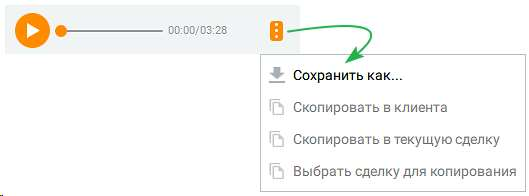

Для того, чтобы отправить файл, щелкните по пиктограмме либо перетяните файл в поле отправки сообщения при помощи функции drag-and-drop. Допускается отправка файлов любого формата объемом не более 2 Гб. Состояние файла отображается в чате, как один из вариантов: отправляется, ошибка, отправлен, доставлен, просмотрен. В чате возможен просмотр изображений, отправленных клиентом, без необходимости их загрузки на компьютер. Для открытия изображения достаточно кликнуть по нему – оно отобразится в модальном окне. Масштаб можно изменять с помощью сочетаний клавиш Ctrl + (увеличение) и Ctrl – (уменьшение). Поддерживаются форматы bmp, jpg, jpeg, gif, tif, tiff, png, при этом максимальный размер файла составляет 10 МБ, а количество вложений в одном сообщении не может превышать пяти. Изображение просматривается только в Контакт- центре и не сохраняется на компьютер, что обеспечивает удобство и безопасность работы. Аудиофайлы и голосовые сообщения можно прослушать прямо в чате — без скачивания. Проигрыватель встроен в сообщение. У голосовых отображается подпись, у файлов — название и формат. Действия в контекстном меню: сохранить, копировать в обращение или в сделку.

Также в чате доступен предпросмотр изображений, ссылок, файлов и сохранение файлов чата в карточку сделки или клиента.

| Оператор может скачать и просмотреть полученные из мессенджеров /социальных сетей |  |  |
| --- | --- | --- |
|  | файлы в течение 3 месяцев после их отправки. Файлы, полученные ранее этого срока, |  |
| недоступны для скачивания. |  |  |

Для файлов обращения доступны следующие действия:

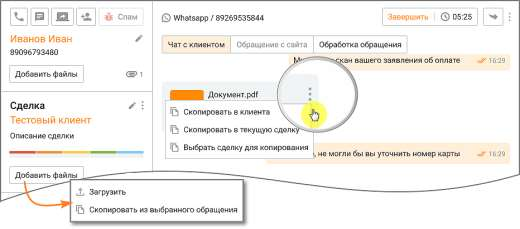

• сохранить файл в карточку клиента – пиктограмма

• сохранить файл в карточку текущей сделки клиента – пиктограмма

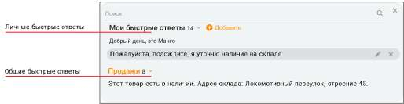

• сохранить файл в карточку любой сделки клиента – пиктограмма • сохраните все файлы обращения в карточку клиента или сделки – кнопка "Добавить файлы" • сохранить все файлы обращения в новую сделку (при ее создании) – чекбокс "Скопировать файлы из обращения в сделку" • сохранить все файлы обращения в карточку нового клиента (при ее создании) – чекбокс "Скопировать файлы из обращения в карточку клиента"

БЫСТРЫЕ ОТВЕТЫ Для рационального использования времени сотрудников предусмотрена возможность использования быстрых ответов — заранее подготовленных сообщений, содержащих стандартные приветствия, ответы на часто повторяющиеся вопросы и т. п. Быстрые ответы делятся на • общие – доступные всем сотрудникам, в зависимости от их роли в Контакт-центре • личные - добавленные конкретным сотрудником и недоступные другим сотрудникам Для начала работы с быстрыми ответами настройте список общих быстрых ответов на вкладке "Быстрые ответы". Максимальное количество общих быстрых ответов на продукте – не более 1000.

Для выбора быстрого ответа нажмите кнопку "Быстрые ответы" в области поля ввода. В результате отобразится окно выбора быстрого ответа, с полем поиска.

При выборе ответа из формы "Быстрых ответов" выбранный ответ добавляется к тексту в строке ввода, а не заменяет его. Чтобы заменить текст, следует выделить в строке заменяемую часть. Ведение списка быстрых ответов осуществляется в настройках программы на вкладке "Быстрые ответы". Переход на настройки быстрых ответов также доступен по клику на

пиктограмме "шестеренка" – Сотруднику доступны быстрые ответы: • назначенные на группу/-ы, в которых состоит текущий сотрудник; • без категории (такие быстрые ответы доступны всем); • созданные текущим сотрудником на любом из устройств. Быстрые ответы распределены по категориям. Напротив наименования категории отображается количество ответов, относящихся к данной категории. Также у сотрудника имеется возможность ведения списка личных быстрых ответов. Для

этого введите в поле ввода свой вариант ответа и нажмите . Максимальное количество личных быстрых ответов каждого сотрудника – 50.

Для поиска нужного быстрого ответа введите искомый текст в поисковом поле. При вводе не менее трех символов срабатывает автоподбор. Поиск выполняется согласно их приоритету в списке быстрых ответов: • сначала в списке "моих быстрых ответов"; • затем в списке общих групповых ответов. Свои быстрые ответы пользователь может:

• отредактировать – кликом по пиктограмме

• удалить – кликом по пиктограмме Для отправки быстрого ответа выберите его из списка, в результате чего текст быстрого ответа

отобразится в области ввода, после чего нажмите кнопку либо клавишу Enter. ФОРМА СБОРА КОНТАКТНЫХ ДАННЫХ Если в настройках канала в Личном кабинете пользователя ВАТС выбрана опция «Запрашивать информацию о клиенте» – «по запросу оператора», в разделе "Мои обращения" отображается кнопка для отправки формы сбора контактных данных в чат на сайте. Маркер кнопки означает, что форма сбора данных в этом обращении еще не

отправлялась.

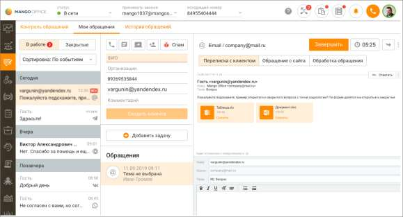

Чтобы отправить форму в чат с клиентом, последовательно нажмите на кнопки и . После того как клиент заполнит форму сбора контактных данных и отправит ее в чате на сайте, в поле переписки отобразится служебное сообщение – "Заполнена анкета". Маркер кнопки сменит цвет на зеленый.

| Форма сбора контактных данных в рамках одного обращения может быть отправлена |
| --- |
| только один раз. Повторная отправка формы не доступна. |

История обращений клиента История обращений клиента включает историю вызовов по текущему клиенту по всем номерам телефонов клиента по всем номерам телефонов компании. При получении нового письма по адресу отправителя осуществляется идентификация Клиента, и данные контакта попадают в Историю обращений. Также в истории обращений клиента находятся обращения со всех текстовых каналов. При поступлении текстового обращения по другим каналам также осуществляется идентификация Гостя с существующим контактом (если имеется), с объединением всех данных по данному контакту. Список обращений одновременно отображает не более 15 последних обращений клиента. Для просмотра всех обращений нажмите кнопку Все обращения клиента. В результате выполняется переход к вкладке "Обращения" карточки клиента. При щелчке по теме обращения выполняется переход к выбранному обращению на вкладке просмотра обращений клиента в окне просмотра карточки клиента. Обращение с сайта Переход на вкладку доступен только при наличии информации о посетителе с сайта. Также на вкладке отображается информация на сайте по динамическому номеру клиента.

| Возможность просмотра информации по динамическому номеру доступна только при |
| --- |
| наличии подключенной услуги. |

Обращения из чата на сайте, которые обрабатывает чат-бот с кнопками, при переводе на оператора отображаются в Контакт-центре:

• 1. Обращения – Мои обращения – Чат с клиентом • 2. Карточка клиента – История обращений Переписка с клиентом по e-mail Переписка с клиентом может осуществляться: • с электронной почты компании; • с электронной почты сотрудника.

| Как настроить отправку писем с электронной почты сотрудника, читайте в подразделе |  |  |
| --- | --- | --- |
|  | Телефония и E-mail. |  |

После авторизации e-mail в Контакт-центр подгружаются все обращения, поступившие на электронную почту в период, когда e-mail не был авторизован. Редактор писем Контакт-центра Mango Office При использовании для переписки редактора писем Контакт-центра Mango Office: ▪ в качестве адресата указывается адрес клиента; ▪ в качестве отправителя указана электронная почта компании или сотрудника; ▪ в теме указана тема письма с добавленными символами "Re:" ▪ в строке "Копия" автоматически проставляется электронная почта компании; ▪ в поле ответа добавлена подпись для текущего письма (если настроена во вкладке "Телефония и e-mail"), а также предыдущая переписка со всеми вложениями.

Для отправки письма заполните поля формы, при необходимости добавьте присоединенные файлы при помощи стандартных средств Windows и нажмите кнопку Отправить. Если письмо не отправлено, то редактор переходит в состояние до нажатия кнопки "Отправить" и в трее отображается системное уведомление с иконкой "Восклицательный знак", с кнопкой закрытия уведомления и с текстом: "Не удалось отправить письмо. Проверьте настройки электронной почты и попробуйте ещё раз". На иконке прикрепленного файла имеется информация о наименовании, типе, размере и статусе файла. Сторонний почтовый клиент Также переписка с клиентом может осуществляться в стороннем почтовом клиенте. Для

этого щелкните по пиктограмме и нажмите кнопку "Ответить в почтовом клиенте".

| Чтобы письма, отправленные в стороннем почтовом клиенте, отображались в истории |  |  |
| --- | --- | --- |
|  | обращений, при каждом ответе клиенту необходимо указывать электронную почту компании |  |
|  | в графе "Копия". Если же сотрудник компании пишет с почты компании в стороннем |  |
| почтовом клиенте, такие письма автоматически попадают в обращения. |  |  |

Для того, чтобы завершить обработку обращения, следует закрыть обращение либо перевести его на другого сотрудника. • Перевод обращения; • Перенос задания кампании Исходящего обзвона вручную на другое время; • Закрытие обработки. 4.3.3. Перевод обращений

| Для перевода обращения на другого сотрудника либо группу нажмите пиктограмму |
| --- |
| "Перевести". |
| Кнопка доступна пользователю, на которого назначено обращение, а также пользователям, у |
| которых имеются подконтрольные группы. |

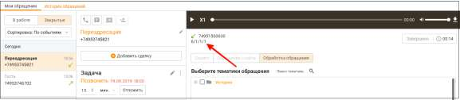

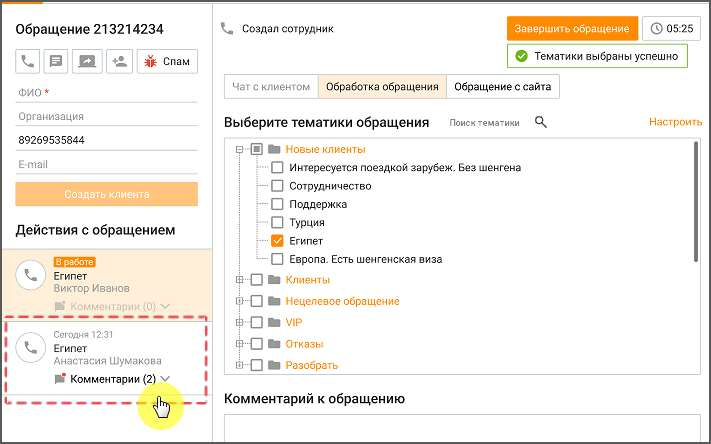

Текстовое обращение нельзя перевести на сотрудника с ролью "Робот". В результате на экране отобразится форма перевода обращения, позволяющая: • изменить тему обращения – кнопкой Выбрать; • выбрать сотрудника либо группу, на которого будет переведено обращение; • ввести поясняющий комментарий. Комментарий не является обязательным. Если в обращении имеется комментарий, в списке обращений оно будет отмечено пиктограммой

.

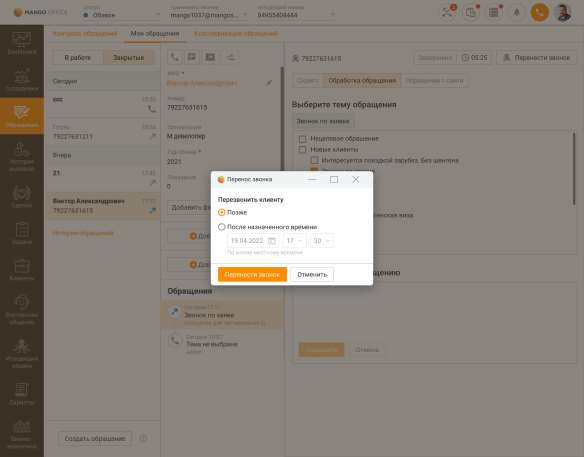

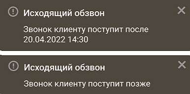

Для перевода части обращения нажмите кнопку и выберите пункт меню Перевести часть обращения. Также перевод можно осуществить кликом правой кнопкой мыши по сообщению и в открывшемся контекстном меню выбрать сообщения для перевода. Далее установите флаги напротив сообщений, которые будут переведены, и нажмите Перевести. Для завершения перевода сообщения нажмите Перевести и закрыть. В результате в рамках текущего сотрудника данное обращение будет закрыто и создано новое обращение, назначенное на указанного сотрудника либо группу. Перевод вызова После перевода вызова на другого сотрудника на экране отображается окно завершения обработки обращения. При включенной настройке Закрывать звонковое обращение после окончания разговора через ... секунд окно завершения не отображается. Полный путь переадресации закрытых обращений отображается в окне обращения:

Сотрудник, на которого переводят звонок, может видеть обращение с тематиками и комментариями сотрудника, от которого поступил перевод, пока звонок ещё не завершился.

Перевод e-mail-обращения При переводе e-mail-обращения вся цепочка переписки (с вложениями) из исходного обращения доступна для просмотра в новом обращении, созданном после закрытия исходного. 4.3.4. Перенос задания на обзвон Оператор Контакт-центра, обрабатывающий звонки Исходящего обзвона, при общении с клиентом может вручную назначить перезвон клиенту на конкретное, удобное клиенту время. Звонок вернется в кампанию Исходящего обзвона, и будет выполнен в заданное оператором время. Чтобы задать время перезвона после завершения разговора с клиентом в карточке завершенного вызова кликните по кнопке "Перенести звонок". В открывшемся окне выберите вариант "Позже", либо задайте точную дату и время перезвона.

<!-- изображение на стр. 157: байты не извлечены (PyMuPDF недоступен) -->

<!-- изображение на стр. 157: байты не извлечены (PyMuPDF недоступен) -->

Сохраните изменения кнопкой "Перенести звонок". В правом нижнем углу экрана отобразится системное уведомление о времени повторного звонка клиенту в рамках кампании Исходящего обзвона.

<!-- изображение на стр. 157: байты не извлечены (PyMuPDF недоступен) -->

4.3.5. Завершение обработки Для звонковых обращений Звонковое обращение закрывается сразу с завершением вызова, т. е. кликом по кнопке "Повесить трубку". Для текстовых обращений При закрытии текстовому обращению (кроме СМС-обращений) назначается один из результатов: • Переведено – обращение переведено на другого сотрудника;

<!-- изображение на стр. 158: байты не извлечены (PyMuPDF недоступен) -->

• Не обработано – сотрудник, после распределения обращения на него, закрывает обращение, взятое в работу, без единого ответа сотрудника; • Спам – сотрудник закрывает обращение кнопкой "Спам"; • Запрещена отправка – исходящее текстовое обращение не было доставлено до

|  | . Повторная отправка таких сообщений из всех текстовых каналов |
| --- | --- |
| невозможна. |  |

• Обработано – во всех остальных случаях, отличных от описанных выше.

| Текстовое обращение, полученное по каналам E-mail, WhatsApp, ВКонтакте, Telegram, Авито, |
| --- |
| Авито Работа, Max, которое не было распределено на |

заданного в настройках канала в Личном кабинете ВАТС, автоматически закрывается с результатом "Не обработано". Для закрытых текстовых обращений Гостей данные об имени пользователя, полученные из канала коммуникации, сохраняются. СМС-обращение автоматически закрывается с результатом: • Обработано – если смс было доставлено; • Запрещена отправка – если смс не было доставлено. Повторная отправка такого сообщения невозможна. Текстовое обращение, распределенное на сотрудника вручную, автоматически закрывается через промежуток времени, заданный в настройках канала E-mail в Личном кабинете, после отправки последнего сообщения в текущем обращении. Текстовое обращение, распределенное на сотрудника в результате автоматического распределения обращений, в котором сотрудник не отправил ни одного сообщения, закрывается автоматически с результатом "Не обработано" согласно выставленным настройкам в Личном кабинете ВАТС, раздел "Обработка звонков", вкладка "Ожидание ответа", настройка "Максимальное время ожидания клиентом первого ответа от сотрудника". Если закрытие обращения инициирует сторонний сервис, оно также закрывается с результатом "Не обработано".

| Обращение, созданное сотрудником вручную, автоматически закрывается через 4 дня с |
| --- |
| момента создания. |

Чтобы завершить обращение вручную, сотруднику следует нажать кнопку "Завершить обращение" в шапке обращения.

<!-- изображение на стр. 158: байты не извлечены (PyMuPDF недоступен) -->

| ПРИМЕР |
| --- |
| Сотрудник закрывает обращение, взятое в работу. При этом время отправки первого ответа |
| сотрудника позже времени последнего ухода клиента с сайта. Обращение закрывается с |
| результатом "Обработано". |

Закрытое обращение не отображается в мониторе очереди обращений и списке обращений, находящихся в работе у другого сотрудника. Переоткрыть закрытое обращение не допускается. Присоединенные к закрытому обращению файлы недоступны для просмотра. В Контакт-центре отображаются данные о закрытых обращениях, полученных в модуле «Текстовые коммуникации» Личного кабинета ВАТС. Из закрытого текстового обращения можно инициировать новое исходящее обращение к

<!-- изображение на стр. 158: байты не извлечены (PyMuPDF недоступен) -->

клиенту кликом по кнопке (действует для всех каналов, кроме Авито, Авито Работа). Оценка обращения

<!-- изображение на стр. 159: байты не извлечены (PyMuPDF недоступен) -->

Если для канала обращения настроена возможность клиента оставить оценку работы сотрудника, то после закрытия обращения клиенту будет предложено поставить оценку согласно настроенным в модуле Контроль качества правилам для групп и отдельных сотрудников. При маршрутизации обращений и дальнейшем их закрытии, правила отображаются в следующем порядке: Обращение распределилось на сотрудника и его закрыл сотрудник с настроенным на него правилом оценки – клиенту отображается правило оценки сотрудника, который закрыл обращение. Обращение распределилось на сотрудника и его закрыл сотрудник без настроенного на него правила оценки – клиенту правило оценки не отображается. Обращение распределилось на группу с настроенным на нее правилом оценки и его закрыл сотрудник с настроенным на него правилом оценки – клиенту отображается правило оценки группы. Обращение распределилось на группу с настроенным на нее правилом оценки и его закрыл сотрудник без настроенного на него правила оценки – клиенту отображается правило оценки группы. Обращение распределилось на группу без настроенного на нее правила оценки и его закрыл сотрудник с настроенным на него правилом оценки – клиенту отображается правило оценки сотрудника, который закрыл обращение. Обращение распределилось на группу без настроенного на нее правила оценки и его закрыл сотрудник без настроенного на нее правила оценки – клиенту правило не отображается. Просмотр истории обращений осуществляется: • При просмотре истории открытых и закрытых обращений; • При просмотре карточки контакта (в случае, когда обращение было привязано к контакту адресной книги). В случае, когда по клиенту, обращение с которым закрывается, есть хотя бы одна незакрытая задача, устанавливается флаг "Закрыть задачу".
