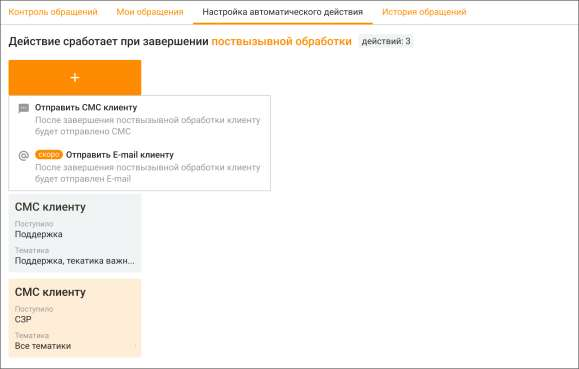
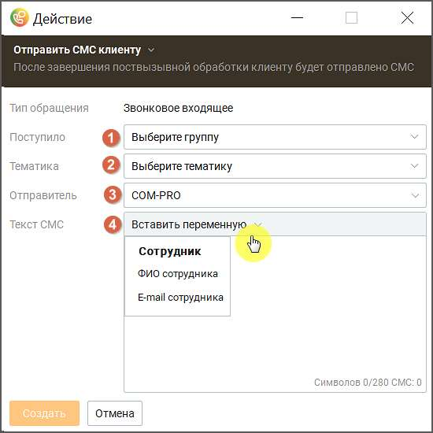

# 4.4. Настройка автоматических действий

> Трассировка: PDF §4.4 · сквозные стр. 159-161 · источники: ч.1 `kb/sources/mango-cc-manual/CC_manual_1.26.28.1.pdf` с.159-161.

Вкладка отображается только для пользовательской роли Администратор. Вкладка предназначена для настройки автоматических действий по результатам работы оператора с обращением. Пользователь может настроить отправку СМС сообщения с заданным текстом и переменными на номер телефона клиента по завершению звонка, чтобы закрепить результаты общения.

Тип триггера – на звонковое входящее обращение, срабатывает после завершения поствызывной обработки. В триггере может настраиваться использование шаблона СМС и выбираться параметры Адресной книги. Максимальное количество автоматических действий – 20. Автоматические уведомления могут быть настроены для следующих категорий получателей: на группу, на тематику. Для добавления СМС сообщения необходимо кликнуть по кнопке "+" и в открывшемся окне произвести настройки триггера.

Настройки триггера: 1. Поступило – группа операторов Контакт-центра, на которую был распределен звонок. 2. Тематика – тематика, назначенная звонку. 3. Отправитель – выбор имени отправителя. Доступен при подключении услуги "Отраслевое имя отправителя СМС" или "Индивидуальное имя отправителя СМС" в Личном кабинете ВАТС. 4. Текст СМС – поле для текста СМС-уведомления. Максимальная дли текста 280 символов без учета переменных. При создании уведомления доступны следующие переменные: • ФИО сотрудника • E-mail сотрудника
