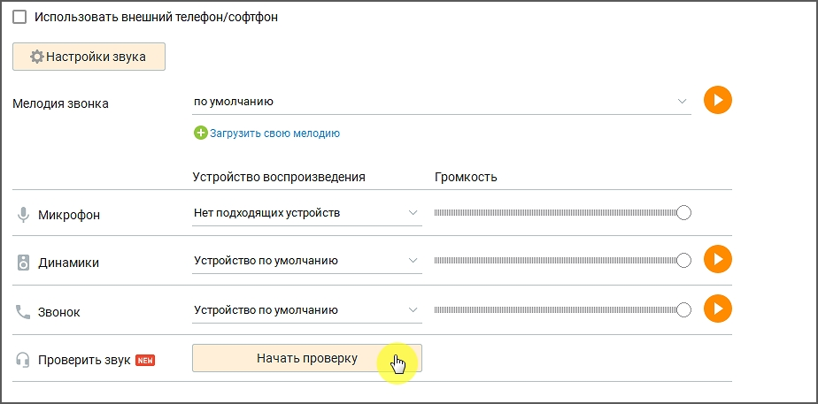
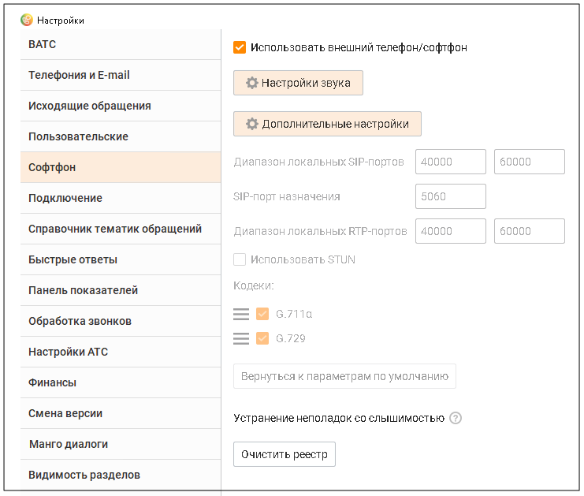

# 2.5.1.3.7. Софтфон

> Трассировка: PDF §2.5.1.3.7 · сквозные стр. 65-67 · источники: ч.1 `kb/sources/mango-cc-manual/CC_manual_1.26.23-part-1.pdf` с.65-67.

Данная вкладка предназначена для выбора устройств, которые вы будете использовать в качестве микрофона и динамиков (наушников гарнитуры) для осуществления разговоров, прослушивания записей разговоров и т. д. с использованием Контакт-центра MANGO OFFICE.

| Контакт-центр использует выбранные устройства в монопольном режиме. Это означает, |  |  |
| --- | --- | --- |
|  | что во время работы Контакт-центра MANGO OFFICE вы не сможете использовать эти же |  |
| устройства для голосовой связи в других программах. |  |  |

Настройки звука При включенной настройке Использовать внешний телефон / софтфон вы можете использовать внешний аппаратный или программный телефон для осуществления разговоров с помощью Контакт-центра MANGO OFFICE.

| При использовании внешнего телефона / софтфона вместе с Контакт-центром MANGO |  |  |  |
| --- | --- | --- | --- |
|  | OFFICE становятся недоступными элементы интерфейса, предназначенные для настройки |  |  |
|  | гарнитуры во время разговора (см. раздел Настройка гарнитуры во время разговора). |  |  |

При щелчке по кнопке Настройки звука отображается список звуковых настроек софтфона: Мелодия звонка. Чтобы загрузить свою мелодию звонка, следует щелкнуть по ссылке "Загрузить свою мелодию" и при помощи стандартного диалогового окна операционной системы указать путь к файлу. Микрофон, динамики, звонок. Укажите тип устройства, либо оставьте устройства по умолчанию (рекомендуется). Проверить звук. Кликнув по кнопке "Начать проверку" пользователь сможет сделать запись голоса с помощью службы тестирования звука и услышать себя. Дополнительные настройки

При щелчке по кнопке Дополнительные настройки отображается список дополнительных настроек софтфона: • Диапазон локальных SIP-портов; • SIP-порт назначения; • Диапазон локальных RTP-портов; • Использование технологии STUN; • Выбор и приоритет использования кодеков.

| Кнопка Очистить реестр позволяет устранить неполадки слышимости путем полной очистки реестра |
| --- |
| Windows. Если во время работы возникли проблемы слышимости, воспользуйтесь инструкцией по |
| устранению неполадок. |

| Информацию о настройках подключения вы можете получить у вашего системного |
| --- |
| администратора. |

<!-- изображение на стр. 67: байты не извлечены (PyMuPDF недоступен) -->

Для того, чтобы новые настройки вступили в силу, необходимо перезапустить приложение.
