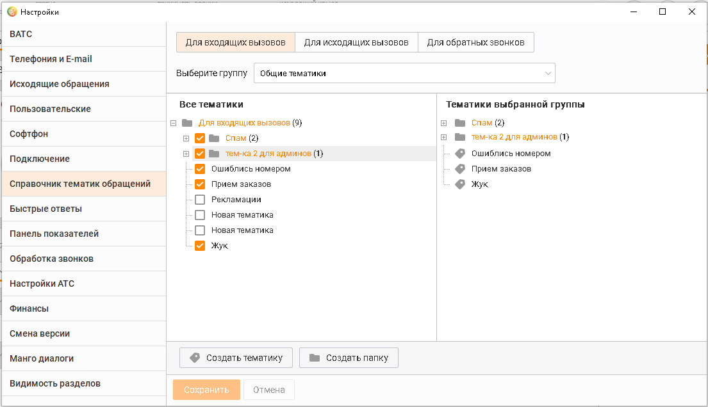

# 2.5.1.3.9. Справочник тематик обращений

> Трассировка: PDF §2.5.1.3.9 · сквозные стр. 69-71 · источники: ч.1 `kb/sources/mango-cc-manual/CC_manual_1.26.23_compressed.pdf` с.69-71.

На данной вкладке осуществляется редактирование списка папок и тематик обращений, применяемых при обработке вызова, при редактировании информации об уже совершенных вызовах, при создании кампании исходящего обзвона, а также для виджетов обратных звонков и т. д.

| Права доступа к вкладке настраиваются в разделе Безопасность и ограничения → |  |  |
| --- | --- | --- |
| [выбрать роль] → Инструменты → Обращения. Для стандартных ролей: |  |  |
| Сотрудник, Бухгалтер, Оператор – доступ закрыт; |  |  |
|  | Супервизор – редактирование тематик всех групп, в которых пользователь является |  |
| супервизором; | супервизором; |  |
| Администратор – редактирование тематик всех групп. |  |  |

Максимально допустимое количество папок -100, может быть увличено до 500. Для тематик предусмотрен лимит в 500 единиц, который может быть расширен до 1500. Для расширения лимитов обратитесь к персональному менеджеру для подключения соответствующей услуги. Длина названий папок и тематик ограничена 100 символами. Максимальная глубина вложенности структуры не может превышать 5 уровней. Тематики для определенного типа вызова создаются для каждой группы сотрудников. Таким образом, при вызове определенного типа сотруднику будут доступны тематики только одного соответствующего списка. Для обратных звонков тематики создаются для выбранного виджета "Обратный звонок".

| Доступ к вкладке Для обратных звонков возможен только при наличии хотя бы одного |
| --- |
| виджета "Обратный звонок". |

Список в левой части окна содержит все созданные тематики. В правой части окна отображается список тематик, выбранных для текущей группы сотрудников либо виджета "Обратный звонок". Выбор тематик осуществляется при установке флага напротив нужной папки либо тематики. Сохранение изменений выполняется автоматически. Папка или тематика создаются в иерархическом дереве последним элементом текущего элемента – папки либо тематики. Чтобы добавить тематику, нажмите ссылку Создать тематику. Введите название тематики и нажмите клавишу Enter. При этом порядок расположения ранее добавленных тематик и папок сохраняется. Чтобы изменить тематику, выберите ее. Выбранная тематика подсвечивается цветом (см.

пример на рисунке выше). Затем нажмите кнопку либо дважды щелкните левой кнопкой мыши. Измените название тематики и нажмите клавишу Enter.

Чтобы удалить тематику, выберите ее и нажмите кнопку . Если тематика была задана в рамках одного или нескольких разговоров, то на экране отображается соответствующее сообщение вида:

| Справочник тематик является единым. Проявляйте повышенную внимательность при |  |  |
| --- | --- | --- |
|  | изменении или удалении тематик. При переносе папки вместе с ней переносятся все ее |  |
| элементы. При удалении папки удаляются все ее элементы. |  |  |

<!-- изображение на стр. 71: байты не извлечены (PyMuPDF недоступен) -->

Чтобы изменить положение тематики, используйте кнопки и . В результате положение тематики изменится в рамках одного уровня. Также вы можете воспользоваться механизмом "перетаскивания" тематик, который позволяет создать иерархическое дерево, меняя уровни. Для этого "захватите" тематику и переместите ее на ту тематику, которая станет родительской.

<!-- изображение на стр. 71: байты не извлечены (PyMuPDF недоступен) -->

Изменения, внесенные в список тематик, сохраняются автоматически.
