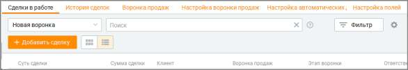
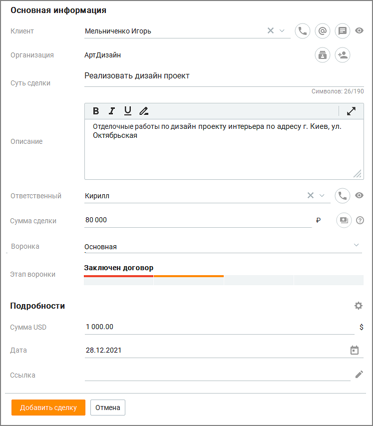
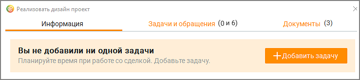
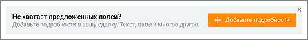
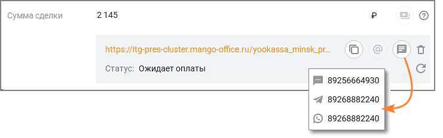
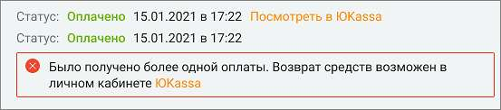
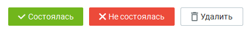

# Безопасность и ограничения → Настройка доступа → (Выбрать роль) → Инструменты

> Трассировка: PDF §5 · сквозные стр. 166-170 · источники: ч.1 `kb/sources/mango-cc-manual/CC_manual_1.26.28.1.pdf` с.166-170.

Модуль Сделки в меню разделов содержит список всех сделок, доступных к просмотру пользователю, в зависимости от его роли. Модуль включает в себя несколько инструментов: • Сделки в работе • История сделок • Воронка продаж • Настройка воронки продаж (для пользователей с ролями Руководитель компании и Администратор) • Настройка автоматических действий (для пользователей с ролями Руководитель компании и Администратор) • Настройка пользовательских полей (для пользователей с ролями Руководитель компании и Администратор) • Настройка причин отказа

| На данный раздел распространяется возможность скрытия номера клиента. Узнать больше |  |  |
| --- | --- | --- |
|  | здесь. |  |

Для создания новой сделки откройте окно Сделки в меню разделов и нажмите Добавить сделку. По достижении количества сделок 1000, попытка добавить еще одну сделку приводит к появлению уведомления о достижении лимита.

| При изменении подключенных услуг сделки сверх лимита не удаляются, но для работы |
| --- |
| доступно лишь 1000 последних по дате создания сделок (созданных или переоткрытых). |

На карточке сделки заполните стандартные и пользовательские поля: • Клиент - контакт адресной книги (вкладка Клиенты/Контакты). Если клиент был удален, то в созданной ранее сделке отображается как Удаленный клиент. Также можно добавить нового клиента кликом по кнопке "+ Новый клиент". • Организация – поле автоматически заполняется данными об организации указанного выше клиента; • Суть сделки – поле является обязательным к заполнению, допускается несколько сделок с одинаковым названием. • Описание – описание сделки, не более 3000 символов;

• Ответственный – сотрудник, создавший сделку либо сотрудник, на которого назначена сделка при её создании. Ответственный сотрудник впоследствии может быть изменен вручную или автоматически. При смене Ответственного вручную пользователю будет предложено назначить связанные со сделкой задачи на нового Ответственного. • Сумма сделки – сумма сделки, не более 12 цифр; • Воронка продаж - наименование воронки продаж, к которой относится сделка (выбор из выпадающего списка); • Этап воронки – выбор этапа сделки.

Пользовательские поля размещаются в блоке "Подробности". Клик по пиктограмме открывает вкладку Настройка пользовательских полей.

Помимо полей, заполняемых пользователем при создании сделки, карточка сделки содержит пиктограммы:

– звонок клиенту или сотруднику. Кнопка активна, если в карточке клиента/сотрудника имеется номер телефона;

– отправить e-mail. Кнопка активна, если в карточке клиента указан адрес электронной почты. Для отправки e-mail в настройке Телефония и E-mail должен быть указан и авторизован адрес электронной почты сотрудника;

- отправить текстовое обращение. Кнопка активна, если в карточке клиента указан хотя бы один канал для текстовых обращений;

– открывает список всех контактов организации в модуле "Клиенты";

- открывает карточку добавления нового контакта в указанную организацию;

– просмотр карточки клиента/сотрудника;

– редактирование текста;

– формирование ссылки на оплату сделки в сервисе ЮKassa. После создания карточку сделки можно открыть в режиме просмотра и редактирования. У вновь созданной сделки отсутствуют задачи, поэтому отобразится соответствующее информационное сообщение.

Если у пользователя имеются права на настройку пользовательских полей, при создании сделки будут отображаться дополнительные блоки уведомлении.

Оплата сделки В карточке сделки сотрудник может cгенерировать ссылку на оплату сделки в сервисе ЮKassa.

В Личном кабинете пользователя ВАТС должна быть подключена интеграция с ЮKassa.

Чтобы сгенерировать ссылку, кликните по пиктограмме в строке "Сумма сделки". После того, как ссылка будет сгенерирована, ее можно:

• скопировать в буфер обмена кликом по пиктограмме ;

• отправить на e-mail, указанный в карточке клиента, кликом по пиктограмме ; • отправить СМС-уведомлением (в преднастроенном системном шаблоне), WhasApp- уведомлением или текстовым обращением по выбранному каналу кликом по

пиктограмме ;

• удалить кликом по пиктограмме . После удаления ссылка становится недействительной, платеж по ней не может быть произведен.

• Клик по пиктограмме обновляет статус платежа.

После получения оплаты статус платежа меняется на Оплачено. В карточке сделки отображаются дата и время оплаты, а также ссылка "Посмотреть в ЮKassa".

| Ограничение по времени для оплаты платежей настраивается пользователем в личном |  |  |
| --- | --- | --- |
|  | кабинете ЮKassa. По истечении данного срока не оплаченный платеж автоматически |  |
| отменяется, ссылка на оплату становится не действительной. |  |  |

В настройках можно задать автоматическое перемещение сделки на выбранный этап после поступления оплаты. Если клиент произвел оплату по ссылке несколько раз, в карточке сделки отразится информация обо всех полученных платежах, а также ссылка на Личный кабинет ЮKassa для возврата ошибочного платежа.

<!-- изображение на стр. 169: байты не извлечены (PyMuPDF недоступен) -->

Статус сделки Каждая сделка находится в одном из статусов: • В работе • Не в работе: Состоялась, Не состоялась, Удалена При создании сделки ей присваивается статус В работе. Пользователь может изменить статус сделки одной из кнопок в карточке сделки:

<!-- изображение на стр. 169: байты не извлечены (PyMuPDF недоступен) -->

<!-- изображение на стр. 170: байты не извлечены (PyMuPDF недоступен) -->
