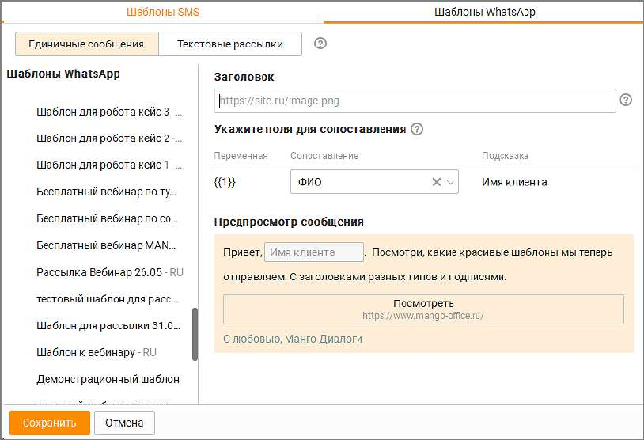
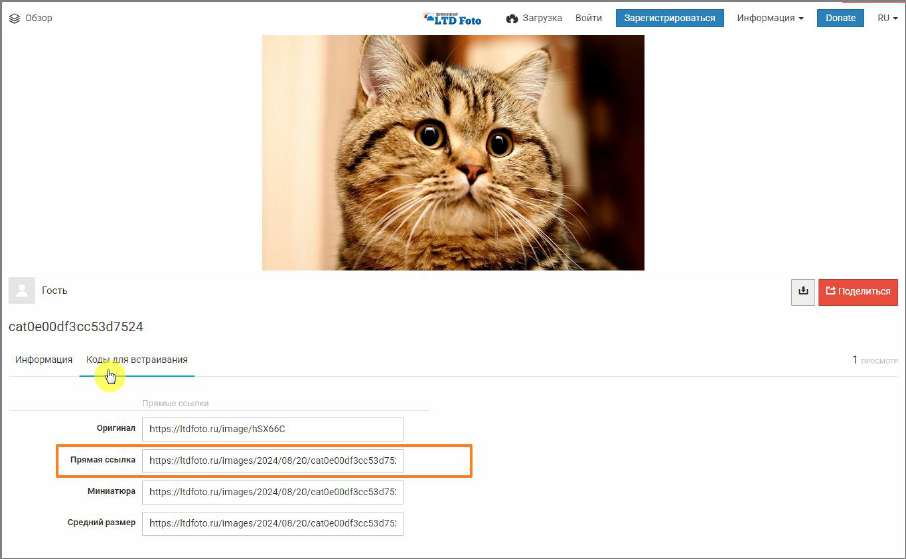
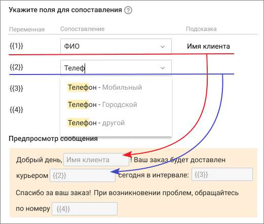

# 2.5.1.3.11. Шаблоны сообщений

> Трассировка: PDF §2.5.1.3.11 · сквозные стр. 73-78 · источники: ч.1 `kb/sources/mango-cc-manual/CC_manual_1.26.23_compressed.pdf` с.73-78.

Вкладка предназначена для настройки сообщений, отправляемых пользователям по каналам СМС и WhatsApp. Шаблоны СМС Создавать, редактировать и удалять шаблоны могут пользователи, у которых имеется хотя бы

|  | На |
| --- | --- |
| вкладке можно создавать шаблоны как для единичных сообщений, так и для текстовых |  |
| рассылок. |  |

| Если услуга текстовых рассылок не подключена, подвкладка "Текстовые рассылки" не |
| --- |
| отображается. |

Максимальное количество возможных шаблонов – 100. Для расширения лимита необходимо обратиться с запросом к персональному менеджеру.

Добавить новый шаблон – добавление шаблона СМС-сообщения; Наименование шаблона – поле может быть не уникально, максимум 255 символов; Имя отправителя – возможные значения поля устанавливаются в Личном кабинете ВАТС. Значение поля получатель смс-сообщения видит, как имя отправителя. Если отправитель недоступен, сообщение будет отправлено от отправителя, настроенного в ЛК ВАТС по умолчанию.

| ПРИМЕР: |
| --- |
| Пользователь в ЛК ВАТС подключил услугу "Отраслевое имя" и настроил в шаблоне СМС-сообщения |
| отраслевое имя в качестве отправителя. |
| Позже пользователь отключил услугу "Отраслевое имя", но продолжает отправлять СМС на основе |
| этого шаблона. |
| Результат: СМС-сообщения отправляются от отправителя, настроенного в ЛК по умолчанию. |

Текст сообщения - максимальное количество символов в поле – 280; Символов:_/280 СМС:_ – данные в правом нижнем углу окна формы содержат информацию: • символов_/280 – количество использованных символов из 280-ти возможных; • СМС:_ – количество СМС-сообщений, на которые будет разбит текст; Одно СМС-сообщение содержит (символов, включая пробелы): • 140 – для латинских символов • 70 – для кириллических символов. Вставить переменную - в качестве переменных можно использовать • все поля адресной книги; • поля ФИО и e-mail из карточки сотрудника, который отправляет сообщение; • два поля из карточки сделки: клиент и ссылка на оплату. Поля из карточки сделки передаются в шаблон только при условии запуска шаблона отправки СМС из сделки. Такой шаблон не требует предварительного создания пользователем, так как создается системой автоматически. Значения переменных будут подставлены при выборе адресата и при отправке сообщения. Одна переменная может быть использована в шаблоне более одного раза. Удалить шаблон – клик по кнопке Удалить приводит к скрытию шаблона из списка шаблонов. Шаблон будет удален без возможности восстановления только после клика по кнопке Сохранить. Нажатие кнопки Отмена отменяет команду удаления шаблона. При сохранении настроек кнопкой Сохранить изменения становятся доступными всем пользователям продукта. Изменения в настройку можно вносить в любой момент. Шаблоны WhatsApp

Для создания HSM-шаблона WhatsApp ознакомьтесь с инструкцией.

| На вкладке отображаются шаблоны как для единичных сообщений, так и для текстовых |
| --- |
| рассылок. |

Вкладка отображается, если у пользователя: • имеется хотя бы одна подконтрольная группа; • в ЛК ВАТС имеется хотя бы один созданный и активный шаблон WhatsApp. Создавать, редактировать и удалять шаблон в Контакт-центре невозможно.

1. Шаблоны WhatsApp – в блоке отображаются наименования категорий и активных шаблонов, созданных в ЛК ВАТС, в "Шаблонах WhatsApp". В Контакт-центре эти данные не редактируются. 2. Заголовок - заголовок, описывающий тип шаблона и указанный при создании шаблона. В поле "Заголовок" Контакт-центра размещается подсказка о типе заголовка: изображение, текст, документ видео. Тип заголовка не подлежит изменению. В поле необходимо вставить прямую ссылку на файл – видео, изображение или документ. Как получить прямую ссылку на изображение Для размещения изображения при создании сообщения на основе шаблона в сообщение необходимо вставить прямую ссылку на файл. Это ссылка, на конце которой указано расширение файла – .jpg, .jpeg, .png Например https://ltdfoto.ru/images/2024/08/20/cat548ba3aa37a77c1a.jpg Для получения прямой ссылки на изображение можно использовать бесплатные облачные файловые хранилища: • imgur.com – для изображений и видео • ltdfoto.ru – для изображений • telegra.ph – для изображений

| Ссылки на файл на Яндекс-диске не подходят, так как они не являются прямыми |
| --- |
| ссылками. |

Пример размещения прямой ссылки на ltdfoto.ru:

Как получить прямую ссылку на видео Для размещения видео при создании сообщения на основе шаблона в сообщение необходимо вставить прямую ссылку на файл. Это ссылка, на конце которой указано расширение файла mp4 для видео. Для получения прямой ссылки на изображение или видео можно использовать бесплатные облачные файловые хранилища: • imgur.com – для изображений и видео

| Ссылки на файл на Yandex-диске не подходят, так как они не являются прямыми |
| --- |
| ссылками. |

Пример размещения прямой ссылки на imgur.com: 1) Откройте окно добавления видео кликом по кнопке "New post", и добавьте файл. 2) Установите курсор на видео, в правом верхнем углу отобразится пиктограмма "...". Нажмите на нее и в выпадающем списке выберите строку меню "Get share link". 3) В строке "BBCode" скопируйте свою ссылку, удалив теги [] в начале и конце ссылки. 3. Переменная – количество переменных, заданное при создании шаблона. Максимальное количество – 40 переменных. Если в шаблоне нет ни одной переменной, то отображается только текст шаблона. 4. Сопоставление – выпадающий список для сопоставления переменных с контактными данных клиентов и сотрудников Контакт-центра. Переменную можно сопоставить с одним полем в адресной книге (стандартным и пользовательским), с одним полем из карточки сотрудника (ФИО или e-mail) либо полями из карточки сделки (клиент или ссылка на оплату).

| ПРИМЕР |
| --- |
| При ответе клиенту с использованием данного шаблона вместо переменной {{1}} будет |
| подставляться значение поля ФИО клиента из Контактов адресной книги. |
|  |

5. Подсказка – при наведении курсора на строку с переменной отображается пиктограмма

<!-- изображение на стр. 77: байты не извлечены (PyMuPDF недоступен) -->

для добавления или редактирования комментария. 6. Предпросмотр сообщения - текст созданного в ЛК ВАТС шаблона, максимальное количество символов -4096. В Контакт-центре сам текст отредактировать невозможно. Возможно только изменить присвоенные переменным значения. 7. Кнопка-ссылка, Кнопка-звонок – текст кнопок, номер телефона и URL ссылки указываются в ЛК ВАТС при создании шаблона с кнопками. В Контакт-центре изменить их невозможно. Клик пользователя, получившего такое сообщение, по кнопке приводит к выполнению соответствующего действия.

<!-- изображение на стр. 78: байты не извлечены (PyMuPDF недоступен) -->
