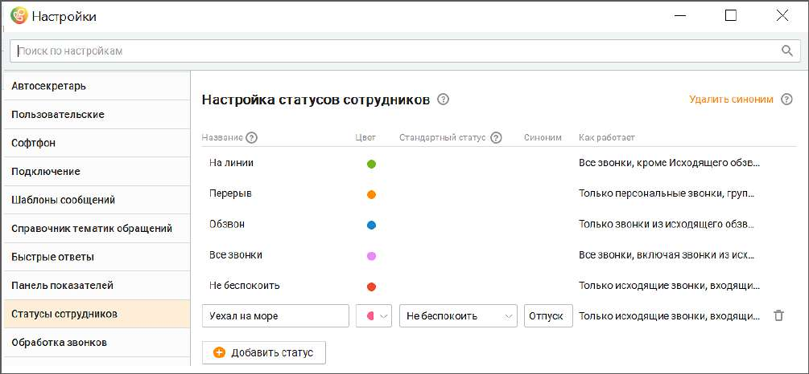

# 2.5.1.3.12. Статусы сотрудников

| Добавление пользовательских статусов возможно, если подключена услуга "Настройка |  |
| --- | --- |
|  | статусов сотрудника". Подключение услуги возможно из приложения Контакт-центр |
| MANGO OFFICE при первом заходе на вкладку. |  |

Вкладка доступна всем пользователям, у которых есть хотя бы одна подконтрольная группа.

Для создания нового статуса сотрудника заполните поля: • Название – название статуса будет отображаться в аналитике, а также на верхней панели Контакт-центра для выбора текущего статуса пользователем; • Цвет – палитра из 9-ти вариантов цвета; • Стандартный статус – настройка поля определяет возможности телефонии пользовательского статуса; • Синоним – не более 20 символов. Должен быть уникальным в рамках одного Контакт- центра. Как может быть использован синоним:

| Пример 1: |
| --- |
| У пользователя два Контакт-центра. Оба продукта связаны с одной внешней системой. В систему из |
| обоих продуктов нужно передавать статус с единым реквизитом. |
| Наличие синонима позволяет привязываться к синониму статуса, который пользователь может |
| задать одинаковым на своих нескольких Контакт-центрах. |
| Пример 2: |
| Требуется вернуть удаленный статус. При создании статуса заново Контакт-центр сгенерирует новый |
| id. Что не всегда удобно, особенно если во внешней системе используется id старого статуса. |
| Наличие синонима позволяет при удалении статуса, создать новый статус, и ввести тот же синоним |
| что был у удаленного статуса. Соответственно, если есть привязка к синониму, во внешней системе |
| ничего изменять не потребуется. |

Кнопка Удалить синоним/Использовать синоним удаляет или добавляет столбец синонимов. Сохраните внесенные изменения кликом по кнопке Сохранить. Новый статус сотрудника будет активен сразу после сохранения. Созданные пользовательские статусы сотрудников можно отредактировать или удалить. Помимо пяти стандартных, в Контакт-центре могут быть созданы до 30 пользовательских статусов. Все пользовательские статусы учитываются во вкладках Контакт-центра – графиках, таблицах, отчетах, показателях, файлах экспорта и др. – наряду со стандартными. При входе в систему (до авторизации) пользовательский статус не может быть выбран. Доступны только стандартные статусы сотрудников.
