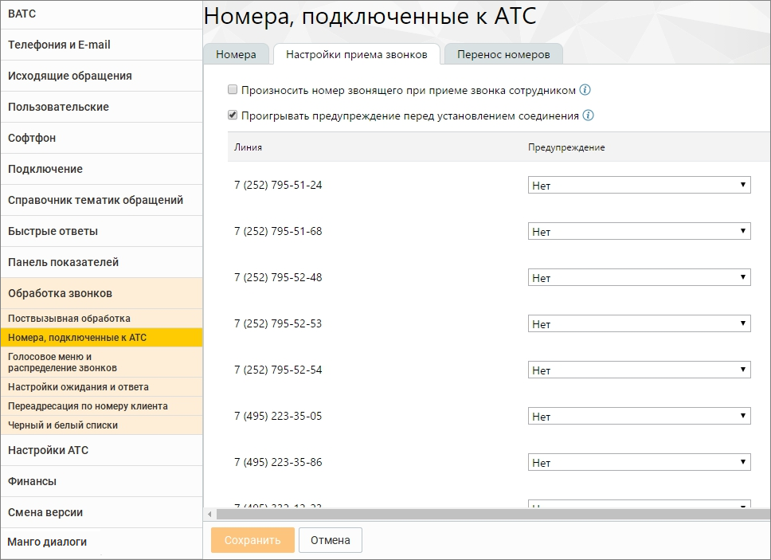

# 2.5.1.3.13. Обработка звонков

> Трассировка: PDF §2.5.1.3.13 · сквозные стр. 79 · источники: ч.1 `kb/sources/mango-cc-manual/CC_manual_1.26.23-part-1.pdf` с.79.

Данная вкладка содержит блоки настроек телефонных номеров.

| Вкладка отображается, если пользователь имеет хотя бы одну подконтрольную группу или |
| --- |
| роль Администратор. |

Подробное описание настроек приведено в п.4.4 справочника абонента "Виртуальная АТС MANGO OFFICE".
