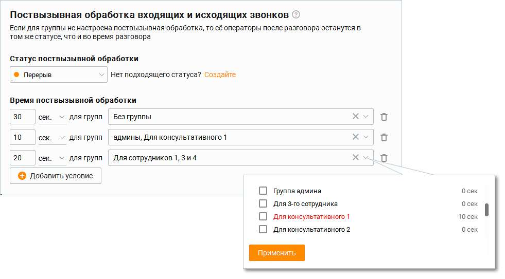

# 2.5.1.3.13.1. Поствызывная обработка

| Вкладка отображается, если пользователь имеет хотя бы одну подконтрольную группу или |
| --- |
| роль Администратор. |

| На вкладке настраивается время, в течение которого операторы группы, завершившие |
| --- |
| разговор, переходят в выбранный статус. |
| По истечении установленного времени поствызывной обработки или при клике по кнопке |
| "Готов к работе" статус текущего оператора группы автоматически возвращается к |
| предыдущему значению. |
| Если выбранный пользовательский статус к завершению вызова удален или в Личном |
| кабинете ВАТС отключена услуга "Пользовательский статус", оператор переходит в статус |
| "Не беспокоить". |
| Максимальное время, в течение которого возможна задержка обновления информации о |
| правилах постзвонковой обработки для операторов группы – 10 минут. |
| Поствызывная обработка применяется при внешних вызовах (в том числе к автоперезвонам и |
| заказу обратного звонка), кроме кампаний Исходящего обзвона. |

Поствызывная обработка применяется только после завершения внешних вызовов: состоявшихся исходящих и принятых входящих. При выходе пользователя из приложения во время поствызывной обработки, она прекращается, т. е. таймер поствызывной обработки останавливается. Пользователь переходит в статус "Не в сети". После повторного входа в приложение таймер поствызывной обработки не запускается.

Кнопка "Добавить условие" открывает поле для добавления нового условия. Группы, для которых условие поствызывной обработки уже настроено, отображаются в выпадающем списке красным цветом. Повторный выбор группы сопровождается системным сообщением о подтверждении назначения нового правила. Если оператор состоит более чем в одной группе, и значения для поствызывной обработки в группах отличаются, то в качестве времени обработки выбирается максимальное время из значений по группам, в которых он состоит.

Максимальное количество условий – 50.

Чтобы удалить условие поствызывной обработки, кликните по пиктограмме (корзина).
