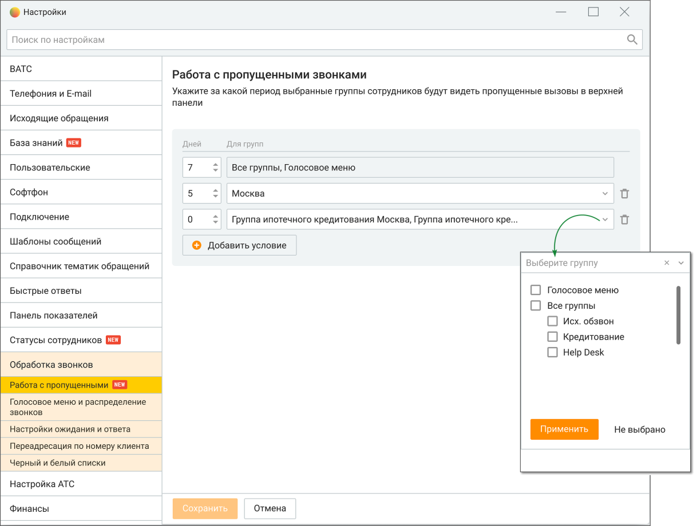

# 2.5.1.3.13.2. Работа с пропущенными

> Трассировка: PDF §2.5.1.3.13.2 · сквозные стр. 81-83 · источники: ч.1 `kb/sources/mango-cc-manual/CC_manual_1.26.23-part-1.pdf` с.81-83.

Вкладка предназначена для настройки периода отображения пропущенных звонков.

Настройка доступна только пользователям с ролью Администратор. Администратор может настроить период, за которой считает необходимым перезванивать по пропущенным звонка. Таким образом операторы будут работать только по горячим контактам и не тратить время на обработку холодных. Для гибкого обслуживания клиентов, обращающихся в компанию по разным вопросам, возможно настроить различный период отображения для разных групп операторов.

На вкладке пользователю доступны следующие настройки: Дней – количество дней, за которые будут отображаться пропущенные вызовы. Максимальное количество – 7 дней. Для групп – выбор групп, для которых будет действовать правило. Возможен выбор следующих значений: • Все группы и каждая группа отдельно • Голосовое меню Кнопка "Добавить условие" – добавление строки условия. Максимальное количество условий – 10.

Фильтрация вызовов происходит по группе, пропустившей звонок, а не по вхождению текущего пользователя в группу, которая пропустила звонок. Если пользователь состоит в двух группах, пропустивших звонок, то правило действует с учетом настроек для последней группы, пропустившей звонок. Если звонок пропущен в Голосовом меню, то настройка применяется для всех пользователей на продукте, состоящих в какой-либо группе или нет.

