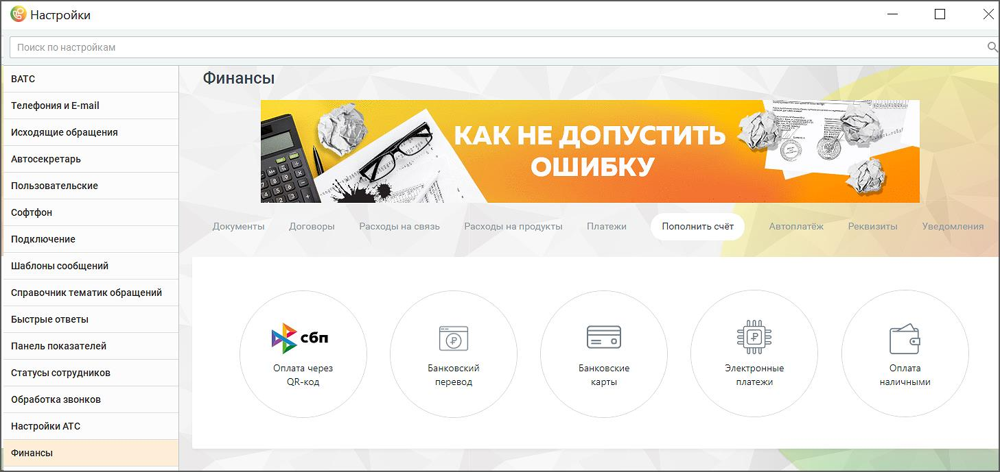

# 2.5.1.3.15. Финансы

> Трассировка: PDF §2.5.1.3.15 · сквозные стр. 83-84 · источники: ч.1 `kb/sources/mango-cc-manual/CC_manual_1.26.23-part-1.pdf` с.83-84.

Данная вкладка содержит настройки и инструменты для работы с текущим Лицевым счетом:

Подробное описание настроек приведено в справочнике абонента "Виртуальная АТС MANGO OFFICE".

