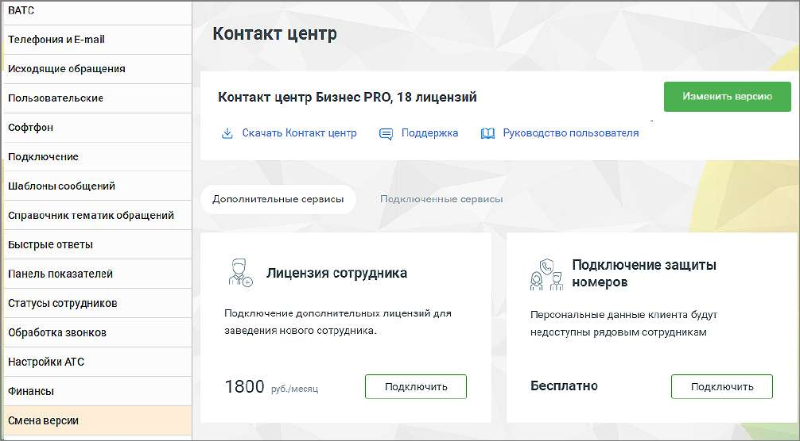

# 2.5.1.3.16. Смена версии

Данная вкладка предназначена для изменения версии и тарифа продукта на другие, согласно потребностям и расходам. А также для подключения дополнительных сервисов.

Подробное описание процесса приведено в справочнике абонента "Виртуальная АТС MANGO OFFICE".
