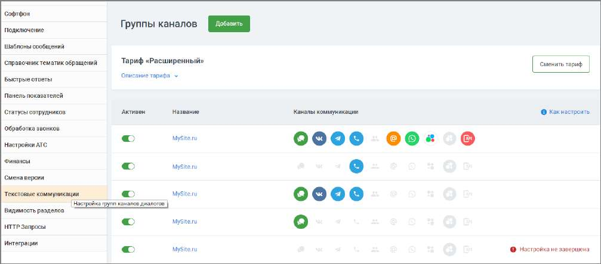

# 2.5.1.3.17. Текстовые коммуникации

Данная вкладка предназначена для работы с группами каналов Текстовых коммуникаций.

На закладке отображается информация о тарифе и список подключенных групп каналов в порядке их создания. Для каждой группы указывается следующее:

• Активность группы с возможностью ее активировать/деактивировать, по умолчанию при создании группа активна. При деактивации не отображается на сайте, сообщения из соц. сетей не поступают.

| Активация/деактивация группы каналов не приводит к подключению или отключению |
| --- |
| услуг. |

• Название группы каналов – активная ссылка, по нажатию открывается форма редактирования группы; • Список подключенных каналов в виде иконок. При наведении на иконку отображается название канала, а также кто обрабатывает обращения с данного канала (название группы, сотрудника или sip-линии в зависимости от канала). Узнайте больше о настройках и работе Текстовых коммуникаций в Руководстве пользователя.
