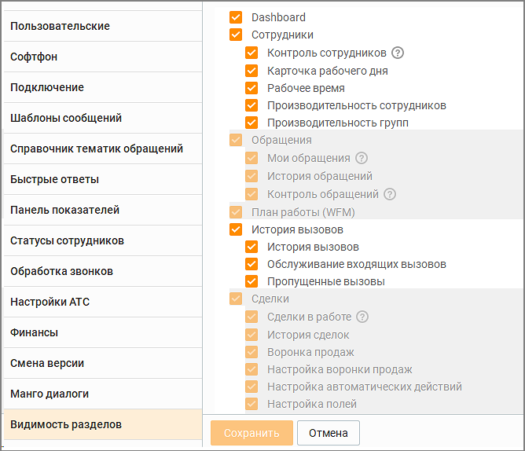

# 2.5.1.3.18. Видимость разделов

> Трассировка: PDF §2.5.1.3.18 · сквозные стр. 85-88 · источники: ч.1 `kb/sources/mango-cc-manual/CC_manual_1.26.23-part-1.pdf` с.85-88.

Вкладка предназначена для настройки отображения разделов Контакт-центра MANGO OFFICE Персонализированное рабочее место: Пользователь Личного кабинета MANGO OFFICE с правом "Изменять права доступа сотрудников" (по умолчанию: Руководитель компании и Администратор) может настроить в ЛК рабочие места сотрудников на основании их ролей, что позволяет гибко адаптировать доступные функции для каждой роли. Все настройки сохраняются в облаке (на сервере MANGO OFFICE), что исключает необходимость ручного конфигурирования на каждом компьютере. Преимущества персонализированных настроек: • Настройка рабочего места для новых сотрудников происходит быстрее. • Рабочее место каждого сотрудника соответствует его задачам. • Улучшена производительность за счет отключения ненужных модулей и снижения нагрузки на ПК. Подробнее о настройке Персонализированного рабочего места узнайте в Справочнике ВАТС, раздел Безопасность и ограничения → Настройка доступа. Если у пользователя не подключена услуга на какой-либо модуль или вкладку, то настройка модуля или вкладки не отображается. По умолчанию часть модулей и настроек отключена. Недоступные для изменения в Контакт-центре настройки можно изменить в Личном кабинете MANGO OFFICE, раздел Безопасность и ограничения → Настройка доступа.

После внесения необходимых изменений в доступных настройках, сохраните их, кликнув по кнопке Сохранить. Размещение настроек персонализированного рабочего места в Личном кабинете ВАТС для соответствующих разделов Контакт-центра:

| Видимость разделов в Контакт-центре |  | Настройка доступа в ЛК ВАТС |  |
| --- | --- | --- | --- |
|  |  |  | Расположение в ЛК: |
|  |  |  | Безопасность и ограничения → |
| Категория | Раздел |  |  |
|  |  |  | Настройка доступа → |
|  |  |  |  |
|  |  |  | Инструменты → ... |
| Главное окно |  |  |  |
|  | Пропущенные вызовы (монитор пропущенных вызовов) |  | Инструменты → Управление звонками → Монитор пропущенных |
| Настройки | Статусы сотрудников |  | Инструменты → Управление сотрудниками → Редактирование кастомных статусов |
|  | Софтфон |  | Инструменты → Управление звонками → Использовать внешний телефон / софтфон |

| Dashboard | Виджеты Dashboard | Инструменты → Отчеты Контакт-Центра → Просматривать виджеты Dashboard |
| --- | --- | --- |
| Обращения |  |  |
|  | Мои обращения | Инструменты → Обращения |
|  | История обращений | Инструменты → Отчеты Контакт-Центра → Просматривать классификацию обращений |
|  | Контроль обращений | Инструменты → Обращения → Просматривать вкладку контроль обращений |
| План работы (WFM) |  |  |
|  | График работы, Планирование входящих | Инструменты → WFM → График работы и планирования |
|  | Шаблоны графика работ | Инструменты → WFM → Шаблоны графика работ |
|  | Настройка автоматических действий | Инструменты → WFM → Настройка автоматических действий |
|  | Работа по трудовому договору | Инструменты → WFM → Работа по трудовому договору |
|  | Производственный календарь | Инструменты → WFM → Производственный календарь |
|  | Отчеты | Инструменты → WFM → Отчеты |
| Сделки | Сделки в работе, История сделок | Инструменты → Сделки |
|  | Воронка продаж |  |
|  |  | Инструменты → Сделки → Настраивать воронку продаж |
|  |  | Инструменты → Сделки → Настраивать автоматические действия |
|  |  | Инструменты → Сделки → Настраивать поля в сделках |
| Клиенты |  |  |
|  | Клиенты | Инструменты → Адресная книга |
|  | Организации | Инструменты → Адресная книга |
|  | Настройка полей | Инструменты → Адресная книга → Настраивать поля в адресной книге |

|  | Настройка разрешения на просмотр персональных контактов и звонки персональным номерам | Инструменты → Адресная книга → чекбокс "Коммуникация с персональными контактам (возможность позвонить и написать на персональный контакт)" |
| --- | --- | --- |
| Исходящий обзвон |  | Инструменты → Исходящий обзвон |
| Очередь обращений |  | Инструменты → Обращения → "Очередь обращений" |
|  | Вызовы | Инструменты → Обращения → "Очередь обращений", чекбокс "очередь звонков" |
|  | Чаты | Инструменты → Обращения → "Очередь обращений", чекбокс "очередь текстовых обращений" |
|  | Заказы ОЗ | Инструменты → Обращения → "Очередь обращений", чекбокс "заказы ОЗ" |
| Внутреннее общение |  |  |
|  | Чаты | Инструменты → Сотрудники → Сотрудники и группы → Внутренние чаты |
|  | Комнаты конференций | Инструменты → Настройки АТС → Конференц-связь |
| История вызовов |  |  |
|  | История вызовов | Инструменты → История вызовов |
|  | Пропущенные вызовы | Инструменты → Отчеты Контакт-Центра → Просматривать историю пропущенных вызовов |
|  | Обслуживание входящих вызовов | Инструменты → Отчеты Контакт-Центра → Просматривать обслуживание входящих вызовов |
| Текстовые рассылки |  | Инструменты → Текстовые рассылки |

При изменении доступности разделов в Личном кабинете ВАТС для определенной роли, изменения вступают в силу после перезагрузки Контакт-центра.
