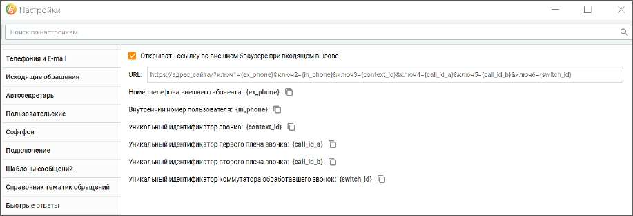

# 2.5.1.3.19. HTTP Запросы

Функция предназначена для быстрого заполнения внешней базы данных, а также поиска по базе. При внешнем входящем вызове в браузере открывается заданная ссылка.

Последовательность настройки функции пользователем: • проставить галочку в чекбоксе, включающем/выключающем работу функции; • прописать целевой url. Сохраните внесенные изменения кнопкой Сохранить. При входящем вызове в заданном по умолчанию браузере будет открыт URL, содержащий вместо переменных следующие номера телефонов: • {ex_phone} – номер телефона внешнего абонента, совершающего вызов; • {in_phone} – внутренний номер пользователя, на который поступает вызов; • {context_id} – уникальный идентификатор звонка; • {call_id_a} – уникальный идентификатор первого плеча звонка ; • {call_id_b}- уникальный идентификатор второго плеча звонка; • {switch_id} – уникальный идентификатор коммутатора, обработавшего звонок.

| Примеры заполнения пользователем поля URL |
| --- |
| http://консалтинг.рф/?ключ1={ex_phone}&ключ2={in_phone} |
| https://investproekt.ru/contact/?ключ1={ex_phone}&ключ2={in_phone} |
