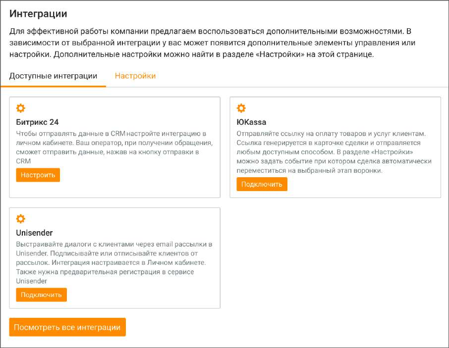

# 2.5.1.3.20. Интеграции

| На вкладке настраиваются интеграции с CRM Битрикс 24, сервисом рассылок Unisender и |  |
| --- | --- |
|  | сервисом приема платежей ЮKassa. Вкладка доступна пользователям с ролью |
| Администратор. |  |

Клик по кнопке "Посмотреть все интеграции" открывает модуль Интеграции в Личном кабинете пользователя ВАТС. В блоках интеграций Битрикс 24, ЮKassa и Unisender в зависимости от статуса подключения, доступны следующие кнопки: • кнопка "Подключить", если услуга не подключена; • кнопка "Настроить", если услуга подключена. Подраздел Настройки вкладки доступен если в ЛК ВАТС подключена услуга ЮKassa.

