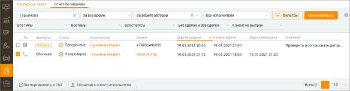

# 6.2. Отчет по задачам

> Трассировка: PDF §6.2 · сквозные стр. 205-206 · источники: ч.1 `kb/sources/mango-cc-manual/CC_manual_1.26.28.1.pdf` с.205-206.

Подраздел Отчет по задачам открывает окно отчета со строкой поиска и кнопкой Сформировать для формирования отчета:

Поиск осуществляется без учета регистра и по всем текстовым полям, доступным в отчете: тема задачи, важность, статус, автор, исполнитель, описание. Отчет показывает текущее состояние задачи на момент формирования отчета. Для построения отчета установите параметры фильтрации (основные и дополнительные), нажимая кнопку Применить в выпадающем окне каждого фильтра. • Основные параметры фильтрации: Период, Автор, Исполнитель.

• Дополнительные параметры фильтрации (открываются кликом по кнопке Фильтры): Тип, Тема задачи, Статус задачи, Наличие/отсутствие сделок, Клиент. Пользователь имеет возможность, массово перенести незавершенные задачи с одного исполнителя на другого. Для этого необходимо отметить чекбоксы выбранных задач и нажать кнопку "Назначить нового исполнителя". В открывшемся окне выберите нового исполнителя и сохраните изменения кнопкой "Назначить". Если после переноса у нового исполнителя будет более 10 задач, об этом системное сообщение уведомит предварительно. Вы можете самостоятельно выбрать, какие столбцы будут отображаться на панели. Для этого

щелкните левой кнопкой мыши по пиктограмме и установите/снимите флаги напротив наименований столбцов. Клик по кнопке Экспортировать в CSV приводит к открытию стандартного окна экспорта данных. Экспорт производится с учетом выбранных в фильтрах значений.
