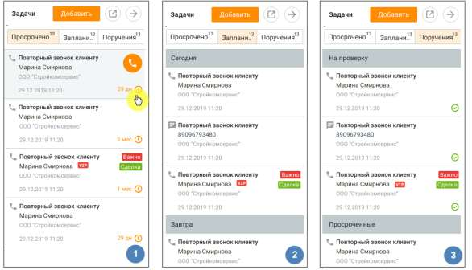

# 6.3. Список задач в верхней панели

> Трассировка: PDF §6.3 · сквозные стр. 206-208 · источники: ч.1 `kb/sources/mango-cc-manual/CC_manual_1.26.28.1.pdf` с.206-208.

Для просмотра списка задач из верхней панели нажмите . В правой части рабочей области отразится список задач, разделенный по трем вкладкам: 1. Просрочено – для авторов и исполнителей задач; 2. Запланировано – для авторов и исполнителей задач; 3. Поручения - отображается только для авторов задач. Вкладка "3.Поручения" не отображается, если у пользователя нет права постановки задач на других пользователей. Если на продукте включена услуга "Скрытие номера клиента", номер может быть недоступен для просмотра и редактирования. Узнать больше здесь.

Кнопки для открепления и закрепления блока задач. Окно с открепленным блоком может быть расположено в любом месте рабочего стола, и отображается поверх всех окон.

Клик по кнопке приводит к скрытию блока. Если в контактных данных клиента указан мобильный телефон, при наведении курсора на поле задачи доступны быстрые действия:

• для задач типа "написать" клик по пиктограмме открывает окно создания СМС- сообщения;

• для задач типа "позвонить" клик по пиктограмме инициирует исходящий вызов. Пользователь может позвонить на указанный в задаче номер: • из карточки клиента; • из карточки сотрудника; • из карточки сделки; • из уведомлений; • из списка задач в панели задач; • из списка задач выбранной сделки; • из быстрой карточки в разделе "Мои обращения". Просроченные задачи В списке Просрочено отображаются просроченные задачи, где исполнитель – текущий пользователь. При наличии просроченных задач иконка модуля задач и вкладка "просроченные" помечаются красным маркером. При входе в Контакт-центр MANGO OFFICE пользователю отображаются уведомление о наличии просроченных задач.

Для каждой задачи из списка указывается следующая информация: • Пиктограмма, обозначающая действие, которое необходимо выполнить в рамках задачи: позвонить, написать, встретиться, сделать; • Дата и время выполнения задачи; • Краткое описание задачи; • ФИО клиента. • Наименование сделки При щелчке по задаче выполняется переход к карточке задачи в режиме просмотра. Запланированные задачи В списке Запланировано отображаются запланированные задачи, где исполнитель – текущий пользователь. Для каждой задачи из списка планируемых указывается та же информация, что и для просроченных задач. При наступлении времени выполнения задачи на экране отображается соответствующее уведомление и раздается звуковой сигнал. При этом инициация целевого действия (позвонить, написать) доступна из уведомления.

При щелчке по задаче на экране отображается карточка задачи в режиме редактирования. Поручения В списке Поручения отображаются задачи, где текущий пользователь является автором, но не является исполнителем. Список состоит из трех частей:

• На проверку – для задач в статусе Завершена, просроченных или запланированных.

• Просроченные – для просроченных незавершенных задач;

• Планируются - для запланированных незавершенных задач.
