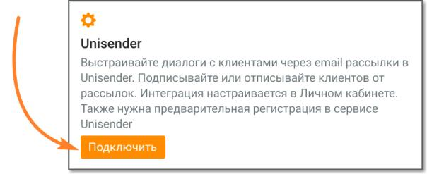
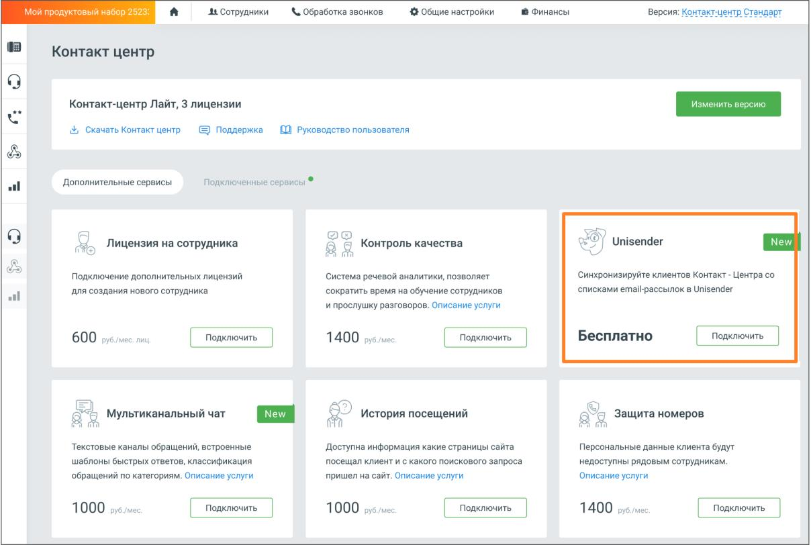
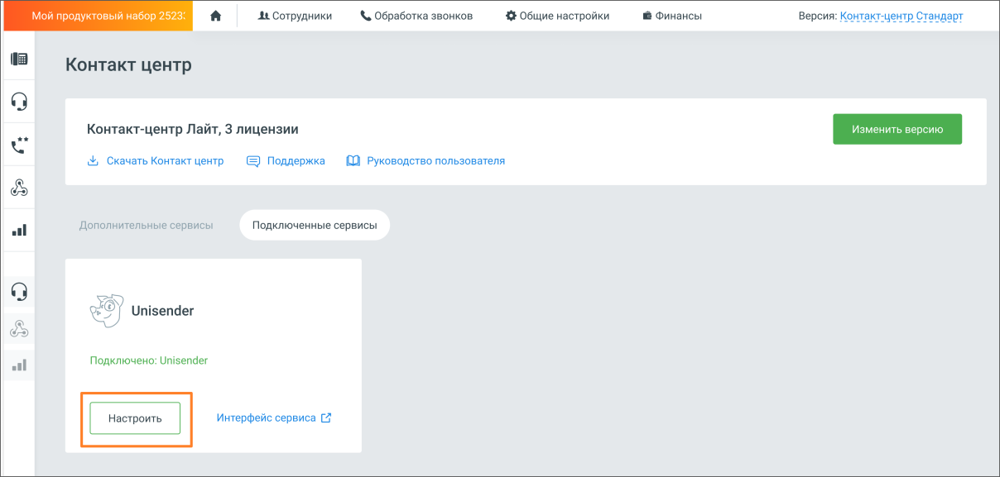

# 2.5.1.3.20.3. Unisender

> Трассировка: PDF §2.5.1.3.20.3 · сквозные стр. 92-94 · источники: ч.1 `kb/sources/mango-cc-manual/CC_manual_1.26.23-part-1.pdf` с.92-94.

Интеграция Контакт-центра Mango OFFICE с сервисом рассылок Unisender позволяет настроить синхронизацию списков рассылок в Unisender и списков клиентов в Адресной книге, вносить изменения в списки рассылок на стороне Unisender из Контакт-центра.

| Для настройки интеграции необходимо иметь аккаунт в Unisender, а также роль в Контакт- |
| --- |
| центре, с правом настраивать интеграции. |

Кликните по кнопке Подключить в блоке Unisender.

Откроется окно Личного кабинета пользователя ВАТС, вкладка "Дополнительные сервисы". Найдите блок "Unisender" и нажмите кнопку Подключить. В открывшемся окне подтвердите согласие на подключение.

Далее на вкладке "Подключенные сервисы" в блоке "Unisender" необходимо произвести настройки интеграции. Нажмите кнопку Настроить.

Откроется окно основных настроек интеграции:

Окно настроек содержит следующие элементы: 1. Поле для ввода ключа доступа – ключ предоставляется на стороне Unisender. Чтобы получить ключ, пройдите по ссылке API-ключ UniSender и выполните указанные в инструкции действия. 2. Информационный блок обязательных связей – связь между указанными полями Контакт- центра и Unisender будет создана автоматически. 3. Блок дополнительной связи – открывается, если переключатель "Добавить дополнительное сопоставление полей" активен. Здесь можно настроить дополнительные связи между полями Контакт-центра и Unisender. Например, передавать в Unisender имя пользователя, для настройки персонализированного обращения в рассылке. Кнопка "Добавить связь полей" добавляет новую связку "Контакт-центр/Unisender". Сохраните внесенные изменения кликом по кнопке Применить настройки. После интеграции доступны следующие действия: • Отписать клиентов (email) – единичная и массовая отписка • Подписать клиентов (email) – единичная и массовая подписка • Создать новый список рассылки • Удалить список рассылки • Изменить наименование списка рассылки
