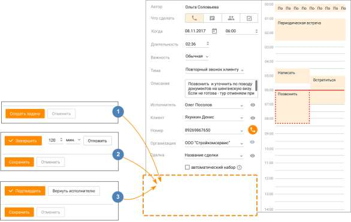

# 6.4. Создание задачи

> Трассировка: PDF §6.4 · сквозные стр. 208-210 · источники: ч.1 `kb/sources/mango-cc-manual/CC_manual_1.26.28.1.pdf` с.208-210.

Создание задач доступно пользователям, обладающим правом "Назначать задачи". Возможны как единичные, так и массовые постановки задач. При создании задачи постановщик может назначить исполнителя задачи в зависимости от права доступа: либо только себя, либо только кого-то из своей или подконтрольной группы, либо любого пользователя. Далее рассмотрим Карточку задачи в режимах: 1. Создания задачи; 2. Просмотра, редактирования и завершения (без подтверждения) задачи; 3. Подтверждения и завершения задачи.

БЛОК 1. Создание задачи Для создания единичной задачи откройте список задач и нажмите Добавить задачу. Откроется карточка создания задачи, где в поле Автор указан постановщик задачи. На карточке задачи заполните поля: • Что делать – целевое действие задачи. Доступны варианты: Позвонить, Написать, Встретиться, Сделать. • Когда – дата и время выполнения задачи. Выбранное время можно изменять вручную по линейке календаря; • Длительность – длительность задачи. Выбранную длительность можно изменять вручную на линейке календаря. После завершения указанного времени задача считается просроченной; • Важность – приоритетность задачи. Доступны варианты: важно, обычная, неважно; • Тема – выбор из списка имеющихся тем, либо создание новой темы (возможно создание не более 50-ти тем); • Описание – описание задачи, максимум 1024 символа. Поле не является обязательным к заполнению; • Исполнитель – исполнитель задачи. При наличии соответствующих прав в качестве исполнителя допускается выбор другого сотрудника; • Клиент – контакт адресной книги либо произвольный номер. Выбранный номер будет записан и в поле "Клиент", и в поле "Номер"; • Номер – номер телефона контакта (выбирается из доступных номеров телефона клиента) либо произвольный номер, указанный в строке Клиент. Если на продукте включена услуга "Скрытие номера клиента", номер может быть недоступен для просмотра и редактирования. (Узнать больше здесь). • Организация – поле автоматически заполняется информацией об организации из Карточки клиента и недоступно для редактирования; • Сделка – выбор сделки доступен после выбора клиента. При необходимости совершения автоматического дозвона клиенту в запланированное время, отметьте галочкой чекбокс "автоматический набор".

Завершите создание новой задачи кликом по кнопке Создать задачу. Исполнителю задачи отображается системное уведомление (приведены варианты для массовой и единичной постановки задач):

| Сотрудники могут отключить уведомления о назначении задач в разделе |  |  |
| --- | --- | --- |
|  | Настройки/Пользовательские. |  |

БЛОК 2. Просмотр, редактирование и завершение задачи (без подтверждения) Пользователь может отредактировать задачу, если он является ее автором и/или исполнителем. Если задача находится в статусе Подтверждена, ее просмотр или редактирование невозможно. В режиме редактирования задачи доступны следующие действия:

• Позвонить – кнопка отображается только для запланированных задач и только в случае наличия у контакта телефонного номера для вызовов и мобильного номера для сообщений; • Завершить задачу – кнопка Завершить. Если автор и исполнитель совпадают, задача завершается. Иначе – после нажатия кнопки задача ожидает подтверждения автора о завершении (см. Блок 3); • Отложить задачу на заданное время – кнопка Отложить.

Клик по пиктограмме открывает карточку Клиента, Исполнителя или Сделки.

Клик по пиктограмме приводит к удалению информации о Клиенте или Исполнителе.

Чтобы сохранить изменения не завершая задачи, закройте окно, нажав на пиктограмму . При нажатии кнопки Отложить внесенные изменения также будут сохранены, а срок выполнения задачи отложен на заданное количество времени. БЛОК 3. Подтверждение и завершение задачи Если автор и исполнитель задачи не совпадают, для завершения задачи необходимо получить подтверждение Автора. Автор может совершить следующие действия в Карточке задачи: Подтвердить – перевод задачи в статус Подтверждена и завершение задачи;
