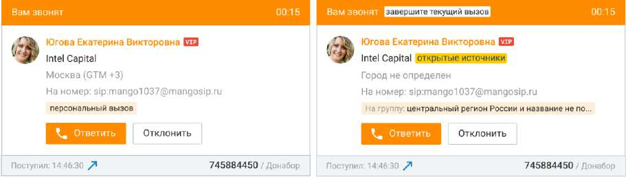

# 2.5.4. Прием и классификация входящих вызовов

При поступлении вызова на номер (средство связи), выбранный для обслуживания вызовов, на экране появляется всплывающее окно карточки входящего вызова.

В правом верхнем углу карточки входящего вызова отображается время дозвона (время, прошедшее с момента начала распределения текущего вызова на сотрудника). На самой карточке отображается: • контактная информация звонящего абонента (при ее наличии). Если контактная информация отсутствует, то отображается номер абонента.

| компания звонящего абонента. Если данные определены из открытых источников, об этом |
| --- |
| имеется пометка. |
| регион абонента или уведомление о том, что регион не определен. |

• номер, на который звонит абонент с шагами голосового меню, которые он прошел до поступления на оператора. При этом если в разделе ЛК ВАТС/Номера, подключенные к АТС поле "Комментарий" к номеру телефона или SIP-Trunk, на который пришел вызов, заполнено, то в карточке входящего вызова комментарий отображается вместо номера. • если звонок осуществляется на группу – отображается наименование группы, на которую поступил звонок; если входящий вызов поступил непосредственно на сотрудника, то отображается информация, что это персональный вызов. В нижней части указывается время поступления вызова, а также номер, на который звонил абонент с шагами голосового меню, которые он прошел до поступления на оператора. Если в Личном кабинете в блоке настроек "Номера, подключенные к АТС" для этого номера заполнено поле "Комментарий", то комментарий будет отображен вместо номера. Чтобы отклонить входящий вызов, нажмите кнопку Отклонить. Если вызов был распределен с группы, то он остается в очереди вызовов, дальнейшее его распределение осуществляется в соответствии с заданными настройками. Чтобы ответить на входящий вызов, нажмите кнопку Ответить. После этого карточка разговора переходит в состояние «Разговор».

| Если вы уже участвуете в вызове, то после ответа на новый входящий вызов предыдущий |
| --- |
| вызов устанавливается на удержание. |

Каждый поступивший вызов, номер которого был не определен или не найден в адресной книге, можно вручную привязать к новому или существующему контакту. Кроме того, вы можете отредактировать информацию о существующем контакте непосредственно из

карточки разговора. Подробное описание оперативного создания контактов приведено в этом разделе.
