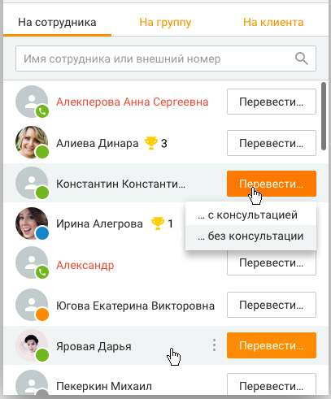
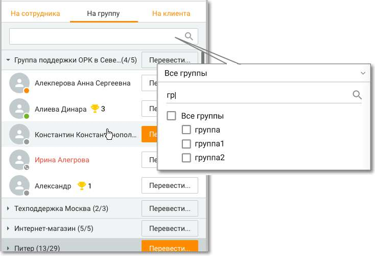
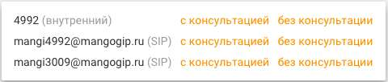

# 2.5.5. Перевод вызовов

> Трассировка: PDF §2.5.5 · сквозные стр. 102-105 · источники: ч.1 `kb/sources/mango-cc-manual/CC_manual_1.26.23_compressed.pdf` с.102-105.

С помощью карточки разговора, находящейся в состоянии «Разговор», вы можете перевести вызов на другого пользователя Контакт-центра MANGO OFFICE, номер (способ связи), контакт из адресной книги или группу операторов. В процессе перевода вы можете немедленно перевести вызов на нужного абонента (т. н. перевод «Без консультации») или предварительно переговорить с абонентом, на которого переводите вызов, чтобы сообщить ему необходимую информацию (т. н. «перевод с консультацией»). Для перевода вызова наведите курсор на имя и нажмите Перевести. При наличии

нескольких номеров нажмите на и нажмите Перевести напротив нужного номера. Укажите, необходима ли консультация Для автоматических "сотрудников-роботов" вариант перевода "с консультацией" отсутствует. Перевод вызова на сотрудника-робота может быть осуществлён только на внутренний номер робота. При выборе варианта С консультацией осуществляется дозвон на выбранный номер с целью консультации, при этом текущий вызов автоматически ставится на удержание. После завершения консультации необходимо выполнить соединение оператора с клиентом, нажав на кнопку Объединить вызовы на панели управления телефонией. Если в карточке контакта помимо основного номера имеется еще и добавочный, то при переводе с консультацией/без возможен донабор на все имеющиеся номера.

Перевод вызова может осуществляться: На сотрудника: осуществляется выбор нужного сотрудника из отсортированного по алфавиту списка. Имя сотрудника, занятого в вызове, отображается красным;

| На группу: вызов переводится на группу сотрудников. В поле поиска задается наименование |
| --- |
| или часть наименования группы, после чего в выпадающем списке отображаются группы, |
| соответствующие поисковому запросу. При раскрытии группы имена сотрудников, занятых в |
| вызовах, отображаются красным/ Напротив наименования группы указывается количество |
| свободных |

операторов;

На клиента: выберите нужный контакт, используя список контактов вашей адресной книги; На номер: вы можете переводить вызовы на телефонные номера, а также на абонентов SIP, указывая соответствующий идентификатор перед именем абонента через двоеточие без пробела. Введите номер (способ связи) и нажмите Перевести. Вы можете переводить вызовы на внешние, внутренние номера и дополнительные номера сотрудников / групп.

| Телефонные номера следует вводить в международном формате. Пример: 74952000000. |  |  |
| --- | --- | --- |
|  |  |  |
|  | Если вы хотите указать номер офисной АТС, которая поддерживает донабор в тональном |  |
|  | режиме, можно указать номер телефона вместе с добавочным местным номером. Для этого |  |
|  | добавочный номер необходимо указать сразу после основного, разделив их точкой или |  |
|  | запятой без пробелов. Пример: 74955555,253. Перед донабором добавочного номера |  |
| выдерживается пауза в 5 секунд. |  |  |

