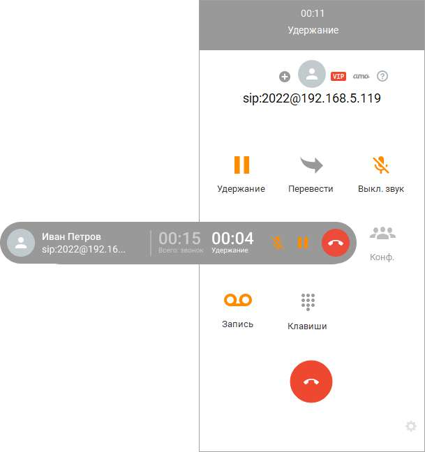
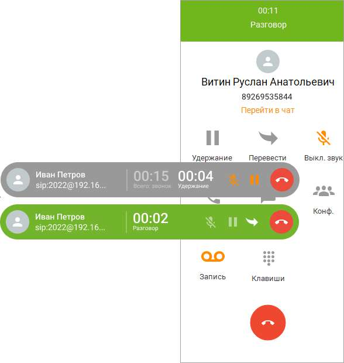

# 2.5.6. Постановка вызовов на удержание

Вы можете поставить текущий вызов в карточке разговора на удержание — например, чтобы ответить на другой входящий вызов. Затем вы можете снять вызов с удержания и продолжить разговор с абонентом.

Чтобы поставить вызов на удержание, нажмите кнопку Удержание на панели либо на соответствующем виджете. Вызов ставится на удержание, при этом заголовок панели и виджет меняют цвет. Отображается счетчик длительности удержания.

Чтобы снять вызов с удержания, нажмите кнопку Удержание еще раз.

| При постановке вызова на удержание и снятии вызова с удержания длительность вызова |
| --- |
| не обнуляется. |

При наличии двух (и более) вызовов на панели управления отображается только активный вызов, при этом второй вызов, находящийся на удержании, отображается в виде виджета. При снятии с удержания второго вызова первый автоматически переходит в режим удержания, при этом на панели отображается второй вызов.

Кроме кнопки паузы, вызов можно поставить на удержание посредством DTMF-команды. Для этого при помощи клавиатурного блока введите команду ##. Более подробное описание DTMF-команд приведено в этом разделе.

