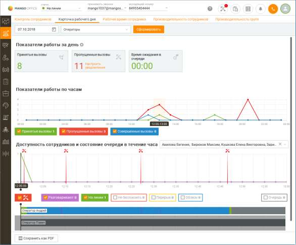
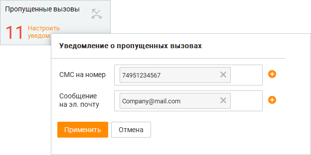

# 7.2. Карточка рабочего дня

> Трассировка: PDF §7.2 · сквозные стр. 217-220 · источники: ч.1 `kb/sources/mango-cc-manual/CC_manual_1.26.28.1.pdf` с.217-220.

Отчет "Карточка рабочего дня" позволяет получить детальную информацию о работе группы за день, а именно: • общую информацию о выбранных показателях производительности по группе за день; • графическое отображение динамики изменений основных показателей производительности (Принятые, Пропущенные, Совершенные) по группе за день; • графическое отображение данных о работе операторов в разрезе их доступности (количество звонков в очереди, доступен, занят разговором и т.д). Карточка рабочего дня содержит два графика: с общей информацией по всем сотрудникам группы и по каждому сотруднику отдельно.

| Дополнительное описание механизма данного отчета доступно на сайте компании. |  |  |
| --- | --- | --- |
|  | Работа с отчетом доступна пользователям с ролью Оператор, Супервизор и |  |
| Администратор. |  |  |

Период хранения данных на графиках – 30 календарных дней. В верхней части страницы **Карточка рабочего дня** отображается баннер с приглашением пройти опрос об удобстве использования раздела. Чтобы его скрыть, нажмите на значок закрытия.

Для получения подробной информации по работе сотрудников группы за день выполните следующие действия: 1. Выберите дату. По умолчанию выбран текущий день. 2. Выберите группу сотрудников. Для обновления информации по выбранной группе нажмите Сформировать. При изменении остальных параметров обновление карточки рабочего дня выполняется автоматически. 3. При необходимости укажите список отслеживаемых показателей производительности групп (их описание приведено здесь). Для этого в блоке "Показатели работы за день"

нажмите пиктограмму , установите флажки и выберите показатели производительности. 4. Укажите сотрудников, по которым будет сформирован отчет. Для этого используйте выпадающий список Все сотрудники в блоке "Доступность сотрудников и состояние очереди в течение часа". Максимальное число сотрудников, по которым отображаются данные, 500 человек.

В блоке "Показатели работы по часам" в виде графика приведена информация по основным показателям производительности (Принятые, Пропущенные, Совершенные). Для того, чтобы просмотреть доступность сотрудников за определенный час, щелкните левой кнопкой мыши по определенному часу. В результате информация о доступности за выбранный час будет отображена в блоке "Доступность сотрудников и состояние очереди в течение часа". Доступность сотрудников описывается показателями статусов: • Разговаривают — Количество сотрудников в статусе “На линии”, занятых разговорами; • Свободны — Количество свободных сотрудников “На линии”; • Не беспокоить — Количество сотрудников в статусе “Не беспокоить”; • Перерыв — Количество сотрудников в статусе “Перерыв”; • Очередь — Количество вызовов в очереди; • Исходящий обзвон — Количество сотрудников в статусе “Исходящий обзвон”. Вы можете скрыть/показать показатели на графиках, нажав левой кнопкой мыши по показателю. При этом блок, содержащий название показателя, меняет свой цвет, значение показателя не выводится на график. Почасовой график доступности сотрудников содержит отметки, расположенные с частотой 2

минуты 30 секунд. Пропущенные вызовы отмечаются отдельными маркерами . Если количество пропущенных вызовов превысит 5 за 5 мин, то рядом с маркером будет указано количество пропущенных вызовов за этот период. При нажатии на маркер пропущенного вызова будут помечены все сотрудники, которые хотя бы один раз пропустили данный вызов. Чтобы настроить отправку уведомлений о пропущенных вызовах, воспользуйтесь уведомлениями на панели показателей либо нажмите ссылку "Настроить уведомления" в показателе "Пропущенные вызовы". Уведомления настраиваются только для групп и подчиняются настройкам расписания, как и другие уведомления. По умолчанию в качестве электронного адреса, на который будет отправлено уведомление, указывается E-mail текущего пользователя из карточки сотрудника ЛК.

В результате на указанные номера и адреса будет отправлено сообщение вида: Пропущен звонок с номера +79265786677. Группа Отдел Продаж Новосибирск. Если номер клиента на пропущенных вызовах совпадает, то отправка сообщений осуществляется не чаще, чем один раз в 5 минут.

<!-- изображение на стр. 220: байты не извлечены (PyMuPDF недоступен) -->

Для экспорта отчета в формате PDF (Adobe Acrobat) или HTML нажмите соответствующую ссылку. После этого на экране отображается окно "Сохранить отчет". Сохраните файл отчета, используя стандартные средства операционной системы. Для того, чтобы распечатать отчет, нажмите ссылку Распечатать. После этого на экране отображается стандартное окно операционной системы, позволяющее вывести файл на печать.
