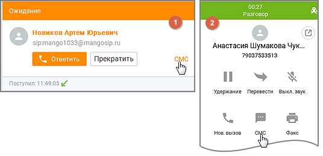
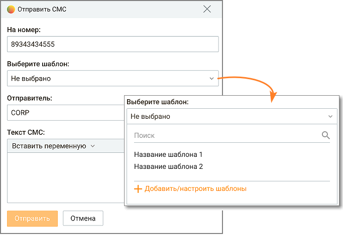
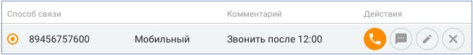
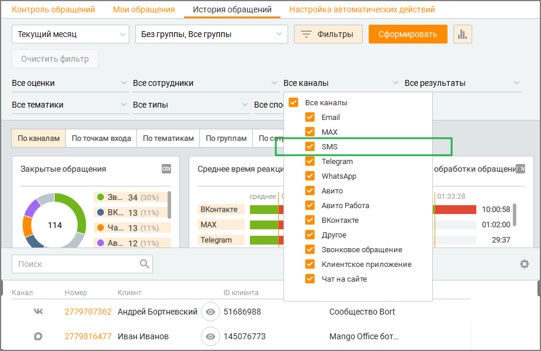

# 2.5.8. Отправка СМС

> Трассировка: PDF §2.5.8 · сквозные стр. 110-113 · источники: ч.2 `kb/sources/mango-cc-manual/CC_manual_1.26.23-part-2.pdf` с.9-12.

Отправка СМС используется для связи с клиентом: подтверждение информации, напоминание, сопровождение заявки и т.д.

| Не все сотрудники имеют право отправлять сообщения — права на отправку СМС |
| --- |
| регулируются отдельно для каждой роли в Личном кабинете ВАТС. Сотрудники без права |
| отправки СМС не видят кнопок отправки в системе. Некоторые сотрудники могут отправлять |
| только шаблонные сообщения, без возможности редактирования. |

Оператор, на которого система распределила обработку звонка в рамках кампании исходящего обзвона, может инициировать отправку СМС в адрес собеседника: • 1. До поднятия трубки собеседником – из всплывающей карточки звонка, кликом по кнопке "СМС" в правом нижнем углу окна: • 2. После поднятия трубки собеседником – из карточки вызова в правой панели в

Контакт-центре, кликом по пиктограмме .

После этого на экране отображается окно Отправить СМС.

Кнопка СМС также может быть доступна: • В карточке клиента (раздел "Контакты", "Организации") • В карточке обращения (если обращение связано с контактом или номером) • В карточке сделки

Телефонные номера следует вводить в международном формате. Пример: 74955555555. На номер – Введите номер (способ связи) и нужный текст. Максимальное количество символов – 280 при использовании символов (хотя бы одного) русской раскладки и 560 – для латинской и цифр. Отправитель – В поле "Отправитель" отображается имя, от которого будет отправлено сообщение. Выбор имени отправителя доступен при подключении услуги "Отраслевое имя отправителя СМС" или "Индивидуальное имя отправителя СМС" в Личном кабинете ВАТС. Если услуга не подключена, ее можно подключить из всплывающего при клике на пиктограмму окна.

Шаблон – Если пользователь отправляет сообщение на основе шаблона (даже если меняет в нем текст и/или переменную), отправка происходит от имени отправителя, выбранного в настройке соответствующего шаблона. Кнопка Добавить/настроить шаблоны доступна только пользователям, в роли которых прописана данная настройка. Клик по кнопке открывает форму настроек шаблонов. После ввода сообщения нажмите "Отправить". После этого Контакт-центр MANGO OFFICE регистрирует запрос на отправку СМС-сообщения.

| Если в результате подстановки переменных при отправке хотя бы одна переменная не |  |  |
| --- | --- | --- |
|  | заполнена для конкретного контакта, то отправка СМС на номер это контакта не |  |
| осуществляется. |  |  |

Для пользователя номер телефона клиента может быть скрыт настройками безопасности, тем не менее отправка смс-сообщения данному клиенту осуществляется. Вместе с отправкой СМС создается закрытое обращение со следующими атрибутами: • Имя отправителя СМС • Идентификатор сотрудника, инициировавшего отправку СМС • Получатель СМС • Текст сообщения • Дата и время инициации отправки СМС • Результат отправки СМС Закрытое СМС-обращение отображается в: • истории обращений по контакту (в карточке контакта)

• общей истории обращений (отчет История обращений)

Ограничения на отправку СМС Если у вас доступ только к шаблонным сообщениям: • Нельзя редактировать текст сообщения • Нельзя создавать или изменять шаблоны • Нельзя вставлять переменные в текст Если у вас нет прав на отправку СМС:

<!-- изображение на стр. 113: байты не извлечены (PyMuPDF недоступен) -->

• Кнопки и функция полностью скрыты Что видит руководитель Все отправленные сообщения сохраняются и доступны руководителю, включая: • Когда было отправлено • Кому • Какой текст Это помогает разбирать инциденты и контролировать расходы.
