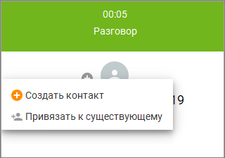

# 2.5.10. Оперативное создание контактов

> Трассировка: PDF §2.5.10 · сквозные стр. 113-114 · источники: ч.2 `kb/sources/mango-cc-manual/CC_manual_1.26.23-part-2.pdf` с.12-13.

Вы можете работать с контактами в ходе разговора.

Чтобы создать новый контакт, нажмите кнопку и выберите действие "Создать контакт":

<!-- изображение на стр. 114: байты не извлечены (PyMuPDF недоступен) -->

После этого на экране отобразится карточка нового контакта. Чтобы привязать номер к другому контакту, нажмите ссылку "Привязать к существующему". После этого на экране отображается всплывающее окно, позволяющее найти и выбрать нужный контакт. При вводе ФИО контакта работает автоподбор.
