# 7.4. Производительность сотрудников

> Трассировка: PDF §7.4 · сквозные стр. 223-235 · источники: ч.1 `kb/sources/mango-cc-manual/CC_manual_1.26.28.1.pdf` с.223-235.

Данные вкладки позволяют получать подробную статистическую информацию о показателях производительности сотрудников за выбранный отчетный период. При этом вы сами выбираете статистические показатели, по которым будет оцениваться эффективность работы сотрудников. Таким образом вы можете, например, отслеживать динамику изменения показателей отдельного сотрудника, либо сравнивать показатели двух сотрудников между собой. Функционал вкладки дает возможность анализировать звонки и текстовые обращения. • Вызовы • Текст

7.4.1. Вызовы Отчет «Вызовы» предназначен для анализа входящих и исходящих телефонных звонков, с возможностью оценки эффективности обработки вызовов, работы сотрудников и изменения ключевых показателей производительности за выбранный отчетный период.

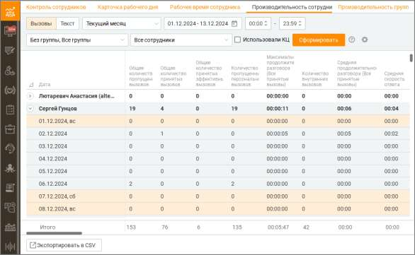

Чтобы получить отчет о показателях производительности сотрудников, вначале следует отобрать вызовы по периоду времени. Для этого выберите нужный период времени из списка Период. При выборе поля с и по, где вы можете ввести нужную дату или выбрать ее, нажав на значок календаря, период автоматически изменится на Произвольный. Вы также можете дополнительно указать время суток для полей с и по. Для этого установите соответствующие флажки и введите или укажите время. Затем вы можете выбрать группу(ы) и при необходимости сотрудника(ов), по которым необходимо получить аналитические данные. Для этого используйте раскрывающиеся списки Группы и Сотрудники.

| Если вы выбрали группу в списке Группы, то в списке Сотрудники будут доступны для |  |  |
| --- | --- | --- |
|  | выбора только сотрудники этой группы, а также вариант Все сотрудники. Если вы |  |
|  | установили флажок Без группы в списке Группы, то в списке Сотрудники будут доступны |  |
| для выбора также сотрудники, не входящие ни в одну группу. |  |  |

При необходимости вы также можете выбрать нужные столбцы отчета. Для этого нажмите на

значок . После завершения выбора критериев нажмите кнопку Сформировать. После этого создается отчет о показателях производительности сотрудников , сформированный в соответствии с критериями выбора, указанными вами выше. Отчет отображается на странице в табличном виде и включает выбранные вами столбцы.

Чтобы экспортировать отчет в формате CSV, нажмите соответствующую кнопку. После этого на экране отображается окно Сохранить отчет. Сохраните файл отчета, используя стандартные средства операционной системы. Подробнее о показателях производительности сотрудников Общее количество пропущенных вызовов Общее количество пропущенных вызовов, взятое из отчета "История вызовов" в разрезе по сотруднику, исключая внутренние вызовы (за исключением автоперезвонов и обратных звонков). Общее количество принятых эффективных вызовов Общее количество принятых вызовов длительностью более 30 секунд, взятое из отчета "История вызовов" в разрезе по сотруднику, исключая внутренние вызовы. Общее количество принятых вызовов Общее количество принятых вызовов, взятое из отчета "История вызовов" в разрезе по сотруднику, исключая внутренние вызовы. Количество принятых групповых вызовов Общее количество принятых вызовов, взятое из отчета "История вызовов" в разрезе по группе и фильтрации по сотруднику (за исключением автоперезвонов и обратных звонков). Количество пропущенных групповых вызовов Общее количество пропущенных вызовов, взятое из отчета "История вызовов" в разрезе по группе и фильтрации по сотруднику (за исключением автоперезвонов и обратных звонков). Количество принятых персональных вызовов Общее количество принятых вызовов, взятое из отчета "История вызовов" в разрезе по сотруднику (за исключением автоперезвонов и обратных звонков). Количество пропущенных персональных вызовов Общее количество пропущенных вызовов, взятое из отчета "История вызовов" в разрезе по сотруднику. Исключая внутренние вызовы. Количество совершенных вызовов Общее количество совершенных вызовов (исходящие вызовы и исходящий обзвон), взятое из отчета "История вызовов" в разрезе по сотруднику за исключением внутренних и несостоявшихся вызовов. Количество попыток дозвона Общее количество попыток дозвона, взятое из отчета "История вызовов" в разрезе по сотруднику. Источники: Исходящие вызовы (состоявшиеся и несостоявшиеся), Исходящий обзвон (состоявшиеся и несостоявшиеся), Автоперезвоны (принятые и пропущенные). Количество внутренних вызовов Общее количество внутренних вызовов, взятое из отчета "История вызовов" в разрезе по сотруднику. Средняя продолжительность разговора (Все принятые вызовы) Среднее арифметическое значение, рассчитанное на основе выборки из истории вызовов в разрезе по сотруднику с типом вызовов Принятые вызовы, исключая внутренние вызовы. Среднестатистическая продолжительность разговора (Все принятые вызовы) Медиана, рассчитанная на основе выборки из истории вызовов в разрезе по сотруднику с типом вызовов Принятые вызовы, исключая внутренние вызовы. Средняя продолжительность разговора (Групповые вызовы) Среднее арифметическое значение, рассчитанное на основе выборки из истории вызовов в разрезе по группе и фильтрации по сотруднику с типом "Принятые вызовы. Среднестатистическая продолжительность разговора (Групповые вызовы) Среднее арифметическое значение, рассчитанное на основе выборки из истории вызовов в разрезе по группе с фильтром по сотруднику и с типом вызовов Принятые вызовы. Средняя продолжительность разговора (Персональные вызовы)

Среднее арифметическое значение, рассчитанное на основе выборки, получаемой путем: общее количество принятых вызовов, взятое из отчета "История вызовов" в разрезе по сотруднику с типом "Принятые вызовы", исключая внутренние вызовы, минус общее количество принятых вызовов из отчета "История вызовов" с разрезом по группе и фильтрации по сотруднику с типом "Принятые вызовы". Среднестатистическая продолжительность разговора (Персональные вызовы) Медиана, рассчитанная на основе выборки, получаемой путем: общее количество принятых вызовов, взятое из отчета "История вызовов" в разрезе по сотруднику с типом "Принятые вызовы", исключая внутренние вызовы, минус общее количество принятых вызовов из отчета "История вызовов" с разрезом по группе и фильтрации по сотруднику с типом "Принятые вызовы". Средняя продолжительность разговора (Исходящие вызовы) Среднее арифметическое значение, рассчитанное на основе выборки из истории вызовов в разрезе по сотруднику с типом вызовов "Исходящие вызовы" и "Исходящий обзвон". Единица измерения: мм:сс. Не отображается по умолчанию в списке Текущие столбцы отчета. Среднестатистическая продолжительность разговора (Исходящие вызовы) Медиана, рассчитанная на основе выборки из "Истории вызовов" в разрезе по сотруднику с типом "Исходящие вызовы" и "Исходящий обзвон". Максимальная продолжительность разговора Максимальное значение длительности разговора по принятым вызовам, рассчитанное на основе выборки из "Истории вызовов" в разрезе по сотруднику. Исключая внутренние вызовы. Процент обслуженных групповых вызовов Процент обслуженных вызовов = Количество Принятых групповых вызовов / (Количество Принятых групповых вызовов + Количество Пропущенных групповых вызовов) (за исключением автоперезвонов и обратных звонков). Процент потерянных групповых вызовов Процент потерянных групповых вызовов = Количество Пропущенных групповых вызовов / (Количество Принятых групповых вызовов + Количество Пропущенных групповых вызовов) (за исключением автоперезвонов и обратных звонков). Количество входящих вызовов с SL 10 секунд Количество внешних вызовов, поступивших на группу и получивших там обслуживание выбранным оператором, время ожидания в очереди которых меньше заданного значения (10 секунд) за выбранный период. Количество входящих вызовов с SL 20 секунд Количество внешних вызовов, поступивших на группу и получивших там обслуживание выбранным оператором, время ожидания в очереди которых меньше заданного значения (20 секунд) за выбранный период. Количество входящих вызовов с SL 30 секунд Количество внешних вызовов, поступивших на группу и получивших там обслуживание выбранным оператором, время ожидания в очереди которых меньше заданного значения (30 секунд) за выбранный период. Уровень обслуживания SL 10 секунд Количество входящих вызовов с SL 10 секунд поделенное на Количество принятых групповых входящих вызовов по каждому выбранному сотруднику. Уровень обслуживания SL 20 секунд Количество входящих вызовов с SL 20 секунд поделенное на Количество принятых групповых входящих вызовов по каждому выбранному сотруднику. Уровень обслуживания SL 30 секунд Количество входящих вызовов с SL 30 секунд поделенное на Количество принятых групповых входящих вызовов по каждому выбранному сотруднику. Суммарное рабочее время

Суммарное время в статусах На линии, Обзвон, Не беспокоить на основе выборки из отчета "Рабочее время". Суммарное время внешних разговоров Сумма на основе выборки всех внешних разговоров (включая исходящий обзвон и обратные звонки) из истории вызовов в разрезе по сотруднику. Суммарное время внутренних разговоров Сумма на основе выборки всех разговоров из истории вызовов в разрезе по сотруднику. Уровень загруженности оператора Уровень загруженности оператора = Суммарное время внешних разговоров / Рабочее время. Суммарное время На линии Суммарное время в статусе На линии на основе выборки из отчета "Рабочее время". Суммарное время Перерыв Суммарное время в статусе Перерыв на основе выборки из отчета "Рабочее время". Суммарное время Обзвон Суммарное время в статусе Обзвон на основе выборки из отчета "Рабочее время". Суммарное время Не беспокоить Суммарное время в статусе Не беспокоить на основе выборки из отчета "Рабочее время". Суммарное время Все звонки Суммарное время в статусе Все звонки на основе выборки из отчета "Рабочее время". Суммарное время /Пользовательский статус/ Суммарное время в статусе /Пользовательский статус/ на основе выборки из отчета "Рабочее время".

Для каждого пользовательского статуса предусмотрен соответствующий показатель. Время входа в систему Значение параметра "Начало работы" из личной статистики оператора. Время выхода из системы Время (дата) последнего изменения статуса в течение суток на основе выборки из отчета "Рабочее время". Средняя скорость ответа Среднее арифметическое значение, рассчитанное на основе выборки из отчета по обслуживанию входящих вызовов с фильтрацией по сотруднику. Суммарное время совершенных вызовов Общее время совершенных вызовов из истории вызовов в разрезе по сотруднику с типом "Исходящие вызовы" и "Исходящий обзвон". Суммарное время принятых групповых вызовов Общее время принятых вызовов из истории вызовов в разрезе по группе с фильтрацией по сотруднику с типом "Входящие вызовы" и "Обратные звонки". Количество принятых обратных звонков Общее время совершенных вызовов из истории вызовов в разрезе по группе и фильтрации по сотруднику с типом "Обратные звонки". Количество пропущенных обратных звонков сотрудником Общее количество пропущенных вызовов из истории вызовов в разрезе по группе и фильтрации по сотруднику с типом "Обратные звонки". Количество пропущенных обратных звонков клиентом Общее количество пропущенных вызовов из истории вызовов в разрезе по группе и фильтрации по сотруднику с типом "Обратные звонки". Количество принятых автоперезвонов Общее количество совершенных вызовов из истории вызовов в разрезе по группе и фильтрации по сотруднику с типом "Автоперезвон – Принятые". Количество автоперезвонов, пропущенных сотрудником

Общее количество совершенных вызовов из истории вызовов в разрезе по группе и фильтрации по сотруднику с типом "Автоперезвон – Пропущенные сотрудником". Количество автоперезвонов, пропущенных клиентом Общее количество совершенных вызовов из истории вызовов в разрезе по группе и фильтрации по сотруднику с типом "Автоперезвон – Пропущенные клиентом". Средняя оценка клиента Среднее арифметическое значение по полю "Оценка клиента" по всем оцененным вызовам с участием сотрудника, в разрезе по сотруднику. Показатель доступен только при подключении в Личном кабинете ВАТС соответствующей услуги. В показателе не учитываются оценки, которые были проставлены, когда сотрудник подключался к разговору в режиме прослушивания или суфлирования. Среднее время поствызывной обработки (исходящий обзвон) Среднее арифметическое значение времени, затраченного на поствызывную обработку сотрудником по всем вызовам Исходящего обзвона. В расчет не попадают: • кампании ИО, в настройках которой не указан параметр "Поствызывная обработка"; • заказ обратного звонка; • автоперезвон. Среднее время поствызывной обработки (исходящие вызовы) Среднее арифметическое значение времени, затраченного на поствызывную обработку сотрудником исходящих вызовов. Среднее время поствызывной обработки (входящие вызовы) Среднее арифметическое значение времени, затраченного на поствызывную обработку входящих вызовов сотрудником. В расчете участвуют персональные звонки и звонки, которые были распределены на группу, в которую входит сотрудник. Суммарное время поствызывной обработки вызова Общее время, затраченное на поствызывную обработку исходящих вызовов, входящих вызовов, а также вызовов кампании ИО. Оплачиваемое время Рассчитывается как разница между временем выхода из системы и временем входа в систему. Загруженность оператора (Utilization) Рассчитывается как суммарное рабочее время сотрудника, поделенное на его оплачиваемое время. Занятость оператора (Occupancy) Рассчитывается как время обработки звонков сотрудником, поделенное на его суммарное рабочее время. Внутреннее общение в расчете показателя не учитывается. Расчет медианы В текущем и следующем разделе используется такое понятие, как медиана. В данном случае это длительность. В отличие от среднего арифметического значения, медиана рассчитывается следующим образом: • При нечетном количестве элементов набора, отсортированного по возрастанию, значением медианы является центральный элемент, например: 8 -> M = 8 1, 1, 8 -> M = 1 1, 2, 4, 4, 8 -> M = 4 • При четном количестве элементов набора, отсортированного по возрастанию, значением медианы является среднее арифметическое последнего элемента левой половины и первого элемента правой половины набора, например: 8, 12 -> M = 10 6, 8, 9, 9, 17, 17 -> M = 9 1, 6, 8, 8, 12, 12, 19, 22 -> M = 10

7.4.2. Текст Данный функционал позволяет получать расширенную аналитику по текстовым каналам. На основе предоставленных агрегированных табличных данных руководитель компании может принимать обоснованные решения, выплачивать KPI операторам и оптимизировать процессы взаимодействия с пользователями.

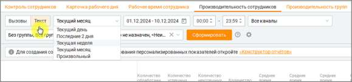

Возможности фильтрации: 1. Выбор периода – укажите конкретный период для анализа, а также временной интервал в пределах одного дня. 2. Фильтрация по каналам связи – аналитика охватывает следующие каналы: Telegram, WhatsApp, Max, Чат на сайте, Авито, Авито Работа, Email, VK, Клиентское приложение. 3. Фильтрация по группам сотрудников – выберите определенную группу сотрудников для анализа показателей внутри конкретной команды. 4. Фильтрация по сотрудникам – таблица может быть настроена для отображения данных только по конкретным сотрудникам или для всех сотрудников одновременно. 5. Выбор отображаемых показателей – в меню фильтров пользователь может выбрать, какие показатели будут отображаться в таблице.

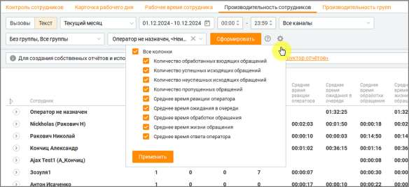

Общая структура и логика формирования отчетов В разделе «Производительность сотрудников» реализована иерархическая структура отчетов, которая позволяет пользователям глубоко анализировать данные. В системе предусмотрены три уровня детализации: 1. Первый уровень — Сотрудники.

o На этом уровне отображаются ключевые показатели для каждого сотрудника. Например, общее количество обработанных обращений, среднее время обработки и прочие метрики. 2. Второй уровень — Каналы. o Второй уровень детализации включает разбивку данных по используемым каналам связи, таким как Telegram, Max, WhatsApp, Чат на сайте и другие. Это позволяет анализировать эффективность работы сотрудника в каждом из каналов. 3. Третий уровень — Дни. o На самом детализированном уровне показатели распределяются по дням, что позволяет отслеживать изменения и выявлять тренды в производительности.

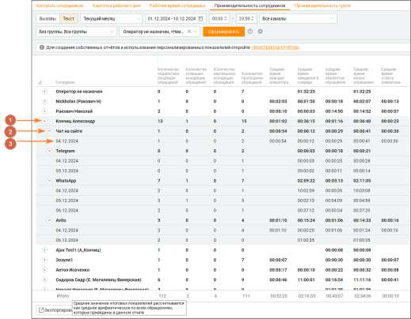

Важные особенности • Показатели рассчитываются на основе данных, имеющихся в системе, с учетом особенностей обработки каждого канала. • Система не учитывает нулевые значения, что обеспечивает точность и надежность расчетов. • При подсчете среднего времени учитываются данные всех обращений, а не только отдельные выборки. Практические рекомендации • Для анализа данных за длительный период рекомендуется использовать фильтры по каналам и сотрудникам, чтобы минимизировать объем отображаемой информации. • Для корректного расчета средних показателей рекомендуется исключать периоды с минимальной активностью или использовать только рабочие часы. Эти показатели детализируют процессы обслуживания в Контакт-центре, обеспечивая мониторинг качества работы операторов и эффективности процессов.

Параметры отчетов и расчёт показателей Для формирования отчетов используется суммарный, процентный или средний расчет показателей: • Суммарные показатели. Для подсчета общего количества каких-либо данных, система суммирует соответствующие данные за выбранный период. • Процентные показатели. Эти показатели демонстрируют долю определённых событий, относительно общего числа обработанных обращений за период. • Средние показатели. Рассчитываются путем деления суммы значений данных на количество обращений за период. Пример расчета суммарного показателя Рассчитываем показатель "Общее количество закрытых обращений". В систему поступило 3 типа обращений: обращения, закрытые вручную, закрытые по тайм- ауту и помеченные как СПАМ. 1. Закрытые вручную – 50 штук. 2. Закрытые по тайм-ауту – 30 штук. 3. СПАМ – 20 штук. Общее количество закрытых обращений: 50+30+20=100

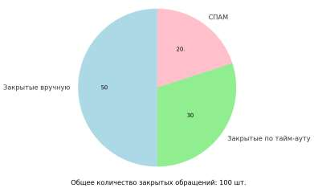

Пример расчета среднего показателя Рассчитываем показатель "Среднее время обработки чата" В чат поступило четыре обращения • Обращение 1: Этапы создания (09:00:00), распределения на группу (09:12:00), распределения на оператора (09:21:00), и закрытия (09:36:00). • Обращение 2: Этапы создания (09:00:00), распределения на группу (09:05:00), распределения на оператора (09:12:00), и закрытия (09:36:00). • Обращение 3: Этапы создания (09:20:00), распределения на группу (09:25:00), распределения на оператора (09:34:00), и закрытия (09:45:00). • Обращение 4: Поступило в (09:25:00), не обработано, автоматически закрыто в (09:55:00).

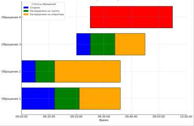

Расчет: 1. Обращение 1: o Время взятия в работу: 09:00:00 (в секундах: 9 * 3600 = 32400 секунд). o Время закрытия: 09:36:00 (в секундах: 9 * 3600 + 36 * 60 = 34560 секунд). o Разница: 34560−32400=2160 секунд. 2. Обращение 2: o Время взятия в работу: 09:00:00 (32400 секунд). o Время закрытия: 09:36:00 (34560 секунд). o Разница: 34560−32400=2160 секунд. 3. Обращение 3: o Время взятия в работу: 09:20:00 (в секундах: 9 * 3600 + 20 * 60 = 33600 секунд). o Время закрытия: 09:45:00 (в секундах: 9 * 3600 + 45 * 60 = 35100 секунд). o Разница: 35100−33600=1500 секунд. 4. Обращение 4: o Не учитывается, так как не было взято в работу. Суммарное время обработки: 2160+2160+1500=5820 секунд. Количество обращений, взятых в работу: 3. Среднее время: 5820÷3=940 секунд. Итого: Среднее время обработки чата — 32 минуты 20 секунд. Список доступных показателей и формулы расчета 1. Количество обработанных входящих обращений – это общее число закрытых и обработанных оператором обращений (шт.). Как считается: Количество обработанных входящих обращений = Обращения, закрытые вручную после ответа + Обращения, автоматически закрытые по истечении тайм-аута после ответа + Обращения, помеченные как СПАМ + Обращения, перенаправленные другому оператору и закрытые. 2. Количество успешных исходящих обращений – это количество исходящих обращений (шт.), которые были успешно доставлены клиенту. Как считается: Количество обращений со статусом "Обработано" и типом "Исходящее". 3. Количество неуспешных исходящих обращений - количество исходящих обращений (шт.), которые не удалось отправить. Как считается: Количество обращений со статусом "Запрещена отправка" и типом "Исходящее".

4. Количество пропущенных обращений – количество обращений (шт.), которые не были обработаны оператором. Как считается: Количество пропущенных обращений = Обращения, закрытые по тайм-ауту без ответа оператора + Обращения, закрытые вручную без ответа + Обращения, отправленные обратно в очередь при автоматическом распределении. 5. Среднее время реакции оператора - среднее время (мм:сс) от момента создания обращения до первого ответа оператора. Как считается:

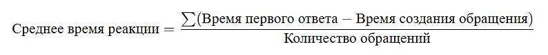

6. Среднее время ожидания в очереди - среднее время (мм:сс), в течение которого обращение находилось в очереди с момента создания до назначения на оператора. Как считается:

7. Среднее время обработки обращения – среднее время (мм:сс), затраченное оператором на обработку обращения с момента взятия в работу до его закрытия. Как считается:

8. Среднее время ответа оператора – среднее время (мм:сс) от взятия обращения в работу до первого ответа клиенту. Как считается:

9. Среднее время жизни обращения – среднее время (мм:сс) от создания обращения до его закрытия.

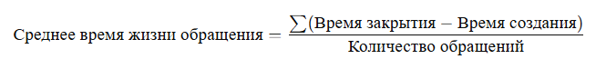

На схеме отражено время жизни обращения, от его создания до закрытия:

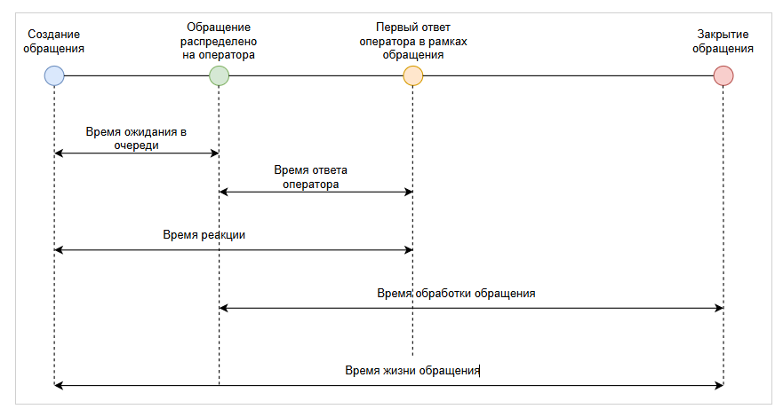

10. Уровень сервиса (SL) по времени ожидания в очереди (%) - процент входящих обращений, которые были распределены на оператора и взяты в работу в пределах установленного в Личном кабинете значения SL по времени ожидания в очереди. Учитываются обращения, распределенные как напрямую на оператора (персонально), так и через группу.

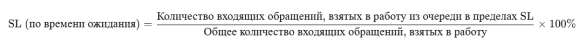

Где • SL — целевое значение времени ожидания (например, 30 секунд). • Числитель — количество входящих обращений, которые были назначены оператору в течение времени, не превышающего SL. • Знаменатель — общее количество входящих обращений, которые были взяты в работу оператором (исключаются пропущенные .и нераспределенные). 11. Уровень сервиса (SL) по времени первого ответа (%) - процент входящих обращений, на которые оператор дал первый ответ в пределах установленного в личном кабинете значения SL по времени ответа. Учитываются обращения, распределенные как персонально, так и через группу, при условии, что они были взяты в работу конкретным сотрудником

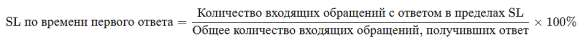

12. Уровень сервиса (SL) по времени реакции оператора (%) - процент входящих обращений, на которые оператор дал первый ответ в пределах установленного в личном кабинете значения SL, отсчитываемого с момента поступления обращения в систему. Учитываются обращения, распределенные на конкретного сотрудника — как напрямую (персонально), так и через группу.

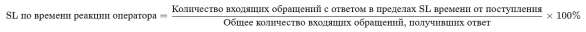

| Для показателей 10-12 в расчёт включаются только входящие обращения, получившие |
| --- |
| первый ответ от оператора. Пропущенные и необработанные обращения не учитываются. |

