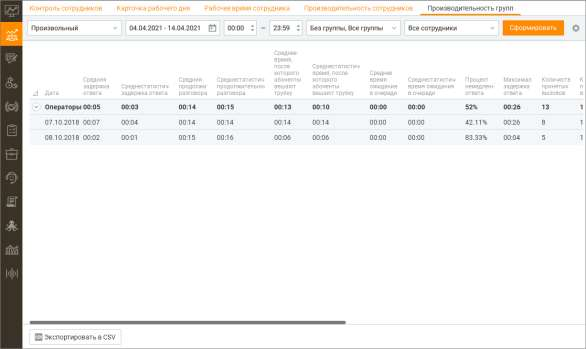
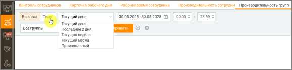
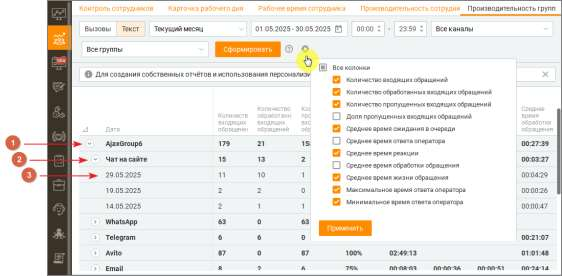

# 7.5. Производительность групп

> Трассировка: PDF §7.5 · сквозные стр. 235-242 · источники: ч.1 `kb/sources/mango-cc-manual/CC_manual_1.26.28.1.pdf` с.235-242.

Этот отчет позволяет получать подробную статистическую информацию о показателях производительности групп сотрудников за выбранный отчетный период. При этом вы сами выбираете статистические показатели, по которым будет оцениваться эффективность работы групп сотрудников. Таким образом, вы можете, например, отслеживать динамику изменения показателей отдельной группы, либо сравнивать показатели двух групп между собой. Функционал вкладки дает возможность анализировать звонки и текстовые обращения. • Вызовы • Текст 7.5.1. Вызовы Отчёт «Вызовы» предназначен для анализа входящих и исходящих телефонных звонков. Он позволяет оценить эффективность обработки вызовов, работу групп сотрудников, а также отслеживать динамику ключевых показателей производительности групп за выбранный период.

Чтобы получить отчет о показателях производительности групп, вначале следует отобрать вызовы по периоду времени. Для этого выберите нужный период времени из списка Период. При выборе поля с и по, где вы можете ввести нужную дату или выбрать ее, нажав на значок календаря, период автоматически изменится на Произвольный. Вы также можете дополнительно указать время суток для полей с и по. Для этого установите соответствующие флажки и введите или укажите время. Затем вы можете выбрать группу(ы) для получения аналитические данные. Для этого используйте раскрывающийся список Группы.

При необходимости вы также можете выбрать нужные столбцы отчета. Для этого нажмите на

значок и выберите необходимые столбцы. После завершения выбора критериев нажмите кнопку Сформировать. После этого создается отчет о показателях производительности групп сотрудников, сформированный в соответствии с критериями выбора, указанными вами выше. Отчет отображается на странице в табличном виде и включает выбранные вами столбцы. Чтобы экспортировать отчет в формате CSV, нажмите соответствующую кнопку. После этого на экране отображается окно Сохранить отчет. Сохраните файл отчета, используя стандартные средства операционной системы. Подробнее о показателях производительности групп сотрудников Средняя задержка ответа Среднее арифметическое значение, рассчитанное на основе выборки из отчета Обслуживание входящих вызовов, показатель Общее время ожидания. Единица измерения: мм:сс. Не отображается по умолчанию в списке Текущие столбцы отчета. Среднестатистическая задержка ответа Медиана, рассчитанная на основе выборки из отчета Обслуживание входящих вызовов, показатель Общее время ожидания. Единица измерения: мм:сс. Отображается по умолчанию в списке Текущие столбцы отчета. Средняя продолжительность разговора Среднее арифметическое значение, рассчитанное на основе выборки из отчета Обслуживание входящих вызовов, показатель Время разговора. Единица измерения: мм:сс. Не отображается по умолчанию в списке Текущие столбцы отчета. Среднестатистическая продолжительность разговора Медиана, рассчитанная на основе выборки из отчета Обслуживание входящих вызовов, показатель Время разговора. Единица измерения: мм:сс. Отображается по умолчанию в списке Текущие столбцы отчета. Среднее время, после которого абоненты вешают трубку Среднее арифметическое значение, рассчитанное на основе выборки из отчета Обслуживание входящих вызовов, показатель Время ожидания вызова в очереди. Единица измерения: мм:сс. Не отображается по умолчанию в списке Текущие столбцы отчета. Среднестатистическое время, после которого абоненты вешают трубку ) Медиана, рассчитанная на основе выборки из отчета Обслуживание входящих вызовов, показатель Время ожидания вызова в очереди. Единица измерения: мм:сс. Отображается по умолчанию в списке Текущие столбцы отчета. Среднее время ожидания в очереди Среднее арифметическое значение, рассчитанное на основе выборки из отчета Обслуживание входящих вызовов, показатель Время ожидания вызова в очереди. Единица измерения: мм:сс. Не отображается по умолчанию в списке Текущие столбцы отчета. Среднестатистическое время ожидания в очереди Медиана, рассчитанная на основе выборки из отчета Обслуживание входящих вызовов, показатель Время ожидания вызова в очереди. Единица измерения: мм:сс. Отображается по умолчанию в списке Текущие столбцы отчета. Суммарное время входящих разговоров Суммарное время групповых внешних входящих разговоров на выбранную группу за выбранный период. Количество принятых вызовов Количество входящих принятых вызовов, рассчитанное на основе выборки из отчета Обслуживание входящих вызовов, показатель Количество вызовов. Единица измерения: шт. Отображается по умолчанию в списке Текущие столбцы отчета. Общее количество принятых эффективных вызовов

Количество принятых групповых вызовов длительностью больше 30 секунд, на основе выборки из отчета "История вызовов" в разрезе по сотруднику. (Внутренние вызовы исключаются). Общее количество принятых персональных вызовов Количество принятых персональных вызовов всех сотрудников группы, на основе выборки из отчета "История вызовов" в разрезе по сотруднику. (Внутренние вызовы исключаются). Общее количество пропущенных персональных вызовов Количество пропущенных персональных вызовов всех сотрудников группы, на основе выборки из отчета "История вызовов" в разрезе по сотруднику. (Внутренние вызовы исключаются). Количество пропущенных вызовов Количество входящих пропущенных вызовов, рассчитанное на основе выборки из отчета Обслуживание входящих вызовов, показатель Количество вызовов. Единица измерения: шт. Отображается по умолчанию в списке Текущие столбцы отчета. Если вызов завершается во время проигрывания служебных сообщений (приветствия и т.д.), он считается пропущенным. Количество поступивших вызовов Количество входящих вызовов, рассчитанное на основе выборки из отчета Обслуживание входящих вызовов, показатель Количество вызовов. Единица измерения: шт. Не отображается по умолчанию в списке Текущие столбцы отчета. Количество вызовов, получивших немедленный ответ Количество входящих вызовов с показателем Время ожидания вызова в очереди = 0, рассчитанное на основе выборки из отчета Обслуживание входящих вызовов, показатель Количество вызовов. Единица измерения: шт. Не отображается по умолчанию в списке Текущие столбцы отчета. Процент обслуженных вызовов Процент обслуженных вызовов = Количество принятых вызовов / Количество поступивших вызовов. Единица измерения: %. Не отображается по умолчанию в списке Текущие столбцы отчета. Процент пропущенных вызовов Процент пропущенных вызовов = Количество пропущенных вызовов / Количество поступивших вызовов. Единица измерения: %. Отображается по умолчанию в списке Текущие столбцы отчета. Процент немедленного ответа Процент немедленного ответа = Количество вызовов, получивших немедленный ответ / Количество поступивших вызовов. Единица измерения: %. Отображается по умолчанию в списке Текущие столбцы отчета. Максимальная задержка ответа Максимальное значение показателя Общее время ожидания для входящих принятых вызовов на основе выборки из отчета Обслуживание входящих вызовов. Единица измерения: мм:сс. Не отображается по умолчанию в списке Текущие столбцы отчета. Максимальная продолжительность разговора Максимальная продолжительность разговора среди показателей групп, попавших в отчет на основе выборки из отчета "История вызовов" в разрезе по сотруднику. Внутренние вызовы исключаются. Процент первичных вызовов Процент первичных вызовов = Количество вызовов Найденных в адресной книге / Количество вызовов. Из отчета Обслуживание входящих вызовов. Единица измерения: %. Отображается по умолчанию в списке Текущие столбцы отчета. Процент обслуженных первичных вызовов Процент обслуженных первичных вызовов = Количество принятых вызовов Найденных в адресной книге / Количество вызовов Найденных в адресной книге. Из отчета Обслуживание

входящих вызовов. Единица измерения: %. Отображается по умолчанию в списке Текущие столбцы отчета. Количество совершенных вызовов Общее количество исходящих вызовов из истории вызовов в разрезе по сотрудникам группы с типом "Исходящие вызовы" и "Исходящий обзвон", за исключением внутренних и несостоявшихся вызовов. Количество попыток дозвона Общее количество попыток дозвона, взятое из отчета "История вызовов" в разрезе по сотруднику группы. Источники: Исходящие вызовы (состоявшиеся и несостоявшиеся), Исходящий обзвон (состоявшиеся и несостоявшиеся), Автоперезвоны (принятые и пропущенные). Количество входящих вызовов с SL 10 секунд Количество внешних вызовов, поступивших на группу и получивших там обслуживание, время ожидания в очереди которых меньше заданного значения (10 секунд) за выбранный период. Количество входящих вызовов с SL 20 секунд Количество внешних вызовов, поступивших на группу и получивших там обслуживание, время ожидания в очереди которых меньше заданного значения (20 секунд) за выбранный период. Количество входящих вызовов с SL 30 секунд Количество внешних вызовов, поступивших на группу и получивших там обслуживание, время ожидания в очереди которых меньше заданного значения (30 секунд) за выбранный период. Уровень обслуживания SL 10 секунд Количество входящих вызовов с SL 10 секунд поделенное на Количество принятых групповых входящих вызовов по каждой группе. Уровень обслуживания SL 20 секунд Количество входящих вызовов с SL 20 секунд поделенное на Количество принятых групповых входящих вызовов по каждой группе. Уровень обслуживания SL 30 секунд Количество входящих вызовов с SL 30 секунд поделенное на Количество принятых групповых входящих вызовов по каждой группе. Количество принятых обратных звонков Общее количество принятых обратных звонков из истории вызовов в разрезе по группе с фильтрацией по сотруднику. Количество обратных звонков, пропущенных сотрудником Общее количество обратных звонков, пропущенных сотрудником, из истории вызовов в разрезе по группе с фильтрацией по сотруднику. Количество обратных звонков, пропущенных клиентом Общее количество обратных звонков, пропущенных клиентом, из истории вызовов в разрезе по группе с фильтрацией по сотруднику. Количество принятых автоперезвонов Общее время совершенных вызовов из истории вызовов в разрезе по группе и фильтрации по сотруднику с типом "Автоперезвон – Принятые". Количество автоперезвонов, пропущенных сотрудником Общее время совершенных вызовов из истории вызовов в разрезе по группе и фильтрации по сотруднику с типом "Автоперезвон – Пропущенные сотрудником". Количество автоперезвонов, пропущенных клиентом Общее время совершенных вызовов из истории вызовов в разрезе по группе и фильтрации по сотруднику с типом "Автоперезвон – Пропущенные клиентом". Средняя оценка клиента

Среднее арифметическое значение по полю "Оценка клиента" по всем оцененным вызовам с участием сотрудников группы. Показатель доступен только при подключении в Личном кабинете ВАТС соответствующей услуги. Среднее время поствызывной обработки (исходящий обзвон) Среднее арифметическое значение времени, затраченного на поствызывную обработку всех вызовов группы в рамках исходящей кампании. Среднее время поствызывной обработки (исходящие вызовы) Среднее арифметическое значение времени, затраченного на поствызывную обработку всех исходящих вызовов группы. Среднее время поствызывной обработки (входящие вызовы) Среднее арифметическое значение времени, затраченного на поствызывную обработку всех входящих вызовов группы. Загруженность операторов (Utilization) Общее суммарное рабочее время всех сотрудников группы, поделенное на общее оплачиваемое время всех сотрудников группы. Средний процент занятости операторов группы (Occupancy) Общее время, затраченное на обработку звонков всех сотрудников группы, поделенное на общее суммарное рабочее время всех сотрудников группы. Внутреннее общение в расчете показателя не учитывается. 7.5.2. Текст Отчёт «Текст» предназначен для анализа входящих и исходящих текстовых сообщений. Он позволяет получать наглядную аналитику по текстовым каналам в отчёте ППГ с разбивкой по группам сотрудников. Это дает возможность отслеживать выполнение SLA, выявлять пропущенные диалоги и оценивать эффективность работы команд. Агрегированные табличные данные помогут быстро понять ситуацию и использовать полученную информацию для принятия решений и улучшения рабочих процессов.

Возможности фильтрации: 1. Выбор периода — задайте интересующий период для анализа, включая точные временные рамки в пределах одного дня. 2. Фильтрация по каналам связи — анализ охватывает такие каналы, как Telegram, WhatsApp, онлайн-чат, Авито, Авито Работа, Email, , Max, VK и Клиентское приложение. 3. Фильтрация по группам сотрудников — позволяет ограничить данные анализом внутри конкретной команды или отдела. 4. Фильтрация по сотрудникам — можно отобразить данные как по отдельным сотрудникам, так и по всему коллективу. 5. Выбор отображаемых показателей — через меню фильтров можно указать, какие метрики будут представлены в таблице.

Общая структура и логика формирования отчетов На вкладке Производительность групп ➔ Текст реализована иерархическая структура отчетов, которая позволяет пользователям глубоко анализировать данные. В системе предусмотрены три уровня детализации: 1. Первый уровень — Группы. o На этом уровне пользователь видит ключевые метрики по каждой группе: общее количество обращений, среднее время реакции и другие показатели, отражающие эффективность работы группы в целом. 2. Второй уровень — Каналы. o Информация детализируется по каналам связи (Telegram, WhatsApp, чат на сайте и др.), что позволяет сравнивать, как группа справляется с обращениями в разных средах коммуникации. 3. Третий уровень — Дни. o Данные разбиваются по дням, что даёт возможность отслеживать динамику показателей, выявлять пики, падения и тренды в производительности. Важные особенности • Все показатели рассчитываются на основе актуальных данных системы с учётом специфики каждого канала коммуникации. • При расчётах игнорируются нулевые значения, что повышает точность и достоверность результатов. • Средние значения формируются на основе всех обращений, а не отдельных выборок. Практические рекомендации • Для анализа за длительные периоды рекомендуется использовать фильтры по каналам связи и группам, чтобы сократить объём выводимых данных и повысить наглядность. • Для получения корректных средних значений желательно исключать периоды низкой активности или ограничивать расчёты только рабочими часами. Эти показатели помогают глубже понять процессы обслуживания в Контакт-центре, способствуя эффективному контролю качества работы операторов и оптимизации внутренних процессов.

Список доступных показателей и формулы расчета 1. Количество входящих обращений — общее количество входящих обращений, поступивших на группу. Как считается: Количество обращений с типом "Входящее", направленных на группу. 2. Количество обработанных входящих обращений — число входящих обращений, которые были обработаны и закрыты операторами группы. Как считается: Количество входящих обращений, закрытых при выполнении одного из условий: • оператор ответил и нажал «Закрыть» или «Перевести и закрыть»; • оператор перевёл обращение без ответа; • обращение закрыто по тайм-ауту после ответа оператора. Также учитываются обращения, помеченные как СПАМ. 3. Количество пропущенных входящих обращений — входящие обращения, на которые не был дан ответ в установленное время. Как считается: Обращение считается пропущенным, если: • закрыто по тайм-ауту без ответа; • оператор взял обращение, но не ответил и закрыл его; • оператор не ответил вовремя, и обращение ушло в общую очередь (автораспределение). 4. Доля пропущенных входящих обращений — процент входящих обращений, на которые не был дан ответ. Как считается: (Количество пропущенных входящих обращений / Количество входящих обращений) × 100 % 5. Количество успешных исходящих обращений — число исходящих сообщений, успешно доставленных клиенту. Как считается: Количество обращений с типом «Исходящее» и статусом «Обработано». 6. Количество неуспешных исходящих обращений — число исходящих сообщений, по которым отправка была заблокирована или не разрешена. Как считается: Количество обращений с типом «Исходящее» и статусом «Отправка запрещена» или аналогичным. 7. Среднее время ожидания в очереди — среднее время, которое обращение провело в очереди до назначения оператору. Как считается: Среднее значение по всем входящим обращениям (Время назначения минус Время поступления). Измеряется в мм:сс. 8. Среднее время ответа оператора — среднее время от момента взятия обращения в работу до отправки первого ответа оператором. Как считается: Среднее значение (Время первого ответа минус Время взятия в работу). Измеряется в мм:сс. 9. Среднее время реакции — среднее время от поступления обращения до первого ответа оператора. Как считается: Среднее время ожидания в очереди плюс Среднее время ответа оператора. Измеряется в мм:сс. 10. Среднее время обработки обращения — среднее время от взятия обращения в работу до его закрытия. Как считается: Среднее значение (Время закрытия минус Время взятия в работу). Измеряется в мм:сс. 11. Среднее время жизни обращения — общее среднее время обращения от поступления до закрытия. Как считается: Среднее время ожидания в очереди плюс Среднее время обработки обращения (для входящих). Измеряется в мм:сс. 12. Максимальное время ответа оператора — наибольшее время, затраченное оператором на первый ответ после взятия обращения.

Как считается: Максимум из (Время первого ответа минус Время взятия в работу). Измеряется в мм:сс. 13. Минимальное время ответа оператора — наименьшее время, затраченное оператором на первый ответ после взятия обращения. Как считается: Минимум из (Время первого ответа минус Время взятия в работу). Измеряется в мм:сс. 14. Уровень сервиса (SL) по времени ожидания в очереди (%) — процент групповых обращений, распределённых или переведённых на конкретную группу, которые были взяты в работу в пределах установленного в личном кабинете значения SL по времени ожидания в очереди. Как считается: Количество групповых обращений, взятых в работу в пределах SL по времени ожидания / общее количество групповых обращений, взятых в работу × 100%. 15. Уровень сервиса (SL) по времени первого ответа (%) — процент групповых обращений, распределённых или переведённых на конкретную группу, на которые оператор дал первый ответ в пределах установленного в личном кабинете значения SL по времени ответа. Как считается: Количество групповых обращений с первым ответом оператора в пределах SL / общее количество групповых обращений, получивших ответ × 100%. 16. Уровень сервиса (SL) по времени реакции оператора (%) — процент групповых обращений, распределённых или переведённых на конкретную группу, на которые оператор дал первый ответ в пределах установленного в личном кабинете значения SL, отсчитываемого с момента поступления обращения. Как считается: Количество групповых обращений с реакцией оператора в пределах SL (от момента поступления) / общее количество групповых обращений, получивших ответ × 100%. Расчет количественных и временных показателей аналогичен примерам на вкладке Производительность сотрудников ➔ Текст
