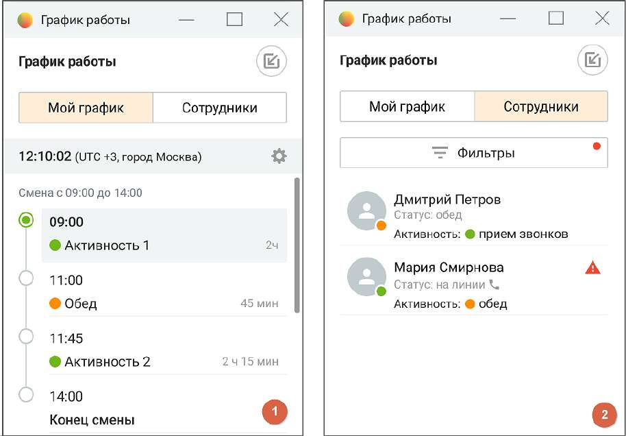

# 2.6. Панель графика работы

Панель графика работы предоставляет информацию о текущем статусе и активности сотрудников, а также обеспечивает возможность контроля за соблюдением рабочего графика.

Панель доступна в двух режимах: Мой график (для оператора) и Сотрудники (для руководителя). Оба режима позволяют получать информацию в реальном времени и оперативно реагировать на отклонения от графика.

Описание функциональных возможностей: 1. Мой график: o Отображает текущее время и часовой пояс. o Отображает текущее расписание: активные статусы, перерывы. o Предоставляет уведомления о статусах и предстоящих событиях. o Показывает таймер до начала следующей активности.

o Информирует об отклонениях от расписания (например, пропущенные звонки, нарушения графика). o Позволяет выбрать часовой пояс для корректного отображения времени. o Позволяет фильтровать активности по типам. o Отображается поверх всех окон для упрощения работы в режиме линии. 2. Сотрудники: o Отображает список сотрудников с указанием текущего статуса и активности. o Предоставляет информацию о нарушениях: пропущенные звонки, опоздания, несоблюдение графика. o Фильтры для отображения сотрудников по статусам, группам и активностям. o Предоставляет данные о текущей занятости сотрудников и их доступности. o Уведомляет о нарушениях по каждому сотруднику в режиме реального времени. Элементы панели:

• Пиктограмма настройки часового пояса — элемент для настройки отображения времени в соответствии с рабочим регионом. • Текущая активность — индикатор активности сотрудника, где: o Зелёный цвет — активный статус, o Оранжевый — перерыв, o Красный — наличие нарушений. • Фильтры — позволяют настроить отображение сотрудников по различным критериям: статус, тип активности, наличие нарушений. • Иконки нарушений — отображают наличие нарушений (например, пропущенные звонки, отклонение от графика) с помощью значков предупреждения. Примеры использования: • Оператор использует панель для получения актуальной информации о графике и статусах, а также для получения уведомлений о предстоящих активностях. Возможность выбора часового пояса помогает операторам, работающим в разных регионах. • Руководитель контролирует выполнение графика сотрудниками, отслеживает нарушения, и может своевременно корректировать работу, назначая задачи или перераспределяя нагрузку среди сотрудников.
