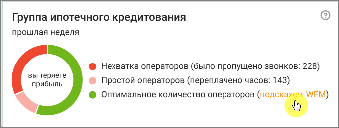
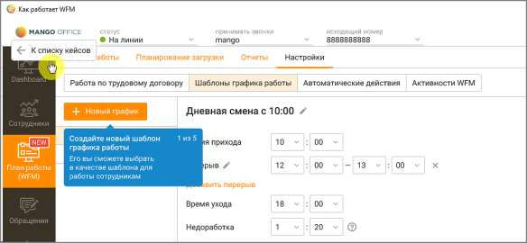

# 8. План работы (WFM)

> Трассировка: PDF §8 · сквозные стр. 245-246 · источники: ч.1 `kb/sources/mango-cc-manual/CC_manual_1.26.28.1.pdf` с.245-246.

План работы (WFM) подключается в Личном кабинете пользователя ВАТС, в разделе "Контакт-центр" → "Дополнительные сервисы".

| Модуль "WFM" отображается, если он подключен в Личном кабинете ВАТС, и у |  |  |  |  |  |  |  |  |  |  |
| --- | --- | --- | --- | --- | --- | --- | --- | --- | --- | --- |
|  | пользователя Контакт-центра имеются соответствующие права. Настройка прав |  |  |  |  |  |  |  |  |  |
|  | осуществляется в ЛК ВАТС, в разделе Безопасность и ограничения |  |  |  |  |  |  | → | Настройка доступа |  |
| → |  | (Выбрать роль) | → | Инструменты | → | WFM. |  |  |  |  |

Модуль План работы (WFM) позволяет вести графики рабочего времени сотрудников, осуществлять контроль за сотрудниками в реальном времени, планировать загрузку сотрудников и распределение их работы в течение рабочего дня, уведомлять сотрудников о нарушении графиков. Отчеты и настройки вкладки: • График работы • Планирование входящих • Отчеты • Обмен сменами • Настройки

| Если услуга "Планирование работы (WFM)" не подключена, Администратор и |  |  |
| --- | --- | --- |
|  | Руководитель компании, а также пользователь c ролью "Супервизор" могут ознакомиться с |  |
| функционалом, пройдя по информационной ссылке. |  |  |

Онбординг позволяет пользователю быстро адаптировать функционал вкладки под свои потребности.

Возврат к разделам Онбординга происходит по нажатию кнопки "К списку кейсов"

<!-- изображение на стр. 246: байты не извлечены (PyMuPDF недоступен) -->
