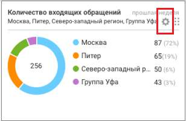
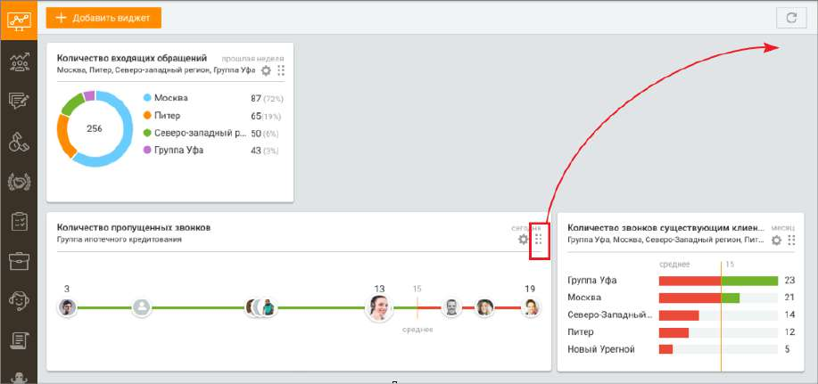

# 3.2. Редактирование виджета

Пользователь может отредактировать (изменить настройки) любого виджета ранее добавленного на Dashboard.

Чтобы отредактировать виджет, нажмите пиктограмму в правом верхнем углу окна виджета.

После редактирования настроек нажмите кнопку Применить Пользователь может изменить расположение выбранного виджета относительно других

виджетов путем перемещения. Для этого зафиксируйте курсор на пиктограмме в правом верхнем углу окна виджета и перемещайте виджет на свободное поле вкладки Dashboard.

<!-- изображение на стр. 127: байты не извлечены (PyMuPDF недоступен) -->
