# 8.5. Настройки

> Трассировка: PDF §8.5 · сквозные стр. 266-277 · источники: ч.1 `kb/sources/mango-cc-manual/CC_manual_1.26.28.1.pdf` с.266-277.

Вкладка Настройки содержит шесть информационных блоков.

| Блоки отображаются только для пользовательских ролей Администратор и Руководитель |
| --- |
| компании при подключенной в ЛК ВАТС услуге "Планирование работы (WFM)". |

• Работа по трудовому договору • Шаблоны графика работы • Автоматические действия • Уровень сервиса • Активности WFM • Производственный календарь Работа по трудовому договору В блоке "Работа по трудовому договору" руководитель имеет возможность задать типовой и пользовательский варианты графика работы сотрудников по Трудовому договору. Таким образом благодаря подсказкам программы по правильному заполнению рабочего времени у сотрудников руководители будут затрачивать меньше времени на подготовку расписания. Вертикальное меню блока содержит список договоров, системную строку "Не задано" и кнопку +Работа по ТД. Клик по кнопке создает новый шаблон трудового договора. 1. Строка "Не задано" содержит список сотрудников, которым не задано рабочее время ни по одному из созданных руководителем шаблонов Трудовых договоров.

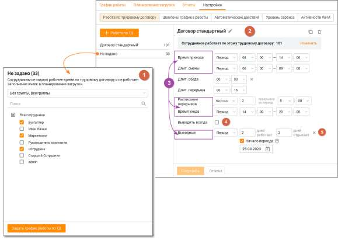

2. Чтобы изменить имя трудового договора в шаблоне нажмите пиктограмму "карандаш" возле наименования договора, внесите и сохраните внесенные изменения. 3. Строки шаблона могут содержать варианты: фиксированное время, временной период и количество (для перерывов). Функционал настройки количества перерывов позволяет руководителю задать одинаковое количество перерывов для всех сотрудников, работающих по одному трудовому договору. 4. Чекбокс "Выводить всегда". Эта настройка предназначена для обеспечения постоянной занятости сотрудников, независимо от текущих потребностей. Если чекбокс включен, система будет выводить всех сотрудников на работу, даже в тех случаях, когда это не требуется по прогнозу. Настройка учитывает график работы сотрудников, перерывы и обеденные перерывы, предусмотренные Трудовым договором. 5. Клик по пиктограмме "х" в строке шаблона скрывает строку.

Чтобы скопировать шаблон нажмите пиктограмму . Клик по пиктограмме "корзина" безвозвратно удаляет шаблон трудового договора, после подтверждения удаления. Клик по ссылке "Изменить" открывает всплывающее окно со всеми списками сотрудников:

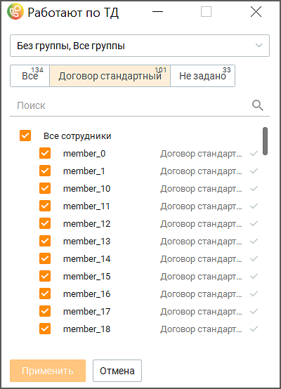

В списках можно удалять и добавлять сотрудников в графики работ по различным договорам, настроенным в Контакт-центре. Шаблоны графика работы Настроенные шаблоны работы позволяют руководителю быстро настраивать график работы сотрудника или группы. Клик по кнопке Новый график открывает форму создания нового шаблона. Доступно создание не более 20 шаблонов. Клик по строке с созданным шаблоном открывает его для просмотра, редактирования,

удаления или копирования кликом по пиктограмме .

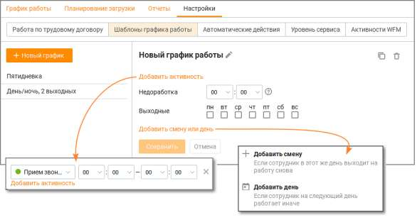

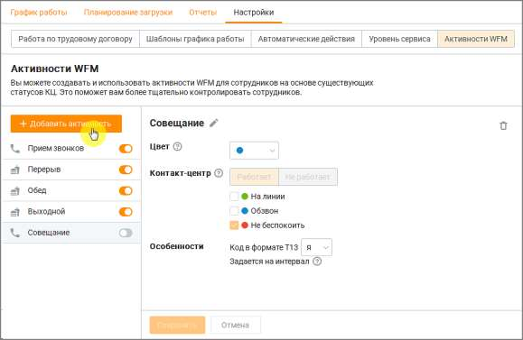

Уровень сервиса В блоке пользователь имеет возможность задать постоянный показатель уровня сервиса – процентное соотношение количества отвеченных звонков к общему количеству звонков. Дневной уровень сервиса задается пользователем в подвкладке "Планирование загрузки". Активности WFM В блоке пользователь имеет возможность задавать нерабочие статусы сотрудникам на любой интервал времени, а также задавать текущие статусы КЦ в WFM. Созданные активности могут быть использованы при настройке автоматических действий.

В блоке по умолчанию размещены 4 активности. В активностях по умолчанию для изменения доступны только цвет и код в формате T13. Активности по умолчанию не могут быть удалены.

Для добавления новой активности нажмите кнопку Добавить активность. Введите наименование новой активности, выберите ее параметры и сохраните внесенные изменения кнопкой Сохранить. Активности, созданные пользователем, могут быть удалены кликом по

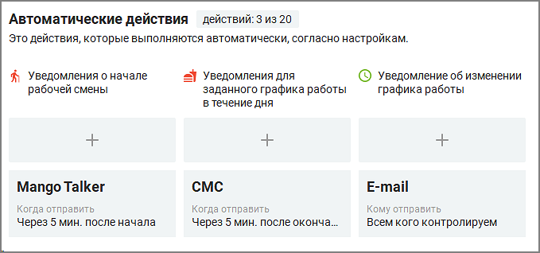

пиктограмме . Пользователь имеет возможность редактировать активности, добавляя или удаляя статусы Контакт-центра, для автоматического обновления расписания. После редактирования активности обновляются связанные с ней данные как для предыдущих, так и для предстоящих периодов времени. 8.5.1. Автоматические действия (WFM) Пользователь Контакт-центра с ролью "Администратор" имеет возможность уведомлять сотрудников о нарушении рабочего времени, чтобы уменьшить опоздание и заранее направить предупреждение.

После настроек триггера выбранным сотрудникам или группам сотрудников приходит MangoTalker-, E-mail или СМС уведомление: • о начале рабочей смены – MangoTalker, E-mail или СМС уведомление; • о заданном графике работы в течении дня – MangoTalker, E-mail или СМС уведомление; • об изменении графика работы – E-mail уведомление. При выборе нескольких сотрудников каждому из них будет отправлен отдельный файл только с его расписанием. Максимальное количество автоматических действий – 20.

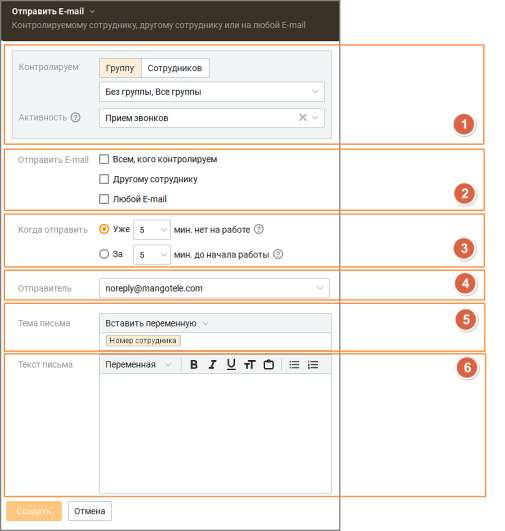

Отправка письма с заданным текстом и переменными на E-mail

В триггере необходимо задать следующие настройки: 1. Контролируем: Выбор сотрудника или группы сотрудников с указанной активностью. Для уведомления "об изменении графика работы" активность не указывается. 2. Отправить e-mail: • всем, кого контролируем – уведомление будет направлено на адреса электронной почты всех выбранных сотрудников; • другому сотруднику – при выборе открываются выпадающие списки для выбора сотрудников, которым будет направлено уведомление; • любой e-mail – при выборе открывается поле для ввода адреса электронной почты, куда будет направлено уведомление;

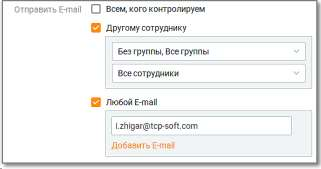

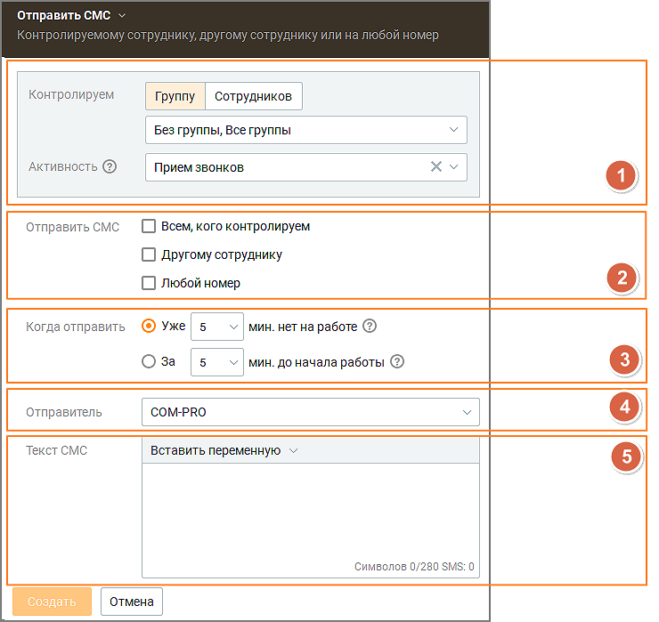

3. Когда отправить – настройка времени отправки уведомления. Диапазон настройки 5 – 60 минут. Шаг настройки – 5 минут. 4. Отправитель: При создании уведомления адрес отправителя указан по умолчанию – это авторизованный электронный адрес компании. Также можно выбрать e-mail отправителя из авторизованных на вкладке Телефония и E-mail. Пользователь может выбрать из списка только авторизованные адреса компании. 5. Тема письма – тема уведомления. Доступны переменные: ФИО сотрудника, номер телефона сотрудника. 6. Текст письма – поле для текста уведомления. Доступны переменные: ФИО сотрудника, номер телефона сотрудника. Сохраните внесенные изменения кнопкой Сохранить. Отправка СМС с заданным текстом и переменными

В триггере необходимо задать следующие настройки:

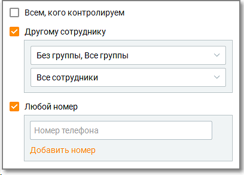

1. Контролируем: Выбор сотрудника или группы сотрудников с указанной активностью. 2. Отправить СМС: • всем, кого контролируем – уведомление будет направлено на мобильный номер телефона всех выбранных сотрудников; • другому сотруднику – при выборе открываются выпадающие списки для выбора сотрудников, которым будет направлено уведомление; • любой номер – при выборе открывается поле для ввода мобильного номера телефона, куда будет направлено уведомление. Формат номера телефона 7XXXXXXXXXX или 8XXXXXXXXXX.

3. Когда отправить – настройка времени отправки уведомления. Диапазон настройки 5 – 60 минут. Шаг настройки – 5 минут. Для уведомления "об изменении графика работы" не настраивается. 4. Отправитель: выбора имени отправителя. Доступен при подключении услуги "Отраслевое имя отправителя СМС" или "Индивидуальное имя отправителя СМС" в Личном кабинете ВАТС. 5. Текст СМС – поле для текста уведомления. Доступны переменные: ФИО сотрудника, номер телефона сотрудника. Сохраните внесенные изменения кнопкой Сохранить.

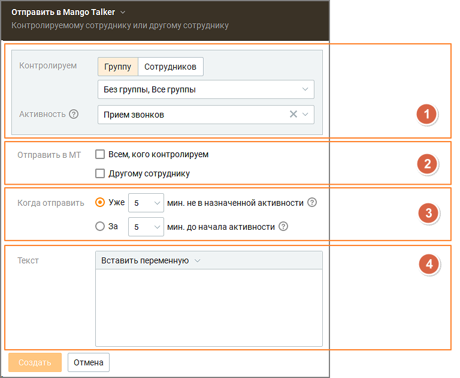

Отправка сообщения на Mango Talker

В триггере необходимо задать следующие настройки: 1. Контролируем: Выбор сотрудника или группы сотрудников с указанной активностью. 2. Отправить в Mango Talker: • всем, кого контролируем – уведомление будет направлено на мобильный номер телефона всех выбранных сотрудников; • другому сотруднику – при выборе открываются выпадающие списки для выбора сотрудников, которым будет направлено уведомление; 3. Когда отправить – настройка времени отправки уведомления. Диапазон настройки 5 – 60 минут. Шаг настройки – 5 минут. 4. Текст – поле для текста уведомления. Доступны переменные: ФИО сотрудника, номер телефона сотрудника. Сохраните внесенные изменения кнопкой Сохранить. 8.5.2. Производственный календарь Вкладка Производственный календарь предназначена для настройки и использования нормативов работы сотрудников в рамках системы WFM, а также для учета рабочих часов в соответствии с производственным календарем (ПК). Зачем это нужно? Автоматизация соблюдения нормативов рабочего времени и исключение ошибок при планировании помогает избежать нарушений трудового законодательства, обеспечивая точный учет рабочих и выходных дней. Что снижает риски штрафов контролирующих органов, конфликтов с сотрудниками и неэффективного распределения ресурсов.

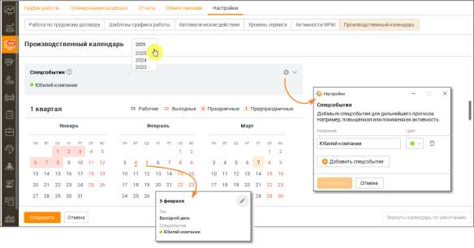

Производственный календарь доступен только в тарифе PRO.

На вкладке пользователю доступны следующие функции: 1. Отображение производственного календаря: o Вкладка показывает производственный календарь за выбранный год. o По умолчанию отображаются следующие данные: ▪ Рабочие, выходные и праздничные дни. ▪ Нагрузка в человеко-часах в разрезе квартала и месяца ▪ Расширенное описание для типов дней и специальных событий. 2. Настройки календаря: o Загрузка производственного календаря на 2023-2025 год. o Изменение типов дней: рабочий, выходной, праздничный, предпраздничный. o Создание специальных событий (до 10 событий) с привязкой к конкретным дням для учета в прогнозировании. 3. Учет нормативов работы: o Календарь используется для расчета графиков работы сотрудников на основе схем 5/2 и 2/2. o Руководитель может видеть норму часов по ПК в разделе График работы. o Нормативы рассчитываются: ▪ Для графика 5/2: 8 часов * количество рабочих дней. ▪ Для графика 2/2: 12 часов * количество рабочих дней. o В случае отсутствия подходящего графика отображаются прочерки. 4. Загрузка и обновление календаря: o Календарь на следующий год загружается автоматически при обновлении версии Контакт- центра. o Пользователь может выбрать между загрузкой стандартного календаря или календаря с пользовательскими изменениями. ▪ При выборе "с моими настройками" пользовательские данные сохраняются, а стандартные обновляются.

▪ При выборе "только дефолтный" все пользовательские изменения сбрасываются. 5. Учет специальных событий: o Специальные события можно использовать для прогнозирования нагрузки и планирования. o События создаются и редактируются в календаре, с автоматическим пересчетом человеко- часов. 8.5.3. Эффективность сотрудника На вкладке Эффективность сотрудника модуля WFM можно задать индивидуальные коэффициенты эффективности для сотрудников, особенно полезные при работе с новичками или временно сниженной продуктивностью.

Для получения доступа к вкладке обратитесь к Персональному менеджеру. Интерфейс позволяет руководителю указать, насколько эффективно сотрудник может выполнять свои задачи в конкретные периоды времени. Это помогает точнее оценивать производительность и учитывать особенности в планировании.

Можно задать до трёх разных временных интервалов для одного сотрудника. В каждом из них устанавливается свой показатель эффективности — от 0.1 до 0.9. Значение по умолчанию составляет 1, что означает стандартную эффективность. Указанные интервалы не должны пересекаться между собой — система проверяет это и предупредит, если значения наложатся. Когда один из интервалов завершится, можно задать новый. Все ранее заданные интервалы сохраняются — история сохраняется в системе и может использоваться для анализа. В левой части экрана отображается список сотрудников, для которых уже задана эффективность. При выборе конкретного сотрудника справа отображаются все его интервалы и соответствующие им значения эффективности. Интерфейс поддерживает фильтрацию — можно отфильтровать сотрудников по группам или найти конкретного по имени.

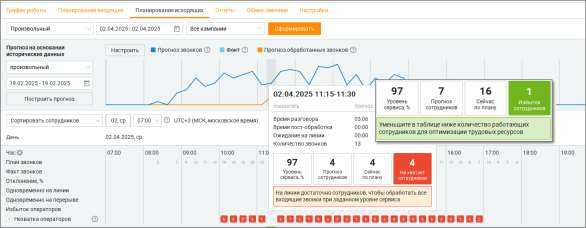

Если у сотрудника установлен коэффициент эффективности меньше 1, это учитывается при формировании расписания: например, если у одного сотрудника установлен коэффициент 0.5, система запланирует ещё одного сотрудника на то же время, чтобы суммарная эффективность была не меньше 1.

<!-- изображение на стр. 277: байты не извлечены (PyMuPDF недоступен) -->

Таким образом достигается равномерная и реалистичная загрузка команды, даже если в составе есть новички или временно менее продуктивные сотрудники.
