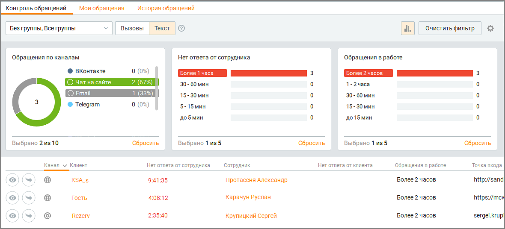

# 4. Обращения

> Трассировка: PDF §4 · сквозные стр. 128-129 · источники: ч.2 `kb/sources/mango-cc-manual/CC_manual_1.26.23-part-2.pdf` с.27-28.

Модуль Обращения представляет набор связанных цифровых коммуникаций между клиентом и компанией для решения вопросов клиента. Коммуникациями служат приложение или инструмент, через которое клиент обращается в компанию (телефон, мессенджеры, соцсети и др.). Модуль Обращения включает в себя несколько инструментов: • Контроль обращений — мониторинг обращений в режиме реального времени; • Автоматическое распределение обращений — настройка автоматического распределения поступающих обращений; • Мои обращения — рабочий инструмент сотрудника для обработки обращения в реальном времени; • Настройка автоматического действия — настройка автоматических действий по результату работы с обращением; • История обращений — аналитическая информация по всем обращениям в компании в различных разрезах. Поступившие обращения автоматически распределяются на сотрудника или группу согласно настройкам автоматического распределения обращений.

| На данный модуль распространяется возможность скрытия номера клиента. Узнать |  |  |  |  |  |  |  |  |  |  |
| --- | --- | --- | --- | --- | --- | --- | --- | --- | --- | --- |
| больше здесь. |  |  |  |  |  |  |  |  |  |  |
|  |  | Модуль отображается, если у пользователя Контакт-центра имеются соответствующие |  |  |  |  |  |  |  |  |
|  | права. Настройка прав осуществляется в ЛК ВАТС, в разделе Безопасность и ограничения |  |  |  |  |  |  |  |  |  |
| → |  | Настройка доступа | → | (Выбрать роль) | → | Инструменты | → | Обращения. |  |  |

Если общий переключатель модуля для какой-либо роли выключен, у пользователей Контакт- центра с данной ролью не отображаются следующие элементы: • Весь модуль "Обращения" в левой панели. • Очередь обращений, вкладка "Текст". • Вкладка "Обращения" в карточке клиента в Адресной книге.
