# 9.1. История вызовов

> Трассировка: PDF §9.1 · сквозные стр. 277-290 · источники: ч.1 `kb/sources/mango-cc-manual/CC_manual_1.26.28.1.pdf` с.277-290.

При первом запуске программы отображается журнал вызовов за последние 2 дня по текущему пользователю, отсортированный по времени вызова, без группировки.

При выходе из программы и повторном входе для периода времени отображения журнала вызовов принудительно устанавливается значение Последние 2 дня.

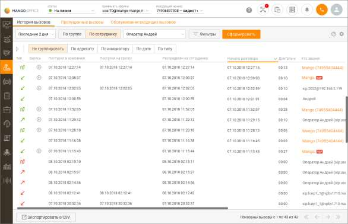

| В рамках компаний исходящего обзвона в Контакт-центре MANGO OFFICE |  |  |  |
| --- | --- | --- | --- |
|  | предусмотрена возможность скрытия номеров клиентов от сотрудников. Данная |  |  |
|  | возможность является опциональной и подключается только через персонального |  |  |
| менеджера. | менеджера. |  |  |
|  |  | Для пользователей Личного кабинета с ролью "Руководитель компании", а также ролей, |  |
|  | созданных на ее основе, предусмотрена возможность ограничения доступа остальных |  |  |
|  | пользователей к просмотру записей своих разговоров. Для настройки ограничений следует |  |  |
| воспользоваться виджетом "Настройки личной защиты" рабочего стола. |  |  |  |

Вы можете самостоятельно выбрать, какие столбцы будут отображаться на панели. Для этого

щелкните левой кнопкой мыши по пиктограмме и установите/снимите флаги напротив наименований столбов. По умолчанию отображается весь набор столбцов. Отображение списка вызовов осуществляется постранично. Действие фильтров поиска и отбора распространяется на все вызовы в истории, а не только на те, которые отображены на текущей странице. . Для перехода по страницам используются кнопки с изображениями стрелок в правой нижней части рабочей области. Количество записей, выводимых на одну страницу, редактируется в настройках программы.

Для отображения направления и типа совершенных вызовов используются следующие значки:

— Входящий (принятый);

— Входящий (пропущенный);

— Исходящий (состоявшийся);

— Исходящий обзвон (состоявшийся);

— Исходящий (несостоявшийся);

— Внутренний (состоявшийся);

— Внутренний (пропущенный, несостоявшийся);

— Обратный звонок (пропущенный);

— Обратный звонок (принятый);

| Чтобы оперативно ознакомиться с текстовой информацией о направлении и типе |
| --- |
| совершенного вызова, наведите курсор на нужный значок. |

Чтобы получить подробную информацию об участнике вызова, нажмите на ссылку с именем в столбце Кто звонил или Кому звонил. В результате на экране отобразится карточка контакта. Сотрудники и клиенты, карточки которых имеются в Контакт-центре, выделены цветом. Чтобы привязать вызов к контакту или создать новый с этим номером, щелкните правой кнопкой по номеру в строке нужного вызова. В результате в рабочей области панели отобразится контекстное меню (см. пример на рисунке ниже). Нажмите нужную ссылку, чтобы создать новый контакт или обновить существующий.

Вы можете скопировать информацию в буфер обмена. При копировании номеров из столбцов Кто звонил и Кому звонил щелкните по нужному номеру левой кнопкой мыши, затем воспользуйтесь сочетанием клавиш на клавиатуре либо нажмите правую кнопку и в контекстном меню выберите команду: • Копировать – копировать текст в буфер обмена; При копировании информации из столбцов Куда звонил и Комментарий щелкните левой кнопкой мыши по нужной строке в соответствующем столбце и при помощи комбинации Ctrl+C скопируйте выделенную информацию в буфер обмена. В дополнение к возможности прослушивания разговоров предусмотрена возможность повторных исходящих вызовов — как по номеру инициатора вызова, так и по номеру адресата вызова. Чтобы совершить повторный вызов, наведите курсор на строку с нужным вызовом и

нажмите появившуюся кнопку с трубкой в нужном столбце таблицы (Кто звонил или Кому звонил). Дополнительные возможности инструмента История вызовов приведены в следующих подразделах: • Фильтрация, группировка, отбор и поиск вызовов; • Прослушивание разговоров и повторные вызовы; • Редактирование информации о вызовах;

• Экспорт данных из истории вызовов.

9.1.1. Фильтрация, группировка, отбор и поиск вызовов Для удобства работы с журналом совершенных вызовов предусмотрены различные элементы интерфейса, позволяющие осуществлять фильтрацию, группировку, отбор и поиск вызовов. В этом подразделе мы подробно рассмотрим их использование для выполнения нужных вам задач.

| Для более эффективной фильтрации вызовов вы можете комбинировать критерии |  |  |
| --- | --- | --- |
|  | фильтрации, группировки, отбора и поиска. Чтобы уменьшить продолжительность ожидания |  |
|  | результатов, рекомендуем указывать этих критерии таким образом, чтобы получить |  |
| наименьшую по числу вызовов выборку. |  |  |

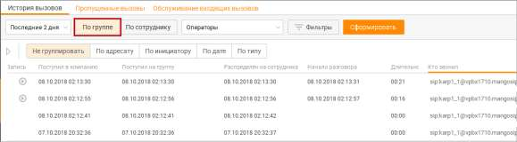

Фильтрация вызовов Для последующего анализа истории вызовов вам необходимо выбрать один из двух фильтров: По группе или по сотруднику. По умолчанию выбран фильтр По сотруднику. Чтобы фильтровать вызовы по группе операторов, выберите фильтр По группе, используя переключатель. Затем при необходимости выберите из списка нужную группу. После этого в рабочей области панели отображаются вызовы из всех групп или выбранной группы (в примере на рисунке ниже выбрана группа «Операторы»).

| В фильтре По группе отображаются группы пользователей, для которых история вызовов |  |  |  |  |  |  |  |  |  |  |  |
| --- | --- | --- | --- | --- | --- | --- | --- | --- | --- | --- | --- |
|  | доступна текущему пользователю в соответствии с его ролью. |  |  |  |  |  |  |  |  |  |  |
|  | По умолчанию выбран вариант Все группы, при этом: |  |  |  |  |  |  |  |  |  |  |
|  | — «все группы» в данном случае означает все группы операторов, для которых история |  |  |  |  |  |  |  |  |  |  |
|  | вызовов доступна текущему пользователю в соответствии с ролью; |  |  |  |  |  |  |  |  |  |  |
|  | — вариант Все группы выбран, если пользователю доступна история вызовов для |  |  |  |  |  |  |  |  |  |  |
|  | нескольких групп; |  |  |  |  |  |  |  |  |  |  |
|  | — если вариант Все группы недоступен для выбора (например, если пользователь является |  |  |  |  |  |  |  |  |  |  |
|  | оператором только в одной группе), то по умолчанию используется группа, где он имеет |  |  |  |  |  |  |  |  |  |  |
|  | роль Оператор; |  |  |  |  |  |  |  |  |  |  |
|  | — для пользователей с ролью Сотрудник данный фильтр недоступен. |  |  |  |  |  |  |  |  |  |  |
|  |  | Выбранные значения фильтра хранятся локально для каждой учетной записи и |  |  |  |  |  |  |  |  |  |
|  | используются при каждом входе на вкладку отчета, в том числе после перехода. Дата всегда |  |  |  |  |  |  |  |  |  |  |
| выбирается текущая. |  |  |  |  |  |  |  |  |  |  |  |

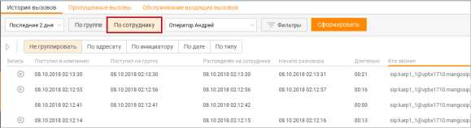

Чтобы фильтровать вызовы по сотруднику, выберите вариант По сотруднику, используя переключатель. Затем при необходимости выберите из списка нужного сотрудника или вариант Все сотрудники (если он доступен). После этого в рабочей области панели отображаются вызовы всех сотрудников или выбранного сотрудника; при этом сотрудник может быть как инициатором, так и адресатом вызовов (как в примере на рисунке ниже).

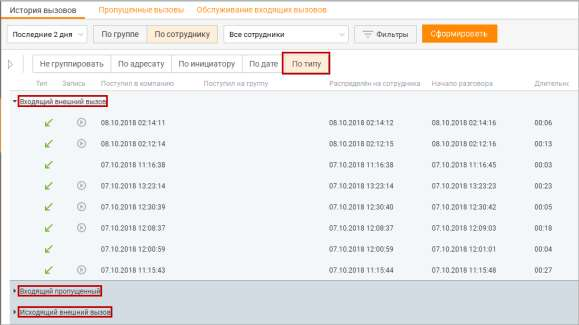

| В фильтре По сотруднику отображаются сотрудники, для которых история вызовов |  |  |  |  |  |
| --- | --- | --- | --- | --- | --- |
|  | доступна текущему пользователю в соответствии с его ролью. |  |  |  |  |
|  | По умолчанию фильтр установлен на текущего пользователя, при этом: |  |  |  |  |
|  | — «все сотрудники» в данном случае означает всех сотрудников, история вызовов которых |  |  |  |  |
|  | доступна текущему пользователю в соответствии с ролью; |  |  |  |  |
|  | — вариант Все сотрудники присутствует для выбора, если пользователю доступна история |  |  |  |  |
| вызовов для нескольких сотрудников. |  |  |  |  |  |

В случае указания фильтра по группе для поиска совершенных группой исходящих звонков (Исходящие, Обратные звонки, Автоперезвоны, Внутренние): сначала ищутся все сотрудники, входящие в искомую группу на момент построения отчета, затем отбираются звонки, совершенные этими сотрудниками. Если сотрудник состоит более, чем в одной группе, звонки сотрудника будут отображаться и для одной и для другой группы. Установленные параметры фильтрации сохраняются при выходе из программы и повторной авторизации. Группировка вызовов Чтобы сгруппировать вызовы по адресату, инициатору, дате или типу, выберите нужный вариант из списка Группировать. После этого в рабочей области панели отображаются вызовы, сгруппированные в соответствии со сделанным выбором. См. пример на рисунке ниже для группировки вызовов по типу.

Дополнительная фильтрация вызовов Дополнительная фильтрация вызовов открывается нажатием кнопки Фильтры.

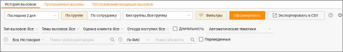

Чтобы отобрать вызовы по дате и времени совершения, выберите нужный период из списка Период. Доступны следующие варианты: сегодня, вчера, последние 2 дня, текущая неделя, текущий месяц, произвольный. При выборе первых четырех вариантов (исключая Произвольный) результаты отбора подгружаются в рабочую область панели немедленно. При выборе варианта Сегодня также становятся доступными поля для выбора по времени суток. При выборе варианта Произвольный длительность выбранного период не может превышать один месяц. Для подгрузки результатов отбора необходимо нажать кнопку Обновить. Чтобы отобрать вызовы по времени суток, выберите вариант Сегодня. После этого становятся доступными поля для выбора по времени суток. Введите начальное и конечное время суток в соответствующие поля или укажите его, используя регуляторы. Чтобы отобрать вызовы по длительности, включите настройку Задать длительность разговора и введите минимальную и максимальную длительность вызова в соответствующие поля или укажите ее, используя регуляторы. После этого нажмите кнопку Обновить.

Допускается отбор вызовов с нулевой длительностью.

Чтобы отобрать вызовы по типу вызовов, выберите нужные типы вызовов в поле Тип Вызовов. Чтобы отобрать вызовы по темам вызовов, выберите нужные темы в поле Темы вызовов из вариантов, настроенных в Справочнике тематик обращений. Чтобы отобрать вызовы по оценке клиента, выберите нужную оценку в поле Оценка клиента. Варианты оценок: Отлично, Хорошо, Нормально, Плохо, Очень плохо. В фильтре оценок не учитываются сотрудники, подключавшиеся к разговору в режиме прослушивания или суфлирования.

| Если в Личном кабинете ВАТС подключена услуга "Контроль качества (постзвонковая |  |  |
| --- | --- | --- |
|  | оценка)", то фильтр отбирает все разговоры, в которых есть хотя бы одна из отмеченных в |  |
| нём оценок. |  |  |

Чтобы отобрать вызовы по источнику, выберите соответствующие источники в поле Откуда поступил. Варианты значений: • Распределён с группы — вызов поступил сотруднику из группы. Не важно, как вызов попал в группу: через IVR, по прямому номеру, через донабор и т. д. • Персональный — вызов был направлен на конкретного сотрудника через пункт меню «Перевод на сотрудника». • Набран добавочный сотрудника — вызов поступил после того, как внешний абонент набрал внутренний номер сотрудника. • Перехвачен сотрудником — вызов был перехвачен другим сотрудником до того, как был доставлен адресату. • Переведён сотрудником — вызов был переведён на сотрудника другим сотрудником (любым способом — слепым или консультационным переводом). • Переведён роботом — вызов был перенаправлен сотруднику роботом после обработки сценария. • Другие — значение отсутствует, если тип распределения не относится ни к одному из перечисленных вариантов

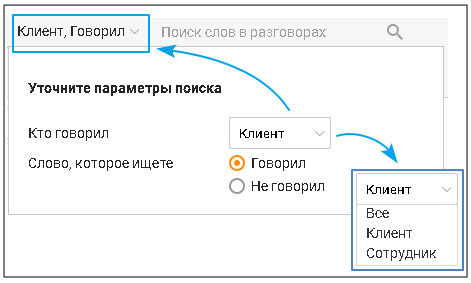

Чтобы отобрать вызовы конкретного абонента, выберите По ФИО или По номеру и введите не менее трех символов для поиска в поле Поиск абонента. Чтобы отобрать переведенные вызовы установить галочку в чекбоксе "Переведенные". В табличной части отчета поле, "Переведено на" отображает куда был переведен звонок. Иконка

раскрытия в столбце "?" показывает, сколько переводов было сделано в рамках одной переадресации.

| ПРИМЕР |
| --- |
| Задача: сделать отбор по переведенным звонкам определенной группы и посмотреть – куда они |
| были переведены. |
| Решение: сделать фильтр только по связанным вызовам и добавить отображение куда был |
| переведен звонок. Далее выбрать искомую группу, проставить чекбокс "переведенные" и |
| посмотреть – куда ушел звонок. Добавив количества "плеч" звонка, можно посмотреть сколько раз |
| клиента "переводили". |

Чтобы отобрать вызовы по тематикам Речевой аналитики, выберите нужные варианты в поле Автоматические тематики. Подробнее о тематиках Речевой аналитики узнайте здесь.

| Для работы фильтра в Личном кабинете пользователя должна быть подключена услуга |
| --- |
| Речевая аналитика. |

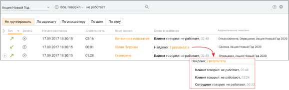

Чтобы отобрать вызовы по ключевым запросам задайте перечень ключевых запросов (терм) в поле Поиск слов в разговорах, а также в фильтре:

Подробнее о правилах ввода терм здесь. В таблице результатов поиска отображаются заданные ключевые слова, их количество, а также минута:секунда разговора, на которой они были произнесены.

Поиск вызовов Чтобы оперативно найти нужный вызов по ФИО контакта или имени сотрудника, введите в поле абонент ФИО контакта или имя сотрудника, или его номер. Искомый текст проверяется на совпадение с ФИО контакта из Адресной книги, или имени сотрудника, или номером связи. При вводе искомого текста работает автоподбор — по мере ввода отображается до 5 элементов автоподбора (номеров или ФИО контактов / сотрудников), которые начинаются с введенного искомого текста. После щелчка по элементу автоподбора в поле Абонент автоматически подставляется полное ФИО контакта. Затем по подставленному тексту выполняется поиск из истории вызовов. Чтобы найти нужные вызовы по имени абонента, введите в поле Абонент имя или его часть. После этого осуществляется поиск вызовов всех абонентов, ФИО которых начинается с комбинации символов, соответствующих искомому тексту. Чтобы найти нужные вызовы по телефонному номеру, введите в поле Абонент телефонный номер или его часть. После этого осуществляется поиск вызовов всех абонентов, телефонный номер которых начинается с указанной комбинации символов. Связные вызовы Чтобы просмотреть информацию о связных вызовах, разверните вызов. Для этого щелкните по значку со стрелкой слева от строки с вызовом. После этого вызов разворачивается, и в рабочей области отображается информация о связных вызовах. Для того, чтобы свернуть/развернуть все связные, нажмите на иконку свернуть/развернуть.

Данная иконка имеет три состояния: • Свернуть всё – свернуть все связные вызовы; • Развернуть всё – развернуть все связные вызовы; • Пользовательский – в рамках этого режима запоминается информация о состоянии вызовов, которое вы установили сами. 9.1.2. Прослушивание разговоров и повторные вызовы Вы можете прослушивать записи разговоров и осуществлять повторные вызовы непосредственно в рабочей области Истории вызовов.

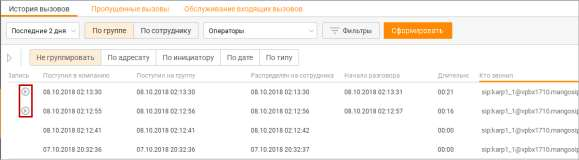

| Возможность прослушивания вызовов зависит от роли пользователя. Аналогичные |  |  |  |  |
| --- | --- | --- | --- | --- |
|  | правила действуют для раздела "Скрипты" и подраздела "Задачи обращения" раздела |  |  |  |
|  | "Клиенты": |  |  |  |
|  | — Оператор может прослушивать записи разговоров только для вызовов, в которых он |  |  |  |
|  | участвовал. |  |  |  |
|  | — Супервизор может прослушивать записи разговоров только для вызовов, в которых он |  |  |  |
|  | участвовал, а также для вызовов с участием операторов в группах, в которых он является |  |  |  |
|  | супервизором. |  |  |  |
|  | — Администратор может прослушивать записи разговоров для любых вызовов, |  |  |  |
| осуществляемых с использованием Контакт-центра MANGO OFFICE. |  |  |  |  |

Чтобы прослушать разговор, выберите вызов с имеющейся записью разговора (на что

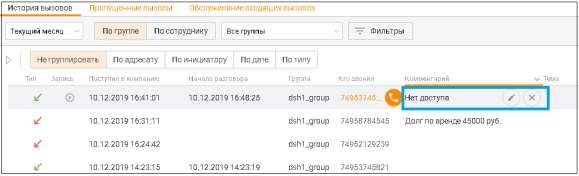

указывает наличие кнопки ).

Затем нажмите кнопку . После этого выполняется воспроизведение записанного разговора. Для управления прослушиванием используйте встроенный плеер.

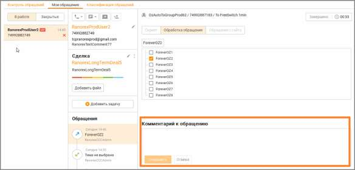

Кнопка для скачивания записи отображается на плеере, но недоступна для нажатия, если у пользователя нет права "Выгружать и отправлять записи по почте". 9.1.3. Тематики и комментарии к вызову Более подробное описание приведено далее в данном подразделе. Как добавить комментарий Чтобы работать с комментарием к вызову, наведите курсор на строку нужного вызова в столбце Комментарий. При этом в столбце отображаются кнопки правки и удаления.

Чтобы создать или изменить комментарий, нажмите кнопку правки и внесите необходимые изменения.

Чтобы удалить комментарий, нажмите кнопку . Если в карточке обращения имеется комментарий, то он также отображается в этом поле.

Как добавить тематику Чтобы работать с тематикой комментария к вызову, наведите курсор на строку нужного вызова в столбце Тема. При этом в столбце отображается кнопка редактирования темы и кнопка удаления — так же, как и для комментария к вызову. Чтобы добавить, создать или изменить тематику, нажмите кнопку редактирования и внесите необходимые изменения.

| Комментарии и тематики обращения будут доступны для просмотра и редактирования в |
| --- |
| карточке контакта и статистическом отчете "Обслуживание входящих вызовов". |

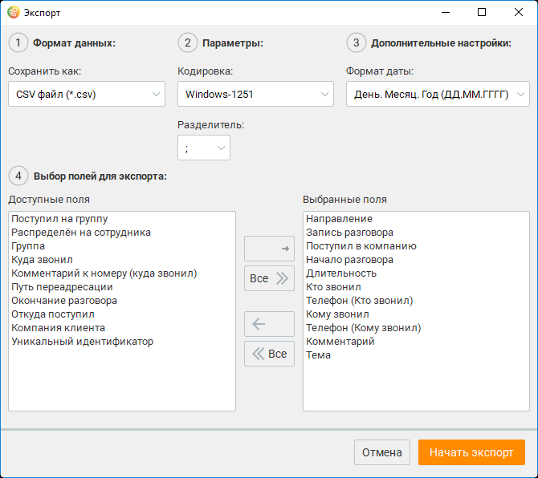

Напомним, что набор тематик, доступных при обработке вызова, определяется ролью пользователя в Личном кабинете: • Сотрудник – доступны тематики, входящие в псевдогруппу Без группы. • Оператор – тематики своей группы; • Супервизор – тематики своей группы; • Администратор (не оператор и/или супервизор) – тематики псевдогруппы Без группы; • Администратор (оператор и/или супервизор) – тематики своей группы. Полный список ролей пользователей, которым доступна работа с тематиками, см. в Приложении 2 "Роли и права доступа Контакт-центра", вкладка "Обращения". Кроме того, в Контакт-центре MANGO OFFICE предусмотрена возможность создания отдельных списков тематик внутри группы, в которую включен пользователь. Отдельные списки применяются в зависимости от типа вызова. Таким образом, при поступлении вызова определенного типа сотруднику, с учетом его роли в Личном кабинете, будут доступны тематики только одного соответствующего списка, созданного для обработки: • внешних входящих вызовов, распределенных из группы. • персональных входящих вызовов; • внешних исходящих вызовов; • внутренних вызовов. Подробнее о создании тематик см. в подразделе Справочник тематик обращений.

| Список доступных тематик различается в зависимости от выбранного фильтра: По группе |  |  |
| --- | --- | --- |
|  | или По сотруднику. Если был принят входящий вызов, распределенный из группы, то при |  |
|  | фильтрации по группе для его редактирования будет доступен набор тематик, определенный |  |
|  | для внешних вызовов, распределенных с группы для данной группы. При фильтрации по |  |
|  | сотруднику будет доступен набор тематик, определенный для персональных вызовов для |  |
| всех групп, где состоит данный сотрудник. |  |  |

9.1.4. Экспорт данных из истории вызовов Контакт-центр MANGO OFFICE обеспечивает возможность анализа данных об истории вызовов в других программных продуктах с помощью экспорта (выгрузки) данных. Экспорт осуществляется в формате CSV (значения, разделенные запятыми).

| Экспорт данных из истории вызовов осуществляется с учетом выбранного пользователем |  |  |
| --- | --- | --- |
|  | разреза: По группе или По сотруднику, а также и значений других критериев фильтрации, |  |
| отбора, группировки и поиска. |  |  |

<!-- изображение на стр. 288: байты не извлечены (PyMuPDF недоступен) -->

Чтобы экспортировать данные из истории вызовов, нажмите кнопку Экспорт в нижней части окна. После этого на экране отображается окно Экспорт.

<!-- изображение на стр. 289: байты не извлечены (PyMuPDF недоступен) -->

<!-- изображение на стр. 289: байты не извлечены (PyMuPDF недоступен) -->

Выберите необходимую кодировку экспортируемых данных из списка Кодировка в группе Параметры. Затем выберите нужный разделитель между полями данных (точка с запятой, точка либо символ табуляции) из списка Разделитель в группе Параметры. После этого (при необходимости) выберите формат даты в группе Дополнительные настройки. Теперь выберите подлежащие экспорту поля данных. При необходимости выбирайте поля в соответствии с очередностью, нужной для целевого приложения. Для выбора поля данных дважды щелкните по нужному полю в списке Доступные поля либо воспользуйтесь соответствующими кнопками. После этого поле перемещается в список Выбранные поля. Чтобы отменить выбор поля, дважды щелкните по нему еще раз. После этого оно возвращается в список Доступные поля. Когда вы завершите выбор подлежащих экспорту полей и типа экспорта, нажмите кнопку Начать экспорт. В появившемся окне Экспортировать в файл выберите имя и путь сохранения файла и нажмите кнопку Сохранить. После этого Контакт-центр MANGO OFFICE сохраняет выбранные для экспорта данные в файл с расширением .CSV.

| Рекомендуется изменять CSV-файлы через приложение MS Excel. Другие приложения |
| --- |
| могут некорректно формировать файл для импорта. |

<!-- изображение на стр. 289: байты не извлечены (PyMuPDF недоступен) -->

<!-- изображение на стр. 290: байты не извлечены (PyMuPDF недоступен) -->
