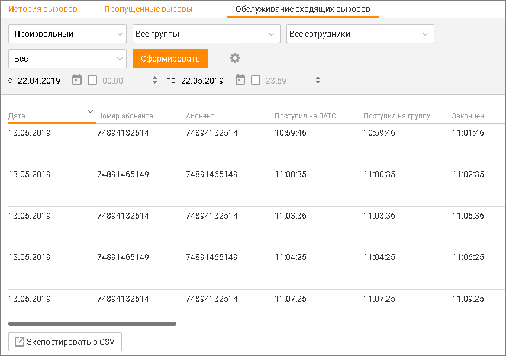

# 9.2. Обслуживание входящих вызовов

> Трассировка: PDF §9.2 · сквозные стр. 290-291 · источники: ч.1 `kb/sources/mango-cc-manual/CC_manual_1.26.28.1.pdf` с.290-291.

Этот отчет позволяет получить аналитические данные обо всех входящих вызовах, поступивших на группы сотрудников за выбранный период времени. Чтобы получить отчет об обслуживании входящих вызовов, вначале следует отобрать вызовы по периоду времени. Для этого выберите нужный период времени. Доступны следующие варианты: сегодня, вчера, последние 2 дня, текущая неделя, текущий месяц, произвольный. При выборе варианта Произвольный становятся доступными поля с и по, где вы можете ввести нужную дату или выбрать ее, нажав на значок календаря. Вы также можете дополнительно указать время суток для полей с и по. Для этого установите соответствующие флажки и введите или укажите время. Затем следует выбрать группу(ы) и сотрудника(ов), по которым необходимо получить аналитические данные.

| Если вы выбрали одну или несколько групп, то в списке сотрудников доступны для выбора |
| --- |
| только сотрудники выбранных групп, а также вариант Все сотрудники. |

После этого вы можете выбрать нужный тип вызовов (Все, Пропущенные, Принятые) в списке результатов вызова. При необходимости вы также можете выбрать нужные столбцы отчета. Для этого нажмите на

кнопку . После завершения выбора критериев нажмите кнопку Сформировать. После этого создается отчет об обслуживании входящих вызовов, сформированный в соответствии с критериями выбора, указанными вами выше. Отчет отображается на странице в табличном виде и включает выбранные вами столбцы.

Для экспорта отчета в формате CSV нажмите соответствующую ссылку. После этого на экране отображается окно экспорта. Установите параметры экспорта и нажмите кнопку Начать экспорт.
