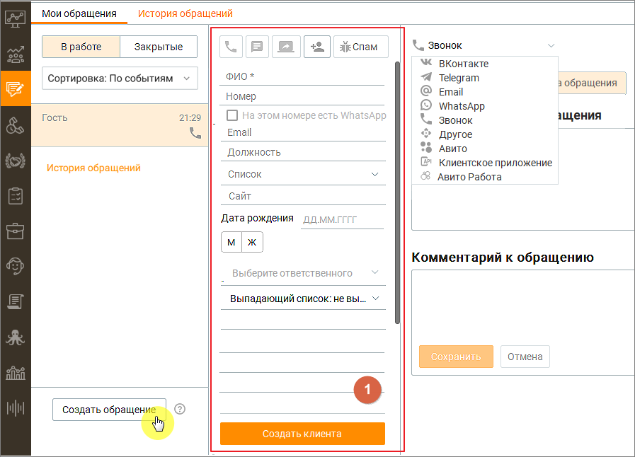
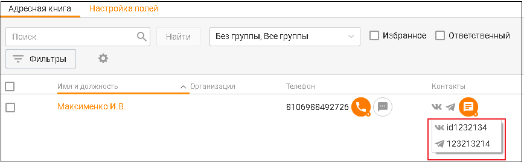
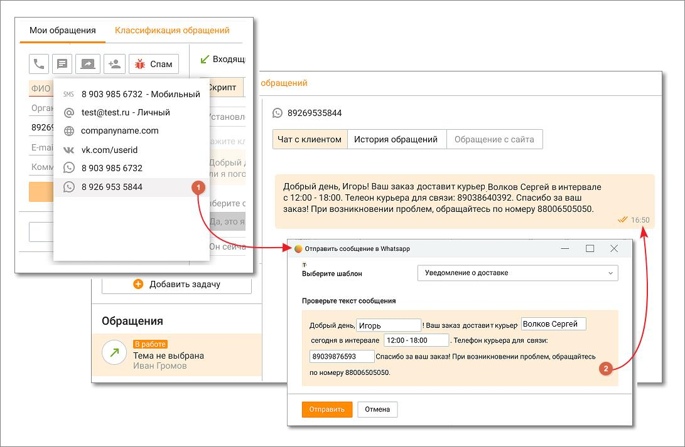
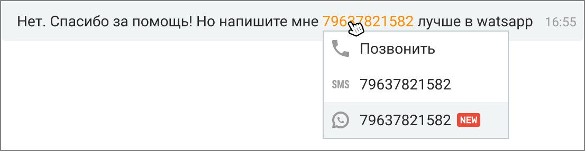
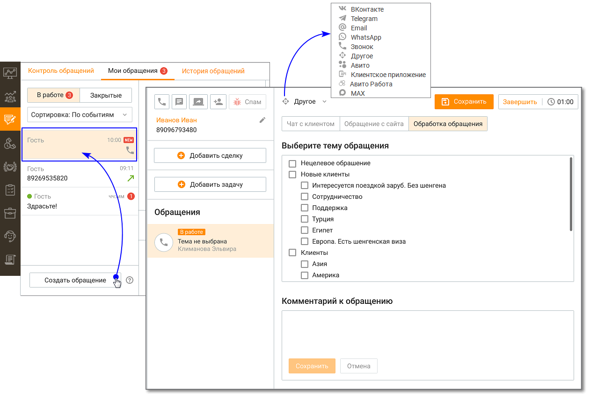

# 4.3.1. Исходящие обращения

> Трассировка: PDF §4.3.1 · сквозные стр. 136-142 · источники: ч.2 `kb/sources/mango-cc-manual/CC_manual_1.26.23-part-2.pdf` с.35-41.

Чтобы создать исходящее сообщение на вкладке Обращения/Мои обращения нажмите кнопку "Создать обращение". Далее из выпадающего списка выберите требуемый тип создаваемого обращения.

При создании исходящего текстового обращения к клиенту проверяется наличие открытых обращений: Если открытое обращение с данным клиентом уже имеется, но находится в работе у другого оператора, то проверяется наличие других аккаунтов по выбранному каналу, доступных текущему пользователю. О наличии либо отсутствии аккаунтов пользователь уведомляется соответствующими системными сообщениями. Если открытое обращение с данным клиентом отсутствует, в блоке 1 создается единичное исходящее текстовое обращение, которое отображается в блоке "В работе" пользователя. Исходящее текстовое обращение имеет статус В работе и создается со следующими атрибутами (часть атрибутов содержат значения по умолчанию): • Тема обращения – "тема не выбрана"; • Назначенный на обработку обращения пользователь – пользователь, инициировавший исходящее обращение; • Клиент – адрес клиента (аккаунт соц. сетей, мессенджеров, e-mail); • Точка входа – адрес компании, выбранный оператором для инициации исходящих обращений по определенному каналу; • Коммуникации; • Результат; • Комментарий; • Оценка; • Тип обращения – исходящее; • Группа, на которую было распределено обращение; • Время создания обращения – дата и время инициации создания исходящего обращения;

• Время распределения обращения на группу; • Время распределения обращения на сотрудника; • Время первого ответа пользователя в обращении – дата и время отправки первой коммуникации оператором в обращении; • Время закрытия обращения; • ID обращения, которое было переведено; • Кто перевел обращение. Если сообщение не может быть отправлено по любой причине (чат-бот заблокирован пользователем, обращение запрещено пользователем, запрещено каналом, не существует пользователя и т. д.), обращение переходит в статус "Закрыто" с результатом "Запрещена отправка". О запрете отправки пользователь уведомляется системным сообщением. Исходящие SMS-сообщения

Исходящие СМС-обращения могут быть инициированы сотрудником кликом по пиктограмме (при наличии в карточке клиента/организации телефонного номера с типом "Мобильный"): • в списке контактов; • в карточке контакта с указанным номером мобильного телефона; • в карточке контакта из закрытого СМС-обращения; • из карточки обращения в Моих обращениях; • в списке организаций; • в карточке организации; • из софтфона. Также исходящие СМС-обращения могут быть инициированы сотрудником: • из карточки обращения в Моих обращениях, если обращение от Гостя и обращение голосовое; • в списке контактов с помощью массовой отправки СМС на несколько адресатов; Исходящие звонковые сообщения Исходящие звонковые обращения также могут быть инициированы сотрудником кликом по

пиктограмме или : 1. Со стартовой страницы раздела Мои обращения в блоках В работе или Закрытые, при отсутствии в этих блоках обращений. 2. Из "шапки" обращения, в ответ на входящие сообщения. 3. Из карточки обращения завершенного входящего или исходящего вызова. 4. Из списка вкладки Контакты в разделе Клиенты. 5. Из карточки клиента, вкладки "Контакты", "Задачи и обращения". 6. Из карточки сделки, вкладки "Информация", "Задачи и обращения". 7. Из списка задач в Панели задач.

| Создание исходящего звонкового сообщения возможно только при наличии в карточке |
| --- |
| клиента телефонного номера. |

Если для клиента указан добавочный номер, то при звонке набор номера клиента происходит с учётом добавочного номера. Исходящие текстовые сообщения по каналам ВКонтакте, Telegram, Max. Исходящие текстовые обращения по каналам ВКонтакте, Max и Telegram также могут быть

инициированы сотрудником кликом по пиктограмме :

1. Из карточки клиента, вкладки "Контакты", "Задачи и обращения" 2. Из списка на вкладке Контакты в разделе Клиенты. 3. Из списка задач в Панели задач. 4. Из карточки сделки, вкладки "Задачи и обращения". 5. Из закрытого текстового обращения.

| Создание исходящего текстового обращения к клиенту по какому-либо каналу возможно, |
| --- |
| если канал подключен (настроен аккаунт) хотя бы в одном виджете на продукте. |

После клика по пиктограмме отображается выпадающий список с указанием всех доступных каналов коммуникации. Клик по одному из каналов приводит к созданию единичного текстового обращения в редакторе писем Контакт-центра Mango Office.

В качестве исходящих контактных данных обращения будет указан аккаунт, настроенный во вкладке Настройки/Исходящие обращения. Исходящие текстовые сообщения по каналу WhatsApp Чтобы инициировать отправку сообщений по каналу WhatsApp, в MANGO Диалогах должны быть созданы и активны HSM-шаблоны. В противном случае сотрудник Контакт-центра сможет только отвечать на входящие сообщения клиентов. Инструкция по созданию HSM- шаблона. Для отправки сообщений по каналу WhatsApp могут использоваться шаблоны, настроенные в Личном кабинете пользователя ВАТС:

| После инициации WhatsApp-сообщения отправка контакту других сообщений недоступна |
| --- |
| до получения ответа от собеседника. |

1. В списке контактных данных адресата выбирается канал WhatsApp; 2. В списке доступных шаблонов выбирается соответствующий шаблон. При ответе клиенту в поля подставляются данные клиента и сотрудника, установленные в настройках шаблона.

Исходящие текстовые обращения по каналу WhatsApp могут быть инициированы

сотрудником кликом по пиктограмме : • из карточки клиента, вкладки "Контакты", "Задачи и обращения" • из "быстрой" карточки клиента на вкладке "Мои обращения" • из списка на вкладке Контакты в разделе Клиенты. • из списка задач в Панели задач • из карточки сделки, вкладки "Задачи и обращения" • из закрытого текстового обращения • из модуля «Роботы» MANGO OFFICE (при подключенном в Текстовых коммуникациях чат-боте) При входящем звонковом обращении от нового клиента в выпадающем списке "Создать текстовое обращение" доступна возможность написать в WhatsApp.

При подключенном в разделе ЛК ВАТС «Текстовые комуникации» чат-боте в WhatsApp можно переводить звонковые обращения из модуля «Роботы» MANGO OFFICE robot.mango- office.ru, используя настроенные шаблоны WhatsApp HSM. При этом в Контакт-центре будет создано закрытое обращение с параметром: "Сотрудник": "имя чат-бота". Также инициировать исходящее обращение можно из текста в чате с клиентом, кликом по номеру телефона:

Если клиент отвечает на сообщение, отправленное через WhatsApp, автоответчик и настройки нерабочего времени не будут применяться. Чат-бот сработает лишь в том случае, если он был установлен в качестве оператора во время начала рассылки; в противном случае работать не будет. Исходящие e-mail сообщения Исходящие e-mail обращения также могут быть инициированы сотрудником кликом по

пиктограмме из карточки клиента, вкладки "Контакты". Исходящие e-mail обращения могут отправляться: • в почтовом клиенте Mango OFFICE – если подключен хотя бы один виджет с каналом

коммуникации – E-mail. • в стороннем почтовом клиенте: если ни один виджет с каналом коммуникации e-mail не подключен, в операционной системе запускается зарегистрированный по умолчанию почтовый клиент, где создается новое письмо. В поле Кому автоматически подставляется соответствующий адрес электронной почты. Больше информации узнайте в подразделе справки Переписка с клиентом по e-mail. Входящие обращения, созданные вручную Сотрудник может создать входящее обращение вручную, нажав на кнопку Создать обращение в подразделе "Обращения/Мои обращения". В списке обращений "В работе" создается обращение от клиента Гость. Отредактируйте созданное обращение, заполнив данные о клиенте. Укажите тему, канал обращения, комментарий. Сохраните внесенные изменения кнопкой Сохранить. Клик по кнопке Завершить закрывает сообщение. Автоматически обращение закрывается через 4 дня с момента создания.

Обращение, созданное вручную, нельзя перенаправить на другого сотрудника. Точка входа такого обращения указывается, как "Создано сотрудником".

<!-- изображение на стр. 142: байты не извлечены (PyMuPDF недоступен) -->
