# 4.3.2. Обработка обращений

Шапка обращения Шапка как голосового, так и текстового обращения содержит элементы:

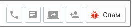

• Кнопка инициации исходящего вызова – Кнопка отображается в случае, когда для контакта адресной книги указан хотя бы один номер телефона. При нажатии кнопки отображается меню выбора телефона для совершения вызова. При щелчке по номеру телефона выполняется дозвон. • Кнопка создания текстового обращения – Пользователь может создать исходящее текстовое обращение для следующих контактных данных: номер мобильного телефона, E-mail, VK, Telegram, WhatsApp, СМС, Max. Кнопка отображается в случае, когда для контакта адресной книги указан хотя бы один способ коммуникации. При нажатии кнопки отображается меню выбора адреса для отправки сообщения. При щелчке по E-mail выполняется открытие переписки с клиентом (редактора писем) с подставленным почтовым адресом. Все электронные письма, в адресатах которых (поля "кому" / "копия" / "скрытая копия") указан адрес компании, создают новое обращение или распределяются в уже существующее обращение в статусе "В Работе". • Кнопка "Создать видеоконференцию" – Сотрудник может пригласить абонента к участию в видеоконференции, сгенерировав ссылку-приглашение.

• Кнопка "Привязать к существующему контакту" – При нажатии кнопки выберите контакт, к которому необходимо привязать текущее обращение. При привязке обращения в карточку

существующего клиента добавляется номер телефона или другой адрес Гостя, а также история обращений Гостя по данному номеру телефона или адресу. Если у контакта уже есть история обращений по другому адресу, то обращения (включая закрытые) с только что привязанного адреса "встраиваются" в историю обращений контакта. • Кнопка "Спам" – щелчок по кнопке закрывает обращение с результатом "Спам", а в случае звонкового обращения – завершает вызов. Не отображается у клиентов из адресной книги.

Закрытое кнопкой "спам" обращение помечается пиктограммой . В закрытом сообщении сохраняется история переписки. Блок информации о клиенте (быстрая карточка клиента) Блок информации о клиенте содержит элементы:

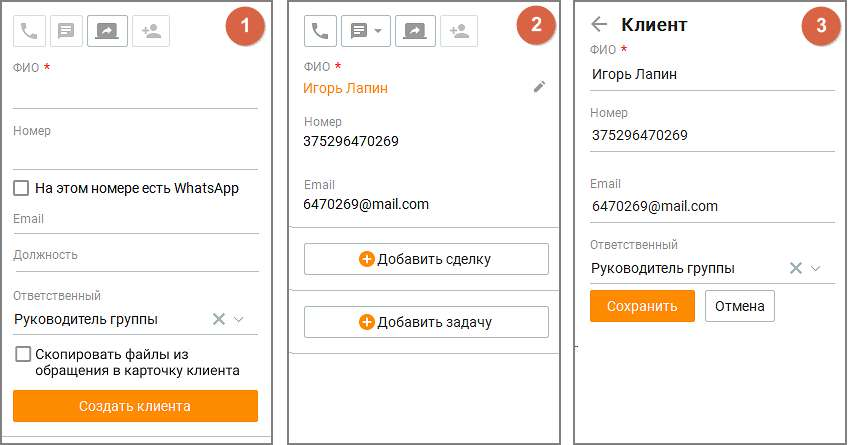

рис. 1 – Контакт отсутствует в адресной книге. рис. 2 – Контакт имеется в адресной книге. По клику на пиктограмме "карандаш" открывается форма редактирования контакта. Щелчок по ФИО открывает карточку клиента. рис. 3 – Форма редактирования контакта. Список полей в блоке информации о клиенте соответствует полям, отмеченным в столбце "Показывать в быстрой карточке" таблицы во вкладке Клиенты/Настройка полей. Если обращение создано в рамках кампании Исходящего обзвона, в быстрой карточке клиента отображается информация пользовательских полей, собранная в процессе обзвона. Чтобы ее просмотреть, кликните на ссылку "Информация о клиенте". Кнопки "Добавить сделку" и "Добавить задачу"

| Кнопка "Добавить сделку" доступна, если у клиента нет сделок "в работе", а поле ФИО |
| --- |
| содержит данные о клиенте. Щелчок по кнопке открывает форму создания/редактирования |
| сделки. |

статусом "в работе", автоматически привязывается к открытой сделке. Если открытых сделок больше, то обращение привязывается к последней по дате создания сделке.

| Кнопка "Добавить задачу" доступна, если у контакта нет открытых задач, а поле ФИО и/или |
| --- |
| Телефон содержит данные о клиенте. Щелчок по кнопке открывает форму |
| "Создания/редактирования задачи у клиента". |

Для контакта, не указанного в адресной книге, кнопка "Добавить сделку" не отображается

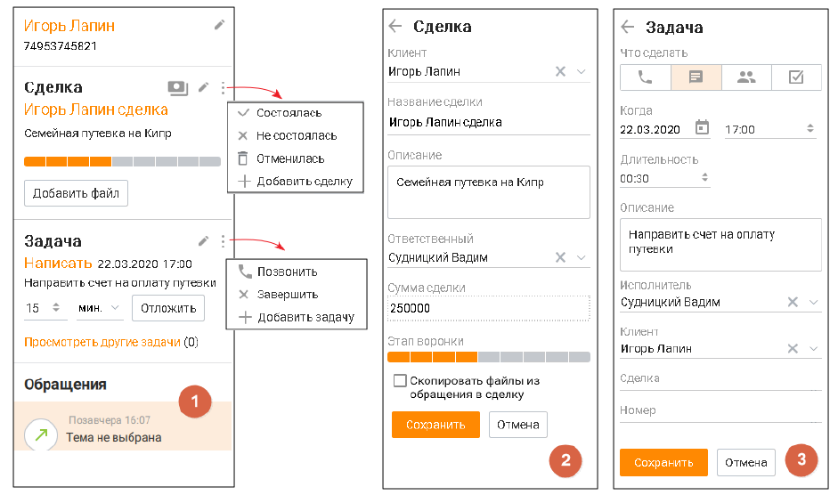

| рис. 1 Форма просмотра клиента, данные которого имеются в адресной книге, а также его задач |
| --- |
| и сделок. Форма содержит базовый набор функций и элементов, что и формы карточки задачи и |
| карточки сделки. |
| рис. 2 Форма создания/редактирования сделки. Форма содержит стандартный набор функций и |
| элементов, что и формы создания/редактирования сделки. |
| рис. 3 Форма создания/редактирования задачи. Форма содержит стандартный набор функций и |
| элементов, что и формы создания и редактирования задачи. |

Кнопки статуса оплаты

Клик по пиктограмме открывает окно информации о статусе платежа по сделке:

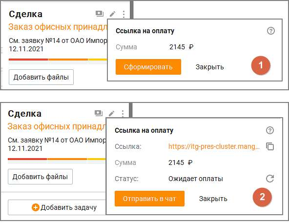

• рис. 1 Ссылка на оплату в сервисе ЮKassa не сгенерирована. • рис. 2 Ссылка на оплату сгенерирована, ожидается платеж. Блок обращений Блок обращений по умолчанию включает в себя 5 последних обращений клиента, отсортированных по дате создания, от новых сообщений к старым. Каждое обращение содержит: • Иконка обращения – значок соответствующего канала обращения; • Дата создания обращения – дата, когда обращение было создано. Если обращение в работе, то вместо даты создания отображается "В работе"; • Тема обращения – если тема не проставлена, то отображается надпись "Тема не выбрана". Выбор темы осуществляется во вкладке Обработка обращения.

| Если у сотрудника нет доступных для выбора тематик, в карточке оператора для |
| --- |
| сообщений с сайта кнопка выбора темы недоступна. |

• ФИО сотрудника, обработавшего обращение;

• Оценка обращения клиентом, если она проставлена – пиктограммы или ; • Кнопка "Загрузить ещё" – отображается, если у клиента больше обращений, чем отображается в данный момент. Щелчок по кнопке загружает еще 5 последних по дате создания обращений; • Значок "Спам" – отображается, если обращение было закрыто кнопкой спам. Блок информации о выбранном обращении

Блок информации о выбранном обращении содержит: • общую информацию об обращении

| номер обращения - только для текстовых обращений: Чат на сайте, VK, Telegram, WhatsApp, |
| --- |
| Авито, Авито Работа, Max, Клиентское приложение |

• раздел "Скрипт" • раздел "История обращений клиента" • раздел "Чат на сайте" • раздел "Обращение с сайта" • раздел "Обработка обращения" Если в разделе ЛК ВАТС/Номера, подключенные к АТС поле "Комментарий" к номеру телефона или SIP-Trunk, на который пришло обращение, заполнено, то в общей информации об обращении комментарий отображается вместо номера. При подключенной интеграции в блоке доступна кнопка "Отправить" для передачи оператором данных об обращении в CRM-систему.

Отправка обращения в CRM возможна, только если обращение привязано к контакту Адресной книги. Чтобы иметь возможность получать подсказки от Искусственного интеллекта, обратитесь к персональному менеджеру за подключением соответствующей услуги.

Скрипт Вкладка "Скрипт" отображается только при обработке голосовых вызовов. Вкладка доступна при наличии хотя бы одного доступного скрипта. Выбор скрипта осуществляется из выпадающего списка. После выбора любого из ответов клиента, а также при вводе ответа, выбор скрипта блокируется. Если в скрипте используются переменные из данных контакта в Адресной книге и пользователь заполняет соответствующие поля в Быстрой карточке клиента, внесенные данные автоматически подставляются в скрипт. Карточка контакта при этом не создается, данные о клиенте не сохраняются.

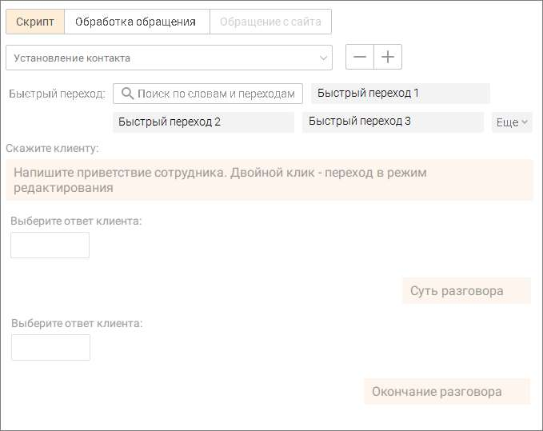

Быстрый переход На вкладке также отображается список быстрых переходов для прохода скрипта. Список не отображается, если одновременно нет быстрых переходов и в скрипте не используются переменные. Имеется поле поиска по словам в тексте ответа сотрудника и в названии быстрого перехода. Клик по кнопке Еще открывает полный список быстрых переходов. После клика по быстрому переходу ответ сотрудника и соответствующие ему ответы клиента, установленные выбранным переходом, отображаются в ленте диалога, как очередной шаг скрипта. Если шаг, соответствующий быстрому переходу, в текущем диалоге уже был пройден 10 раз, то в перечне быстрых переходов этот переход виден, но недоступен для клика.

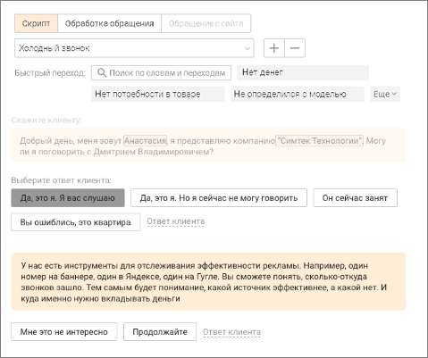

Действия в скрипте доступны только до завершения прохождения скрипта. После завершения прохождения скрипта, доступен только просмотр прохождения скрипта. Ответ клиента После ответа клиента сотрудник выбирает из вариантов, предложенных скриптом, соответствующий "ответ клиента". Далее скрипт предлагает сотруднику текст "скажите клиенту" для продолжения диалога с клиентом. Также сотрудник может самостоятельно прописать ответ клиента в поле диалога. Кнопка "Ответ клиента" отображается только в случае, если для текущего ответа сотрудника предусмотрен хотя бы один ответ клиента. Завершить работу со скриптом Клик по кнопке "Завершить работу со скриптом" завершает диалог с клиентом и блокирует возможность внесения изменений в прохождение скрипта. Чат с клиентом Вкладка "Чат с клиентом" отображается только при обработке текстовых обращений. В чатах предусмотрена проверка орфографии с помощью стандартного контекстного меню, вызываемого в любом месте поля ввода сообщения чата кликом по правой кнопке мыши.

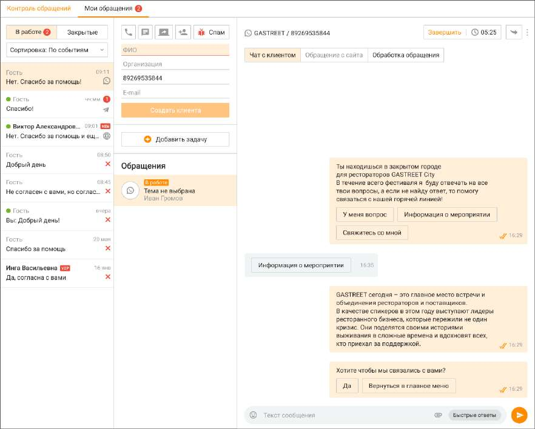

Список текстовых сообщений, получаемых, отправляемых сотрудником Контакт-центра MANGO OFFICE в рамках обращения, отображается в ленте обращения. Если канал обращения поддерживает кнопки быстрых ответов для пользователя, они также отображаются в ленте.

| Если в ленте переписки более 100 сообщений, остальные доступны по клику на кнопке |
| --- |
| Показать еще. |

Программа автоматически распознает ссылки и 11-значные номера телефонов. При нажатии на ссылку открывается браузер по умолчанию, и в нем в новой вкладке открывается соответствующая ссылке страница. При нажатии на номер выполняется инициация исходящего вызова на указанный номер телефона. При получении слишком длинного текстового сообщения последние несколько символов заменяются на текст "Читать полностью...", являющийся кнопкой. При нажатии кнопки отображается отдельное окно, содержащее весь текст сообщения. Для отправки сообщения установите курсор в область поля ввода, наберите сообщение и

нажмите кнопку либо клавишу Enter. Для перехода на следующую строку без отправки сообщения воспользуйтесь комбинациями клавиш Ctrl+Enter, Shift+Enter. В чате сотрудник может вставить в сообщение одну или несколько картинок из буфера обмена (используя сочетание клавиш Сtrl+V) или из контекстного меню. Картинку можно удалить из сообщения, используя кнопку Backspace на клавиатуре. Если в Личном кабинете ВАТС заданы соответствующие настройки, оператор Контакт-центра и посетитель виджета "чат на сайте" имеют возможность редактировать свое сообщение в течение заданного периода времени. ФАЙЛЫ ЧАТА

Для того, чтобы отправить файл, щелкните по пиктограмме либо перетяните файл в поле отправки сообщения при помощи функции drag-and-drop. Допускается отправка файлов любого формата объемом не более 2 Гб. Состояние файла отображается в чате, как один из вариантов: отправляется, ошибка, отправлен, доставлен, просмотрен. В чате возможен просмотр изображений, отправленных клиентом, без необходимости их загрузки на компьютер. Для открытия изображения достаточно кликнуть по нему – оно отобразится в модальном окне. Масштаб можно изменять с помощью сочетаний клавиш Ctrl + (увеличение) и Ctrl – (уменьшение). Поддерживаются форматы bmp, jpg, jpeg, gif, tif, tiff, png, при этом максимальный размер файла составляет 10 МБ, а количество вложений в одном сообщении не может превышать пяти. Изображение просматривается только в Контакт- центре и не сохраняется на компьютер, что обеспечивает удобство и безопасность работы. Аудиофайлы и голосовые сообщения можно прослушать прямо в чате — без скачивания. Проигрыватель встроен в сообщение. У голосовых отображается подпись, у файлов — название и формат. Действия в контекстном меню: сохранить, копировать в обращение или в сделку.

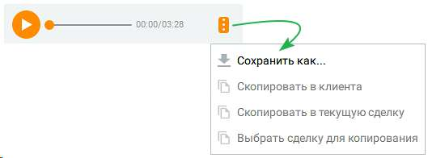

Также в чате доступен предпросмотр изображений, ссылок, файлов и сохранение файлов чата в карточку сделки или клиента.

| Оператор может скачать и просмотреть полученные из мессенджеров /социальных сетей |  |  |
| --- | --- | --- |
|  | файлы в течение 3 месяцев после их отправки. Файлы, полученные ранее этого срока, |  |
| недоступны для скачивания. |  |  |

Для файлов обращения доступны следующие действия:

• сохранить файл в карточку клиента – пиктограмма

• сохранить файл в карточку текущей сделки клиента – пиктограмма

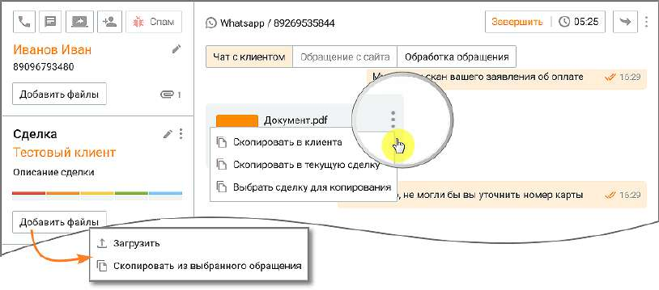

• сохранить файл в карточку любой сделки клиента – пиктограмма • сохраните все файлы обращения в карточку клиента или сделки – кнопка "Добавить файлы" • сохранить все файлы обращения в новую сделку (при ее создании) – чекбокс "Скопировать файлы из обращения в сделку" • сохранить все файлы обращения в карточку нового клиента (при ее создании) – чекбокс "Скопировать файлы из обращения в карточку клиента"

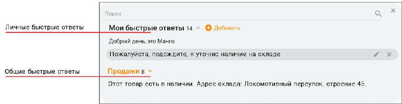

БЫСТРЫЕ ОТВЕТЫ Для рационального использования времени сотрудников предусмотрена возможность использования быстрых ответов — заранее подготовленных сообщений, содержащих стандартные приветствия, ответы на часто повторяющиеся вопросы и т. п. Быстрые ответы делятся на • общие – доступные всем сотрудникам, в зависимости от их роли в Контакт-центре • личные - добавленные конкретным сотрудником и недоступные другим сотрудникам Для начала работы с быстрыми ответами настройте список общих быстрых ответов на вкладке "Быстрые ответы". Максимальное количество общих быстрых ответов на продукте – не более 1000.

Для выбора быстрого ответа нажмите кнопку "Быстрые ответы" в области поля ввода. В результате отобразится окно выбора быстрого ответа, с полем поиска.

При выборе ответа из формы "Быстрых ответов" выбранный ответ добавляется к тексту в строке ввода, а не заменяет его. Чтобы заменить текст, следует выделить в строке заменяемую часть. Ведение списка быстрых ответов осуществляется в настройках программы на вкладке "Быстрые ответы". Переход на настройки быстрых ответов также доступен по клику на

пиктограмме "шестеренка" – Сотруднику доступны быстрые ответы: • назначенные на группу/-ы, в которых состоит текущий сотрудник; • без категории (такие быстрые ответы доступны всем); • созданные текущим сотрудником на любом из устройств. Быстрые ответы распределены по категориям. Напротив наименования категории отображается количество ответов, относящихся к данной категории. Также у сотрудника имеется возможность ведения списка личных быстрых ответов. Для

этого введите в поле ввода свой вариант ответа и нажмите . Максимальное количество личных быстрых ответов каждого сотрудника – 50.

Для поиска нужного быстрого ответа введите искомый текст в поисковом поле. При вводе не менее трех символов срабатывает автоподбор. Поиск выполняется согласно их приоритету в списке быстрых ответов: • сначала в списке "моих быстрых ответов"; • затем в списке общих групповых ответов. Свои быстрые ответы пользователь может:

• отредактировать – кликом по пиктограмме

• удалить – кликом по пиктограмме Для отправки быстрого ответа выберите его из списка, в результате чего текст быстрого ответа

отобразится в области ввода, после чего нажмите кнопку либо клавишу Enter. ФОРМА СБОРА КОНТАКТНЫХ ДАННЫХ Если в настройках канала в Личном кабинете пользователя ВАТС выбрана опция «Запрашивать информацию о клиенте» – «по запросу оператора», в разделе "Мои обращения" отображается кнопка для отправки формы сбора контактных данных в чат на сайте. Маркер кнопки означает, что форма сбора данных в этом обращении еще не

отправлялась.

Чтобы отправить форму в чат с клиентом, последовательно нажмите на кнопки и . После того как клиент заполнит форму сбора контактных данных и отправит ее в чате на сайте, в поле переписки отобразится служебное сообщение – "Заполнена анкета". Маркер кнопки сменит цвет на зеленый.

| Форма сбора контактных данных в рамках одного обращения может быть отправлена |
| --- |
| только один раз. Повторная отправка формы не доступна. |

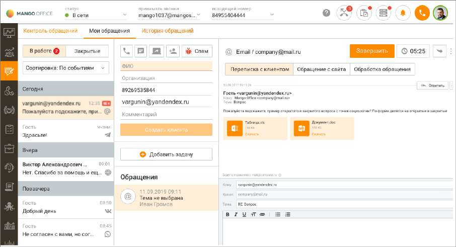

История обращений клиента История обращений клиента включает историю вызовов по текущему клиенту по всем номерам телефонов клиента по всем номерам телефонов компании. При получении нового письма по адресу отправителя осуществляется идентификация Клиента, и данные контакта попадают в Историю обращений. Также в истории обращений клиента находятся обращения со всех текстовых каналов. При поступлении текстового обращения по другим каналам также осуществляется идентификация Гостя с существующим контактом (если имеется), с объединением всех данных по данному контакту. Список обращений одновременно отображает не более 15 последних обращений клиента. Для просмотра всех обращений нажмите кнопку Все обращения клиента. В результате выполняется переход к вкладке "Обращения" карточки клиента. При щелчке по теме обращения выполняется переход к выбранному обращению на вкладке просмотра обращений клиента в окне просмотра карточки клиента. Обращение с сайта Переход на вкладку доступен только при наличии информации о посетителе с сайта. Также на вкладке отображается информация на сайте по динамическому номеру клиента.

| Возможность просмотра информации по динамическому номеру доступна только при |
| --- |
| наличии подключенной услуги. |

Обращения из чата на сайте, которые обрабатывает чат-бот с кнопками, при переводе на оператора отображаются в Контакт-центре:

• 1. Обращения – Мои обращения – Чат с клиентом • 2. Карточка клиента – История обращений Переписка с клиентом по e-mail Переписка с клиентом может осуществляться: • с электронной почты компании; • с электронной почты сотрудника.

| Как настроить отправку писем с электронной почты сотрудника, читайте в подразделе |  |  |
| --- | --- | --- |
|  | Телефония и E-mail. |  |

После авторизации e-mail в Контакт-центр подгружаются все обращения, поступившие на электронную почту в период, когда e-mail не был авторизован. Редактор писем Контакт-центра Mango Office При использовании для переписки редактора писем Контакт-центра Mango Office: ▪ в качестве адресата указывается адрес клиента; ▪ в качестве отправителя указана электронная почта компании или сотрудника; ▪ в теме указана тема письма с добавленными символами "Re:" ▪ в строке "Копия" автоматически проставляется электронная почта компании; ▪ в поле ответа добавлена подпись для текущего письма (если настроена во вкладке "Телефония и e-mail"), а также предыдущая переписка со всеми вложениями.

<!-- изображение на стр. 153: байты не извлечены (PyMuPDF недоступен) -->

Для отправки письма заполните поля формы, при необходимости добавьте присоединенные файлы при помощи стандартных средств Windows и нажмите кнопку Отправить. Если письмо не отправлено, то редактор переходит в состояние до нажатия кнопки "Отправить" и в трее отображается системное уведомление с иконкой "Восклицательный знак", с кнопкой закрытия уведомления и с текстом: "Не удалось отправить письмо. Проверьте настройки электронной почты и попробуйте ещё раз". На иконке прикрепленного файла имеется информация о наименовании, типе, размере и статусе файла. Сторонний почтовый клиент Также переписка с клиентом может осуществляться в стороннем почтовом клиенте. Для

<!-- изображение на стр. 153: байты не извлечены (PyMuPDF недоступен) -->

этого щелкните по пиктограмме и нажмите кнопку "Ответить в почтовом клиенте".

<!-- изображение на стр. 154: байты не извлечены (PyMuPDF недоступен) -->

| Чтобы письма, отправленные в стороннем почтовом клиенте, отображались в истории |  |  |
| --- | --- | --- |
|  | обращений, при каждом ответе клиенту необходимо указывать электронную почту компании |  |
|  | в графе "Копия". Если же сотрудник компании пишет с почты компании в стороннем |  |
| почтовом клиенте, такие письма автоматически попадают в обращения. |  |  |

<!-- изображение на стр. 154: байты не извлечены (PyMuPDF недоступен) -->

Для того, чтобы завершить обработку обращения, следует закрыть обращение либо перевести его на другого сотрудника. • Перевод обращения; • Перенос задания кампании Исходящего обзвона вручную на другое время; • Закрытие обработки.
