# 10.1. Контакты (адресная книга)

> Трассировка: PDF §10.1 · сквозные стр. 296-320 · источники: ч.1 `kb/sources/mango-cc-manual/CC_manual_1.26.28.1.pdf` с.296-320.

Контакты Адресной книги доступны пользователю в соответствии с его ролью в Контакт- центре.

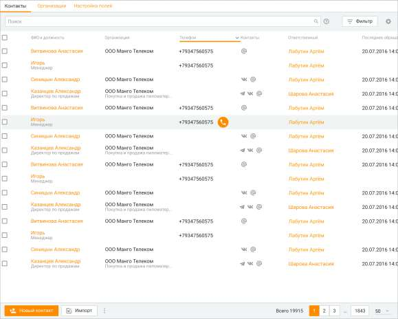

|  | столбцу ФИО и должность. | Пользователю |
| --- | --- | --- |
| доступна сортировка по любому из полей таблицы, включая пользовательские. Полный |  |  |
| список стандартных полей Контактов приведен в описании вкладки Информация. |  |  |

Вы можете самостоятельно выбрать, какие столбцы будут отображаться на панели. Для этого

щелкните левой кнопкой мыши по пиктограмме и установите/снимите флаги напротив наименований столбцов.

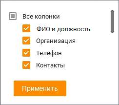

| Пользовательские поля в списке клиентов на вкладке Контакты по умолчанию не |  |  |
| --- | --- | --- |
|  | показываются. При наличии пользовательских полей их необходимо вносить в таблицу |  |
| самостоятельно, щелкнув по пиктограмме |  |  |

По клику на кнопке "Фильтры" открывается окно фильтрации. При выборе хотя бы одного из контактов отображается панель массовых действий с контактами Адресной книги. Как работать с фильтрами Окно фильтрации состоит из двух блоков: 1. Блок настройки параметров фильтрации. 2. Блок сохраненных фильтров. Пользователь может добавлять поля фильтрации кнопкой "Добавить поле". Для фильтрации доступны все поля Контактов, включая пользовательские. Подробнее о пользовательских полях в подразделе Настройка полей.

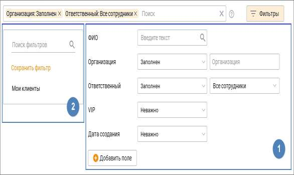

1. Блок настройки параметров фильтрации.

| Пользователю доступна фильтрация по любому из полей таблицы, а также по признаку |  |  |
| --- | --- | --- |
| наличия/отсутствия у контакта задач, сделок, обращений, контактных данных (телефон, |  |  |
| соцсети). В полях ФИО и Организация возможен поиск как по полным данным, так и по |  |  |
| частичному наименованию. В поле Телефон допускается выбор нескольких значений. |  |  |
| Кнопка | Добавить поле | открывает список доступных для выбора полей. Каждое поле |
| пользователь может выбрать только один раз. |  |  |

Выберите фильтры и нажмите кнопку Применить фильтр. Таблица контактов отобразится с учетом выбранных параметров:

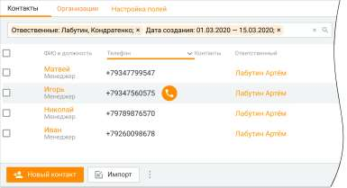

2. Блок сохраненных фильтров Пользователь, независимо от своей роли в Контакт-центре, может сохранить выбранный фильтр. Сохраненный фильтр будет доступен всем пользователям Контакт-центра. В качестве фильтра сохраняется следующий набор данных: • набор выбранных полей;

• приоритет выбранных полей; • значения во всех выпадающих списках и календарях, соответствующих этому полю (включая значение по умолчанию); • наименование сохраненного фильтра – в сохраненном фильтре доступно только редактирование наименования фильтра. Изменение наименования фильтра доступно любому сотруднику, и будет отображаться в измененном виде у всех пользователей Контакт-центра. • приоритет фильтра среди других сохраненных фильтров – изменить приоритет фильтра можно путем перетаскивания его на необходимый уровень в списке фильтров. Только что созданный фильтр имеет наивысший приоритет. Приоритет фильтра у одного пользователя Контакт-центра не влияет на приоритет этого же фильтра у другого пользователя. Сохраненный фильтр может удалить любой сотрудник, удаленный фильтр исчезает у всех пользователей продукта. Пользователям доступен поиск в сохраненных фильтрах – по наименованию фильтра (полному или частичному). На каждом продукте есть один предустановленный сохраненный фильтр "Мои клиенты". К нему применяются все правила, как и к другим сохраненным фильтрам: его можно переименовать, удалить, поменять приоритет только у себя на компьютере, применить. Как работать с панелью массовых действий Панель массовых действий с контактами Адресной книги размещается под поисковой строкой.

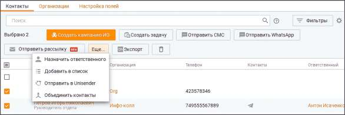

На панели доступны следующие действия: • Создать задачу – Выбранным контактам, у которых имеется Ответственный, осуществляется массовая постановка задачи. Если Ответственный не проставлен, для данного контакта задача не создается. Кнопка доступна, если к Контакт-центру подключен модуль "Задачи" и выбран хотя бы один контакт; • Создать кампанию ИО – клик по кнопке приводит к открытию мастера создания кампании Исходящего обзвона на первом шаге. Кнопка доступна, если к Контакт-центру подключен модуль "Исходящие кампании (Исходящий обзвон)" и выбран хотя бы один контакт; • Отправить СМС – кнопка доступна, если к Контакт-центру подключена услуга "Исходящие кампании (СМС-рассылки)" и выбран хотя бы один контакт; • Отправить WhatsApp – кнопка доступна, если в Контакт-центре настроены канал и шаблоны сообщений для отправки WhatsApp, а также выбран хотя бы один контакт. Массовая отправка сообщений WhatsApp возможна не более, чем 50 контактам одновременно. Обращения, отправленные из панели массовых действий: o закрываются сразу по отправлении; o не отображаются в интерфейсе "Мои обращения" (в том числе в списке закрытых); o доступны для просмотра в Истории обращений.

• Отправить рассылку - кнопка доступна, если к Контакт-центру подключена услуга "Текстовые рассылки". Клик по кнопке открывает раздел "Текстовые рассылки" Контакт- центра. • Еще – клик по кнопке отображает выпадающий список: o Назначить ответственного – если у контакта уже имеется Ответственный, то назначение нового Ответственного осуществляется без уведомления о переназначении; o Добавить в список – добавление выбранных контактов в существующие списки, а также создание новых списков контактов; o Отправить в Unisender – отправление выбранных контактов в список рассылки Unisender; o Объединить контакты – объединение данных выбранных контактов. Также на панели массовых действий имеются кнопки: • Экспорт – экспорт выбранных контактов в формате CSV. Подробнее в подразделе Импорт и экспорт контактов; • Корзина (удалить контакты) – после системного предупреждения происходит удаление выбранных контактов. Как работать с "Избранным" Пользователь может: • добавить/удалять контакт из общей адресной книги в избранные контакты, поставив соответствующую метку на контакте; • создавать избранный контакт, при этом созданный контакт автоматически отобразится и в общей адресной книге; • изменять контакт в избранном контакте, при этом все изменения отобразятся в общей адресной книге. Как работать с личными контактами (с пометкой "Ответственный") Контакт, для которого назначен ответственный сотрудник, считается личным контактом.

| Работа с контактами, у которых есть ответственный, доступна только сотрудникам с |  |  |
| --- | --- | --- |
|  | правом "Просматривать персональные контакты". Для остальных сотрудников такие |  |
| контакты являются "чужими контактами". |  |  |

Сотрудник, обладающий правом "Просматривать персональные контакты", может: • сделать себя ответственным у контакта, если ответственный контакта отсутствует; • поменять ответственного за контакт, если он сам является этим ответственным либо ответственным является сотрудник в подконтрольной ему группе; • при создании нового контакта указать себя ответственным. Если у контакта назначен ответственный, то все звонковые обращения в компанию от такого контакта будут автоматически распределяться на ответственного сотрудника, если сотрудник доступен на момент обращения. Распределение текстовых обращений на ответственного также можно настроить, проставив чекбокс "Автоматическое распределять текстовыe обращения на ответственного оператора" в Личном кабинете ВАТС в разделе "Обработка звонков/Настройки дозвона и сообщений по умолчанию". Пользователь может открыть карточку "чужого контакта" для просмотра в ограниченном режиме. У "чужих контактов" доступны для просмотра следующие поля: Организация, ФИО, Ответственный, Избранное. В карточке "чужого контакта" доступно для редактирования только поле Избранное. Чужой контакт не может быть удален. При попытке экспорта "чужих контактов" никакая информация о таких контактах не попадет в выгружаемый файл. Если поле "Ответственный" отображается в подразделе Настройка полей как обязательное для показа, то при создании контакта в поле Ответственный автоматически подставляется

ответственным текущий пользователь. Это правило работает только для пользователей, не обладающих правами "Просматривать персональные контакты". Как отправить контакты в Unisender Чтобы иметь возможность отправлять контакты в сервис рассылок Unisender, в Контакт- центре должна быть подключена соответствующая интеграция. На вкладке Контакты выберите контакты, которые необходимо отправить в Unisender, и нажмите кнопку "Еще" на панели массовых действий. В выпадающем списке выберите пункт меню "Отправить в Unisender".

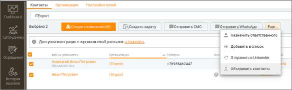

После клика на пункт меню "Отправить в Unisender" откроется окно настройки отправки:

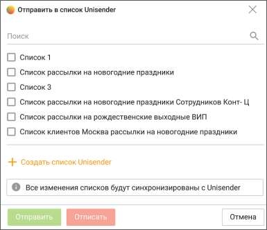

Отметьте списки, в которые необходимо отправить данные клиента или создайте новый список. После кика по кнопке Отправить, данные клиентов будут отправлены в сервис рассылки. Клик по кнопке Отписать удалит данные клиентов из отмеченных списков.

| При первом использовании функционала рекомендуется создавать новый список |  |  |
| --- | --- | --- |
|  | Unisender для тестовой отправки данных. В этом случае все отправленные в тестовом режиме |  |
| контакты несложно будет удалить из сервиса путем удаления целого списка. |  |  |

Для удаления списка нажмите пиктограмму в строке выбранного списка. Для

редактирования наименования нажмите пиктограмму

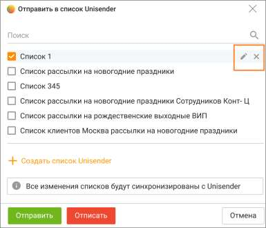

Как отобразить контакты постранично Отображение списка клиентов осуществляется постранично. Действие фильтров поиска и отбора распространяется на все записи, а не только на те, которые отображены на текущей странице. Для перехода по страницам используются кнопки с указанием номера страницы в правой нижней части рабочей области. Там же редактируется количество записей, выводимых на одну страницу. Поиск клиентов Для оперативного поиска клиента введите в поле поиска имя, отчество, фамилию или иные данные клиента. При вводе искомого текста работает автоподбор. Введенный текст проверяется на совпадение с данными клиента, указанными в его карточке. Поиск производится по всем основным полям контактных данных – ФИО, Организация, Должность, Телефон, Электронный адрес, Список, Сайт, Комментарий, ID, Ответственный, Автор, а также по пользовательским полям.

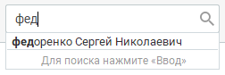

Для поиска нужного клиента введите в поле "Поиск" искомый текст (в качестве разделителя слов можно использовать пробел ' ' или дефис '-' и нажмите кнопку Найти либо клавишу Enter. После этого осуществляется поиск контактов по введенному искомому тексту. После завершения поиска в рабочей области панели отображаются все клиенты, где в указанных выше полях данных которых есть слова, содержащие поисковый запрос. Для точного поиска заключите поисковый запрос в кавычки – "текст поискового запроса". Чтобы найти всех клиентов, связанных с конкретной организацией, наведите курсор на строку

нужного контакта, затем нажмите кнопку .

После завершения поиска в рабочей области панели отображаются все клиенты, где в поле "Организация" указана такая же организация. Максимально допустимое количество символов в поисковом запросе – 70.

| Текстовый поиск осуществляется для всех клиентов, а не только для клиентов, |  |  |
| --- | --- | --- |
|  | отображаемых в текущий момент на экране. Чтобы очистить поле поиска, нажмите кнопку |  |
| . |  |  |

Как скопировать в буфер обмена Чтобы скопировать номер по умолчанию в буфер обмена, выберите номер левой кнопкой мыши, затем нажмите правую кнопку и выберите команду Копировать номер в контекстном меню. Как позвонить, отправить SMS, сообщение в соц.сетях или e-mail Чтобы позвонить клиенту, наведите курсор на строку с ФИО и нажмите соответствующую кнопку. Стрелка на кнопке означает наличие нескольких номеров. Жирным шрифтом выделен номер, указанный в карточке клиента как основной. При наличии в карточке клиента телефонного номера с типом "Мобильный" при наведении курсора на строку с ФИО контакта дополнительно отобразится форма для отправки СМС- сообщения.

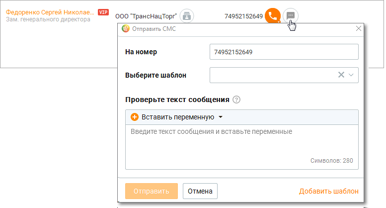

Больше узнать о настройке шаблонов СМС-сообщений можно здесь. Изменение текста выбранного шаблона не приводит к изменению отображения выбранного шаблона или в каким-либо другим действиям с шаблоном. Чтобы отправить клиенту письмо по электронной почте, щелкните по адресу электронной почты в столбце e-mail. После этого в операционной системе запускается зарегистрированный по умолчанию почтовый клиент, где создается новое письмо. В поле Кому автоматически подставляется соответствующий адрес электронной почты.

Чтобы отправить клиенту сообщение в социальных сетях необходимо выбрать в адресной книге иконку контактных данных. Сотрудник может отправлять текстовое обращение в Telegram, ВКонтакте, Max, WhatsApp.

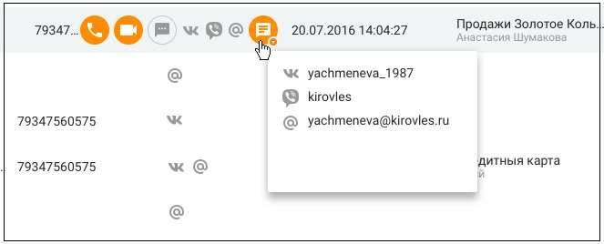

Больше информации узнайте в разделе Мои обращения/Исходящие обращения. Как объединить контакты От одного клиента может поступить несколько обращений, через различные каналы. Как правило, по каждому из обращений сотрудники создают отдельного клиента в адресной книге т.к. не всегда понятно, что клиент уже обращался через другой канал связи. Такие дублированные контакты можно объединять в один. Чтобы объединить контакты, на вкладке Контакты выберите контакты, которые необходимо объединить, и нажмите кнопку "Еще" на панели массовых действий. В выпадающем списке выберите пункт меню "Объединить контакты". Для объединения можно выбрать от 2-х до 10-ти контактов.

Для объединения нельзя выбирать контакты из внешних источников.

После клика на пункт меню "Объединить контакты" откроется окно объединения.

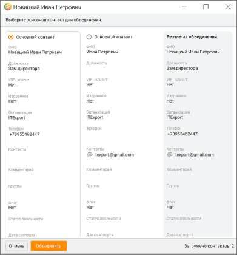

В окне объединения можно провести следующие действия: • Выбрать основной контакт. • Просмотреть результат объединения контактов • Объединить контакты кликом по кнопке "Объединить" • Отменить операцию объединения кликом по кнопке "Отменить"

| При объединении все данные переносятся в основной контакт. После объединения |
| --- |
| контакт, не отмеченный как основной, будет удален. |

Также на вкладке присутствуют кнопки: • Новый контакт - добавление нового контакта в Адресную книгу; • Импорт – импорт контактов в Адресную книгу;

• Пиктограмма - удаление всех контактов Адресной книги (доступна только пользователям с правом "Администратор"). Далее: • Создание, редактирование, удаление контактов • Импорт и экспорт контактов

10.1.1. Создание и редактирование клиентов

| Пользователь с ролью Сотрудник может только просматривать список клиентов. О |  |  |
| --- | --- | --- |
|  | доступности функций редактирования и удаления контактов см. Приложение 2, подраздел |  |
| "Контакты". |  |  |

Создание клиента Для создания нового клиента на вкладке Контакты нажмите Новый контакт в нижней части панели. После этого на экране отображается окно карточки клиента. Укажите необходимые данные, используя соответствующие элементы интерфейса (их подробное описание приведено далее). После ввода всех контактных данных нажмите Сохранить. Запись сохраняется и отображается в адресной книге. Дата создания указывается автоматически. Если при создании нового клиента в адресной книге уже имеется клиент с таким же телефонным номером, то на экране отображается окно с соответствующим предупреждающим сообщением. При выборе варианта "Да" будет создан новый клиент с этим номером телефона. В уже существующей карточке клиента данный номер телефона будет удален.

Создание клиента из карточки Гостя Клиент со статусом Гость – неидентифицированный клиент, которого нет в адресной книге, и который обращается в первый раз. Или обращается повторно, но не был внесен в адресную книгу при первом обращении. Карточка Гостя содержит поля, аналогичные карточке создания нового контакта. В зависимости от вида обращения – текстовое или звонок – на закладке Контакты в карточке Гостя имеется номер телефона либо адрес, с которого обратился клиент. Номер телефона при этом сохраняется в карточке контакта, как "номер мобильного телефона". Чтобы добавить клиента в адресную книгу, внесите данные в остальные поля карточки Гостя и нажмите кнопку Новый контакт. При этом задачи и обращения (открытые и закрытые) Гостя привязываются к этому контакту.

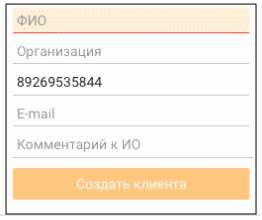

Поле ФИО является обязательным для заполнения.

Создание клиента из карточки обращения Блок информации о клиенте в разделе Мои обращения содержит элементы:

Заполните свободные поля карточки контакта и щелкните по кнопке "Создать клиента". В адресной книге будет создан новый контакт. История обращений "Гостя" сохраняется в истории обращений создаваемого клиента. В случае, когда обращение получено из социальной сети или мессенджера (Telegram, VK, WhatsApp, Авито, Авито Работа, Max), то аватар и имя аккаунта клиента автоматически заносятся в карточку нового контакта. При звонковом вызове в карточку также заносятся номер телефона и учетных записей SIP. При создания контакта из закрытого обращения к новому контакту привязываются все обращения клиента, поступившие с этого адреса до и после закрытия обращения.

| Также в блоке информации о клиенте содержатся пользовательские поля, помеченные *, как |
| --- |
| обязательные для заполнения |

Как отредактировать карточку клиента Чтобы редактировать карточку клиента, нажмите ссылку с ФИО клиента либо дважды щелкните название организации клиента (если оно указано). После этого на экране отображается окно карточки клиента. В заголовке этого окна указано ФИО клиента. Внесите необходимые изменения в карточку, используя соответствующие элементы интерфейса (их подробное описание приведено далее в подразделе "Подробнее о контактных данных"). Затем нажмите Сохранить. После этого сохраняются внесенные вами изменения. Если при редактировании клиента указывается наименование организации, отсутствующей в списке организаций на вкладке Организация, то автоматически будет создана карточка новой организации. К карточке будет привязан клиент. Если же такая организация уже существует, клиент не привязывается к ней автоматически, и его необходимо привязать вручную.

| Если вы внесли изменения в данные и хотите закрыть карточку клиента, на экране |  |  |
| --- | --- | --- |
|  | отображается окно с соответствующим предупреждающим сообщением. Если в адресной |  |
|  | книге уже имеется клиент с указанным вами при редактировании телефонным номером, то |  |
| на экране отображается окно с соответствующим предупреждающим сообщением. |  |  |

Как удалить клиента Чтобы удалить клиента из Избранного, откройте его карточку и выключите настройку Избранное. Затем нажмите Сохранить. После этого клиент удаляется из личной адресной книги, но остается в общей адресной книге. Чтобы удалить клиента(ов) из общей адресной книги, установите напротив нужного клиента(ов) флаг в соответствующем столбце таблицы и нажмите кнопку Удалить контакты. После этого на экране отображается окно с запросом на подтверждение удаления. После подтверждения производится безвозвратное удаление клиента(ов) из адресной книги. Чтобы удалить все записи, установите флаг в заголовке соответствующего столбца и

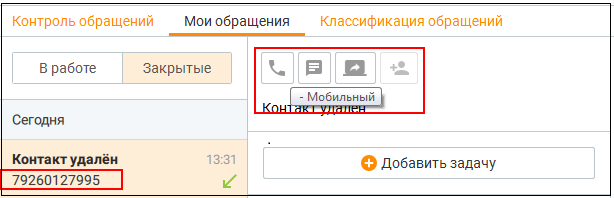

нажмите кнопку Удалить контакты. Также в нижней части окна предусмотрена кнопка для вызова функции "Удалить все контакты". После этого на экране отображается окно с запросом на подтверждение удаления. После подтверждения клиенты безвозвратно удаляются из адресной книги.

| Наличие прав на удаление клиентов зависит от роли пользователя. Вы также можете |  |  |
| --- | --- | --- |
|  | выбрать для удаления только клиентов, которые соответствуют заданными критериям |  |
|  | отбора. Для отбора подлежащих удалению клиентов можно использовать поле поиска, |  |
| списки и флажок Только личная адресная книга. |  |  |

Удаленным из адресной книги клиентам есть возможность позвонить или написать СМС из карточки обращения клиента.

При удалении контакта, созданного из карточки обращения Гостя, все его обращения становятся "гостевыми", то есть не имеющими привязки к контакту. Такие обращения могут

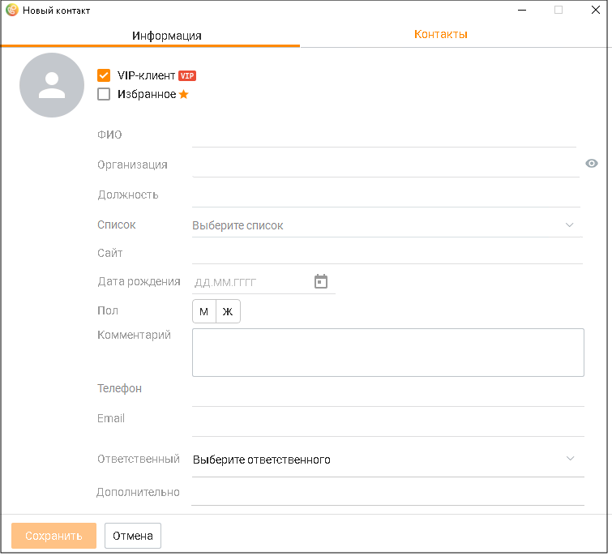

быть привязаны к другому контакту нажатием кнопки в шапке обращения. При этом если у удаленного контакта были обращения с различных адресов, то "гостевых" обращений также будет несколько – по числу адресов. При удалении клиента все загруженные в его карточку документы удаляются, незавершенные загрузки документов прерываются, все открытые карточки клиентов закрываются. Сведения о клиенте распределены по вкладкам: • Информация — сведения о клиенте; • Контакты — контактные данные клиента; • Задачи и обращения — список задач и обращений клиента; • Сделки — список сделок клиента; • Документы — список загруженных в систему документов клиента.

| Для новых контактов и контактов во статусом "Гость" вкладки Сделки и Задачи и обращения |
| --- |
| не отображаются. |

Информация и контакты Подробнее о контактных данных клиента. Информация Вкладка "Информация" содержит следующие атрибуты и поля:

VIP-клиент Настройка позволяет установить или убрать признак «важности» клиента для соответствующего клиента. При включенной настройке VIP-клиент будет отображаться в виде соответствующего значка в различных элементах интерфейса Контакт-центра MANGO OFFICE. Избранное Этот флажок позволяет указать, будет ли клиент включен в избранные контакты пользователя. Если этот флажок установлен, то клиент включается в "Избранное" (о чем свидетельствует соответствующий значок в рабочей области окна Клиенты, и наоборот. Вы можете пометить контакт как "Избранное" для индивидуальной работы с ним в дальнейшем.

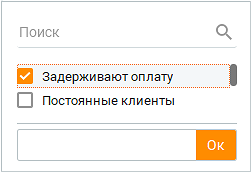

ФИО Это поле является обязательным для ввода. Позволяет указать фамилию, имя, отчество клиента. Максимальное количество символов – 50. Организация Позволяет выбирать и указывать организацию для клиентов (например, ООО «Успех»). По мере ввода символов отображаются первые пять (или менее) названий организаций, в которых встречается искомая комбинация. Если организации с таким наименованием в списке не оказалось, то после нажатия Enter будет создана новая организация. Максимальное количество символов -128. Если при создании нового или редактировании существующего клиента указывается наименование организации, отсутствующей в списке организаций на вкладке Организация,

то автоматически будет создана карточка новой организации. К карточке будет привязан клиент. Если же такая организация уже существует, клиент не привязывается к ней автоматически, и его необходимо привязать вручную. Один клиент может быть привязан только к одной организации. Клик по пиктограмме открывает карточку организации в режиме редактирования.

Чтобы изменить название организации, наведите курсор на название организации и отредактируйте информацию. Для удаления организации из карточки клиента оставьте поле пустым. Должность Укажите должность клиента в поле ввода. Максимальное количество символов – 50. Список Позволяет выбирать и указывать списки клиентов (например, Поставщики, Клиенты, Подрядчики). Один и тот же клиент может входить в несколько списков. Максимальное количество символов – 32. Нажмите стрелку в правом углу поля. После этого в карточке клиента отображается окно, содержащее существующие списки клиентов. Выберите нужные списки, установив соответствующие флажки. Чтобы создать список клиентов, нажмите кнопку Создать список внизу окна. Затем укажите название нового списка в появившемся поле ввода. Сохранение списка происходит по нажатию клавиши Ок.

Чтобы редактировать список клиентов, установите курсор на нужный список и нажмите на пиктограмму . Затем внесите необходимые изменения. Сохранение изменений происходит

по клику вне окна или по нажатию клавиши Enter. Допускается не более 500 списков. Чтобы удалить список клиентов, выберите список и

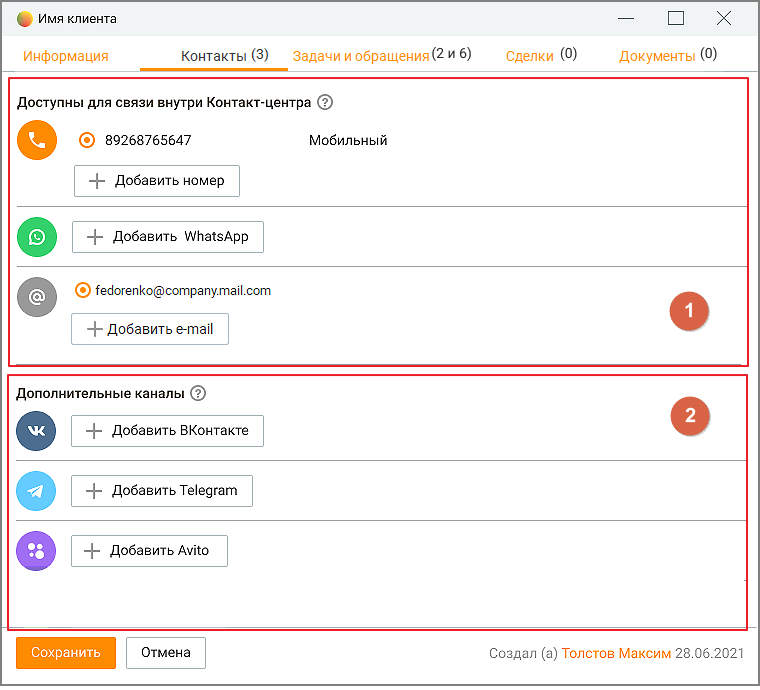

кликните на пиктограмму . Сайт Сайт клиента. Максимальное количество символов – 255. Дата рождения Укажите дату в поле ввода в формате ДД.ММ.ГГГГ или выберите ее с использованием календаря. Пол Чтобы указать пол клиента, нажмите соответствующую кнопку. Комментарий Позволяет указать информацию о клиенте произвольного характера (например, ФИО менеджера, номер лицевого счета и т. п.). Максимальное количество символов – 1000.

| Телефон |
| --- |
| Номер телефона клиента в формате +Х(ХХХ)ХХХ-ХХХХ. Автоматически добавляется на |
| вкладке "Контакты", как мобильный телефон клиента. |
| E-mail |
| Адрес электронной почты автоматически добавляется на вкладке "Контакты", как почтовый |
| адрес клиента. |

Ответственный

Контакт, для которого назначен ответственный сотрудник, считается личным контактом. Обращения в компанию от такого контакта будут распределяться на ответственного сотрудника.

| Поле Ответственный доступно только сотрудникам с правом "Просматривать |
| --- |
| персональные контакты. |

ID – ID-номер контакта отображается, если помечен как "видимый" в настройках поля карточки клиента. Значение ID можно выделить и скопировать в буфер с помощью стандартных клавиш – Сtrl+С. Контакт создал (если есть) – имя сотрудника, создавшего контакт (в таблице Адресной книги соответствует полю "Автор"). Если автор не удален из Контакт-центра, клик по имени автора приводит к открытию карточки соответствующего сотрудника. Контакты Вкладка "Контакты" содержит следующие атрибуты и поля: 1. Доступны для связи внутри Контакт-центра – сотрудник может добавить номер телефона, номер WhatsApp и E-mail в карточку клиента вручную и инициировать отправку исходящего сообщения. Прочие текстовые каналы (ВКонтакте, Telegram, Max, Авито) отображаются в списке доступных только после: • авторизации аккаунта соответствующего канала в Личном кабинете пользователя ВАТС (модуль «Текстовые коммуникации») • получения первого сообщения от клиента по соответствующему каналу. 2. Дополнительные каналы – каналы, пока еще не доступные для связи с клиентом.

Один и тот же аккаунт может отображаться и в списке "Доступных для связи" и "Дополнительных каналов", если оператор сначала добавил канал вручную, а затем клиент написал первое сообщение по этому каналу.

| Если сотрудник инициирует отправку сообщения в WhatsApp, формат номера телефона, |  |  |
| --- | --- | --- |
|  | указанного как контакт WhatsApp в карточке клиента, должен совпадать с форматом номера, |  |
| на который сотрудник отправляет сообщение. |  |  |

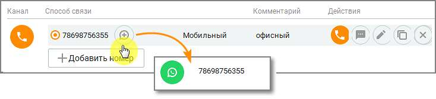

Номера телефонов Позволяет указывать номера телефонов клиента.

| Первый указанный номер становится способом связи по умолчанию для клиента. Чтобы |  |  |
| --- | --- | --- |
|  | выбрать другой элемент в качестве способа связи по умолчанию, используйте переключатель |  |
|  | в первом столбце. Вы можете позвонить по номеру или отправить СМС-сообщение на номер |  |
| клиента, нажав соответствующую кнопку. |  |  |

Чтобы добавить номер телефона, нажмите кнопку Добавить номер. После этого в таблице выше появляется новая строка. По умолчанию выбран тип номера Городской (телефон). Отметьте поле Мобильный, если это мобильный номер телефона. Для добавления второго номера нажмите Добавить номер.

Чтобы редактировать номер, щелкните по кнопке . Внесите необходимые изменения и нажмите вне пределов полей ввода.

Клик по пиктограмме помечает указанный номер телефона, как контактный в WhatsApp.

Чтобы редактировать тип номера (способа связи), выберите нужный номер и дважды щелкните в столбце Тип. Затем выберите нужный тип из списка. Чтобы позвонить по номеру, наведите курсор на строку с номером и нажмите соответствующую кнопку. Кнопка отображается для номеров телефонов любого типа кроме "Факс".

Чтобы удалить номер (способ связи), выберите номер и нажмите кнопку . Электронные адреса Позволяет указывать адреса электронной почты для клиента.

| Первый указанный электронный адрес становится адресом по умолчанию для клиента. |  |  |  |
| --- | --- | --- | --- |
|  | Чтобы выбрать другой адрес по умолчанию, используйте переключатель в первом столбце. |  |  |
|  | Вы можете отправить клиенту сообщение электронной почты, нажав соответствующую |  |  |
|  | ссылку с электронным адресом. При этом используется зарегистрированный в системе по |  |  |
|  | умолчанию почтовый клиент, и в поле "Кому" автоматически подставляется |  |  |
| соответствующий адрес электронной почты. |  |  |  |

Чтобы добавить электронный адрес, нажмите кнопку Добавить адрес. После этого в таблице выше появляется новая строка. Введите электронный адрес в формате «имя@хост.суффикс(ы) домена» (например, petrov@host.org.ru) в отображающееся поле ввода, максимальная длина 64 символа. Если нужно добавить комментарий к электронному адресу, дважды щелкните в соответствующем столбце и укажите его в появившемся поле ввода. Далее нажмите вне пределов полей ввода. После этого электронный адрес добавляется и отображается в списке.

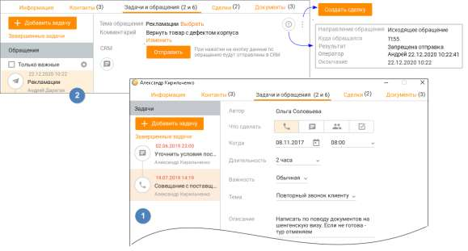

Чтобы редактировать электронный адрес, выберите нужный адрес и нажмите кнопку или дважды щелкните поле ввода в нужном столбце. Внесите необходимые изменения и нажмите вне пределов полей ввода.

Чтобы удалить электронный адрес, выберите адрес и нажмите кнопку . Соц. сети и мессенджеры Позволяет указывать аккаунты пользователя в ВКонтакте, Telegram, Авито, Max, WhatsApp. Чтобы добавить аккаунт, нажмите соответствующую кнопку. После этого в таблицу добавляется новая строка. Введите аккаунт в отображающееся поле ввода. Затем нажмите вне пределов полей ввода. После этого аккаунт добавляется и отображается в списке. Разрешенные символы для ввода номера WhatsApp: цифры от 0 до 9, символ "+".

| Чтобы открыть в браузере профиль контакта в социальных сетях, выберите нужный аккаунт |  |
| --- | --- |
| и нажмите кнопку | . |
| Чтобы редактировать аккаунт, нажмите кнопку |  |
| столбце. Внесите необходимые изменения и нажмите вне пределов полей ввода. |  |
| Чтобы удалить аккаунт, нажмите кнопку |  |

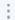

Задачи и обращения Каждый клиент может быть связан: • со множеством задач, сделок и обращений • с одной организацией Вкладка "Задачи и обращения" предназначена для просмотра задач сотрудников, в которых упоминается текущий клиент, его звонковых и текстовых обращений, как находящихся в обработке, так и завершенных.

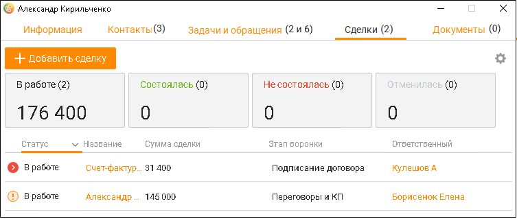

В левой части окна содержится список задач и обращений. 1. ЗАДАЧИ Для каждой задачи в списке указывается следующая информация: • Пиктограмма, соответствующая задаче, • Дата и время выполнения задачи; • Тема задачи (при её наличии); • Имя клиента, связанного с задачей.

При щелчке по записи задачи в правой части окна отображается карточка задачи в режиме просмотра. Клик по кнопке "Завершенные задачи" открывает список завершенных задач. Фильтрация

списка доступна по клику на пиктограмму 2. ОБРАЩЕНИЯ Для каждого обращения в списке указывается следующая информация: • Пиктограмма, соответствующая каналу поступления обращения, • Дата и время поступления обращения; • Тема обращения (при её наличии); • Имя сотрудника, принявшего обращение в обработку.

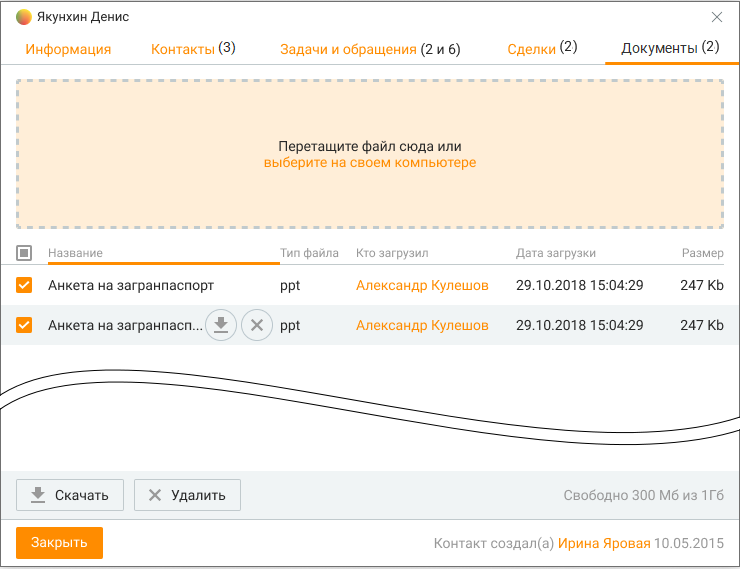

• Комментарий – содержимое поля копируется в буфер обмена кликом на пиктограмму . • Обращения, находящиеся в обработке на данный момент, отмечены как "В работе". Если чекбокс "Только важные" проставлен, в списке обращений выдаются только обращения с указанными настройками важности. Настройки важности задаются кликом по пиктограмме

. При щелчке по записи обращения в правой части окна отображается лента сообщений текущего обращения. Заголовок ленты содержит: • Тема обращения (при её наличии). Доступно редактирование как для завершенного обращения, так и для обращения, находящегося в процессе обработки, по щелчке на кнопке Выбрать; • Результат — значение указывается автоматически при завершении обработки обращения; • Комментарий — комментарий, указанный при завершении обработки обращения. Доступно редактирование; • Оператор — Имя сотрудника, принявшего обращение в обработку; • CRM — об обращении в CRM-систему. Доступна при подключенной интеграции. При просмотре текстовых обращений окно содержит переписку между клиентом и сотрудником, назначенным на обработку обращения. При просмотре текстового обращения, находящегося в обработке, сообщения в обращении обновляются: • при открытии обращения, • каждые 30 секунд, • при написании одним из собеседников ответного сообщения. При просмотре звонкового обращения, находящегося в обработке, пользователю с определенным набором прав и полномочий доступны функции прослушивания, суфлирования и организации конференции в рамках текущего вызова. При просмотре завершенного звонкового обращения при наличии записи разговора в окне отображается панель плеера для прослушивания и скачивания записи. В случае прохождения сотрудником скрипта окно содержит наименование скрипта и кнопку для перехода к просмотру пройденного скрипта.

Клик по пиктограмме открывает кнопку создания сделки. Для получения дополнительной информации о номере обращения, времени поступления и обработки вызова, и др. щелкните

по пиктограмме . Сделки Каждый клиент может быть связан со множеством сделок. Вкладка Сделки предназначена для просмотра сделок сотрудников, в которых упоминается текущий клиент, как со статусом В работе, так и завершенных. А также для просмотра задач по каждой из сделок.

Во вкладке доступны следующие действия: • Просмотр всех сделок клиента, с указанием воронки сделки, этапа сделки и общей суммы сделок по каждому этапу. • Добавление сделки; • Просмотр карточки сделки; • Просмотр карточки сотрудника, ответственного за сделку; • Просмотр и добавление задач, привязанных к сделке;

• Настройка отображения полей таблицы. Документы Вкладка Документы предназначена для просмотра документов, связанных с текущим клиентом. Чтобы прикрепить файл, перетащите его на поле карточки, или выберите на своем компьютере, используя стандартные средства операционной системы. Размер загружаемого файла не должен превышать 100 МБ. Файл должен иметь реквизиты "название-тип", уникальные для этого клиента.

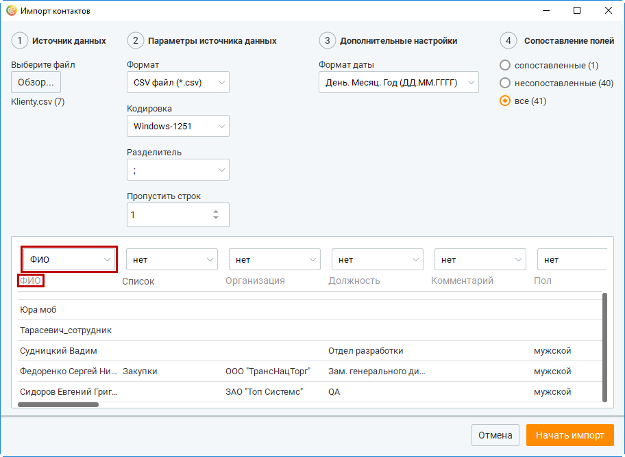

Прикрепленные файлы можно скачать или удалить , предварительно подтвердив свое согласие на удаление. Любой пользователь может работать с документами, кроме случаев, когда одновременно выполняются следующие условия: • у клиента назначен ответственный; • текущий пользователь не является ответственным у клиента; • текущий пользователь не обладает правом "Просматривать персональные контакты". Также пользователю доступно пакетное скачивание/удаление файлов. Кнопки Скачать и Удалить доступны после выбора файлов в списке. После запроса на скачивание откроется стандартное окно проводника Windows с выбором пути для сохранения файлов. 10.1.2. Импорт и экспорт контактов Контакт-центр MANGO OFFICE обеспечивает возможность обмена данными с другими программными продуктами путем импорта (загрузки в нужную адресную книгу) и экспорта (выгрузки из нужной адресной книги) контактных данных. Импорт и экспорт может осуществляться с использованием общей либо личной адресной книги.

| О доступности пользователям функций импорта и экспорта контактов см. Приложение 2 |  |  |
| --- | --- | --- |
| "Роли и права доступа Контакт-центра", подраздел "Контакты". |  |  |
|  | При импорте данных в адресную книгу, первый способ связи (телефон, e-mail) всегда |  |
| указывается в качестве основного. |  |  |

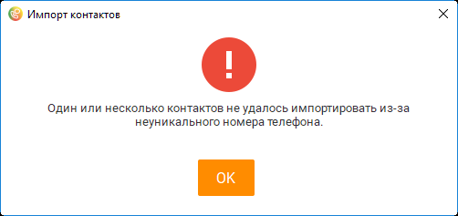

| Если импорт контактных данных выполняется из личной адресной книги, то |
| --- |
| импортированные контакты помечаются как личные. |

в личную адресную книгу проставьте галочку в чекбоксе Ответственный до начала процедуры импорта.

| Если галочка в чекбоксе Ответственный не проставлена, то для импортированных контактов |
| --- |
| пользователь ВАТС проставляется ответственным, если данные в поле "Ответственный" |
| совпадают с ФИО пользователя |

Максимальное количество данных для импорта – 1 000 000 контактов. Как импортировать контакты Чтобы импортировать контакты, нажмите кнопку Импорт в нижней части рабочей области. После этого на экране отображается окно Импорт контактов.

Выберите файл, из которого будут загружаться контактные данные. Нажмите кнопку Обзор... в группе Источник данных. После этого на экране отображается окно Открыть файл для импорта. Выберите нужный файл (с расширением .csv), используя стандартные средства операционной системы, затем нажмите кнопку Открыть. После этого загружается выбранный файл, и его имя отображается в группе Источник данных. В группе Параметры источника данных выберите необходимую кодировку экспортируемых данных из списка Кодировка. После этого (при необходимости) укажите число строк, которые нужно пропустить с начала файла при импорте (это могут быть, например, заголовки столбцов), используя поле ввода с регулятором Пропустить строк.

| По умолчанию пропускается одна строка. Если строки пропускать не нужно, укажите в |
| --- |
| этом поле значение 0. |

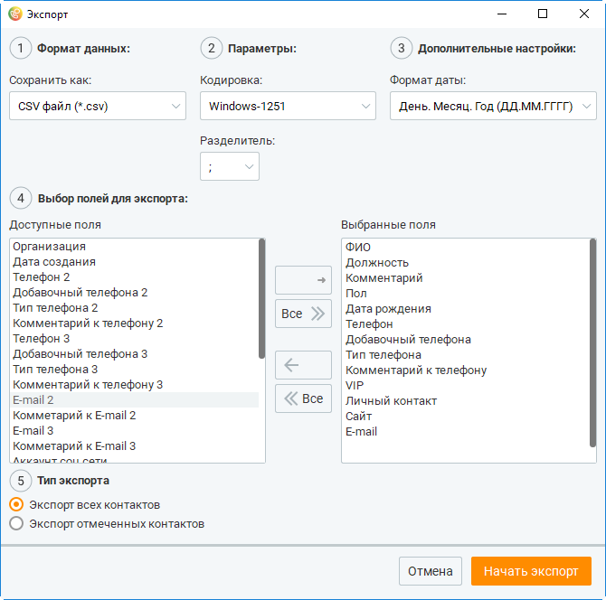

<!-- изображение на стр. 318: байты не извлечены (PyMuPDF недоступен) -->

Затем выберите нужный разделитель между полями данных (точка с запятой, точка либо символ табуляции) из списка Разделитель. После этого (при необходимости) выберите формат даты в группе Дополнительные настройки. Чтобы импорт данных был корректным, нам необходимо сопоставить поля данных в импортируемом файле и доступные поля данных в адресной книге Контакт-центра MANGO OFFICE. Для этого выберите наиболее соответствующее поле данных из списка, находящегося над каждым столбцом таблицы, которая отображается в нижней части окна Импорт контактов. Например, для имени, фамилии и отчества наиболее подходит поле ФИО. Пропущенные строки (строки, которые не будут импортированы) выделяются цветом.

<!-- изображение на стр. 318: байты не извлечены (PyMuPDF недоступен) -->

Поля ФИО и Телефон являются обязательными для сопоставления.

<!-- изображение на стр. 318: байты не извлечены (PyMuPDF недоступен) -->

| Для удобства в процессе сопоставления полей вы можете выбирать, какие поля данных |  |  |
| --- | --- | --- |
|  | будут отображаться в окне Импорт контактов, используя переключатель в группе |  |
|  | Сопоставление полей |  |
|  | — все (по умолчанию) — отображаются все поля; |  |
|  | — сопоставленные — отображаются только поля, для которых уже указано соответствие; |  |
|  | — не сопоставленные — отображаются только поля, для которых еще не указано |  |
| соответствие. |  |  |

<!-- изображение на стр. 318: байты не извлечены (PyMuPDF недоступен) -->

При импорте данных из файла-источника следует соблюдать корректный размер импортируемых значений: • ФИО — текст, максимальное количество символов – 50; • Должность — текст, максимальное количество символов – 50; • Организация — текст, максимальное количество символов – 128; • Список — текст, максимальное количество символов – 40; • Сайт — текст, максимальное количество символов – 40;

<!-- изображение на стр. 319: байты не извлечены (PyMuPDF недоступен) -->

• Комментарий — текст, максимальное количество символов – 255; • Комментарий к номеру телефона или E-mail — текст, максимальное количество символов – 255. Когда вы определили соответствие полей в источнике и целевой адресной книге, нажмите кнопку Начать импорт. После этого начинается импорт контактов в целевую адресную книгу. При импорте контакта, телефон которого полностью совпадает с существующим в целевой адресной книге, на экране отображается окно с соответствующим предупреждающим сообщением.

<!-- изображение на стр. 319: байты не извлечены (PyMuPDF недоступен) -->

Как экспортировать контакты Чтобы экспортировать контакты, выберите подлежащие выгрузке контакты в рабочей области.

| Для выбора всех контактов установите флажок в заголовке соответствующего столбца. |  |  |
| --- | --- | --- |
|  | Для импорта контактов только из личной адресной книги установите флажок в чекбоксе |  |
| Ответственный. |  |  |

<!-- изображение на стр. 319: байты не извлечены (PyMuPDF недоступен) -->

Затем нажмите кнопку Экспорт на панели массовых действий. После этого на экране отображается окно Экспорт контактов. Выберите необходимую кодировку экспортируемых данных из списка Кодировка в группе Параметры. Затем выберите нужный разделитель между полями данных (точка с запятой, точка либо символ табуляции) из списка Разделитель в группе Параметры. После этого (при необходимости) выберите формат даты в группе Дополнительные настройки. Теперь выберите подлежащие экспорту поля данных. При необходимости выбирайте поля в соответствии с очередностью, нужной для целевого приложения. Для выбора поля данных дважды щелкните по нужному полю в списке Доступные поля либо воспользуйтесь соответствующими кнопками. После этого поле перемещается в список Выбранные поля.

<!-- изображение на стр. 320: байты не извлечены (PyMuPDF недоступен) -->

<!-- изображение на стр. 320: байты не извлечены (PyMuPDF недоступен) -->

| Чтобы отменить выбор поля, дважды щелкните по нему еще раз. После этого оно |  |  |
| --- | --- | --- |
|  | возвращается в список Доступные поля. Чтобы перенести все поля из одного списка в |  |
| другой, нажмите кнопку с угловой стрелкой в исходном списке. |  |  |

<!-- изображение на стр. 320: байты не извлечены (PyMuPDF недоступен) -->

После этого при необходимости выберите тип экспорта, используя соответствующий переключатель. Значение переключателя Экспорт отмеченных контактов доступно, если перед экспортом вы отметили флажком хотя бы один контакт. При выборе значения переключателя Экспорт всех контактов (по умолчанию) будут экспортированы все контакты в адресной книге. Когда вы завершите выбор подлежащих экспорту полей и типа экспорта, нажмите кнопку Начать экспорт. В появившемся окне Экспортировать в файл выберите имя и путь сохранения файла и нажмите кнопку Сохранить. После этого сохраняются выбранные для экспорта данные в файл с расширением .csv.
