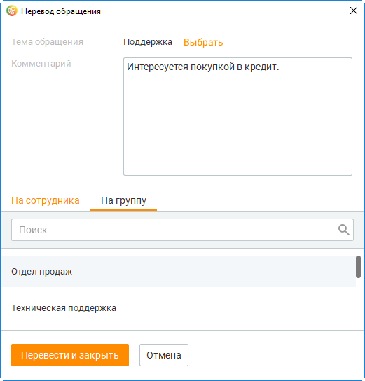
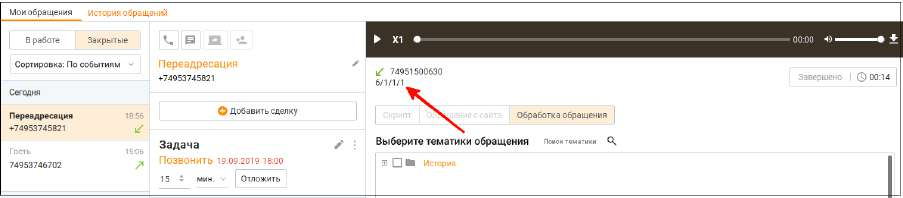
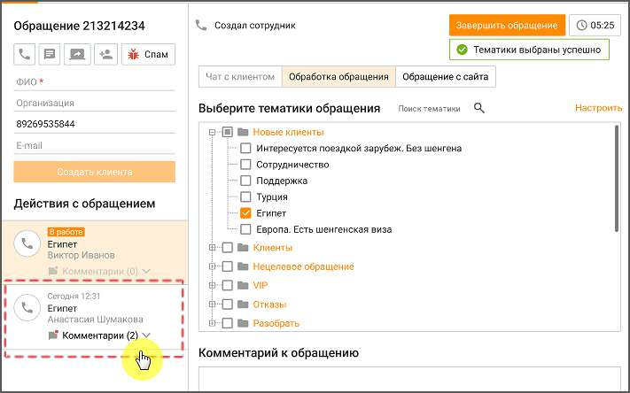

# 4.3.3. Перевод обращений

> Трассировка: PDF §4.3.3 · сквозные стр. 154-156 · источники: ч.1 `kb/sources/mango-cc-manual/CC_manual_1.26.23_compressed.pdf` с.154-156.

| Для перевода обращения на другого сотрудника либо группу нажмите пиктограмму |
| --- |
| "Перевести". |
| Кнопка доступна пользователю, на которого назначено обращение, а также пользователям, у |
| которых имеются подконтрольные группы. |

Текстовое обращение нельзя перевести на сотрудника с ролью "Робот". В результате на экране отобразится форма перевода обращения, позволяющая: • изменить тему обращения – кнопкой Выбрать; • выбрать сотрудника либо группу, на которого будет переведено обращение; • ввести поясняющий комментарий. Комментарий не является обязательным. Если в обращении имеется комментарий, в списке обращений оно будет отмечено пиктограммой

.

Для перевода части обращения нажмите кнопку и выберите пункт меню Перевести часть обращения. Также перевод можно осуществить кликом правой кнопкой мыши по сообщению и в открывшемся контекстном меню выбрать сообщения для перевода. Далее установите флаги напротив сообщений, которые будут переведены, и нажмите Перевести. Для завершения перевода сообщения нажмите Перевести и закрыть. В результате в рамках текущего сотрудника данное обращение будет закрыто и создано новое обращение, назначенное на указанного сотрудника либо группу. Перевод вызова После перевода вызова на другого сотрудника на экране отображается окно завершения обработки обращения. При включенной настройке Закрывать звонковое обращение после окончания разговора через ... секунд окно завершения не отображается. Полный путь переадресации закрытых обращений отображается в окне обращения:

Сотрудник, на которого переводят звонок, может видеть обращение с тематиками и комментариями сотрудника, от которого поступил перевод, пока звонок ещё не завершился.

<!-- изображение на стр. 156: байты не извлечены (PyMuPDF недоступен) -->

Перевод e-mail-обращения При переводе e-mail-обращения вся цепочка переписки (с вложениями) из исходного обращения доступна для просмотра в новом обращении, созданном после закрытия исходного.
