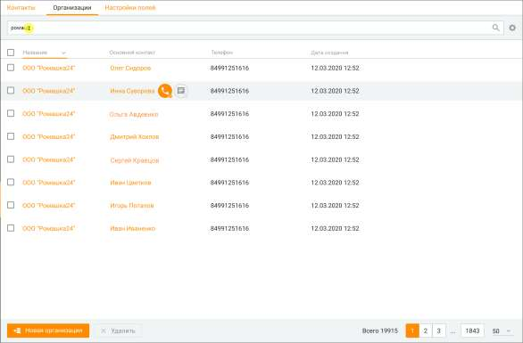
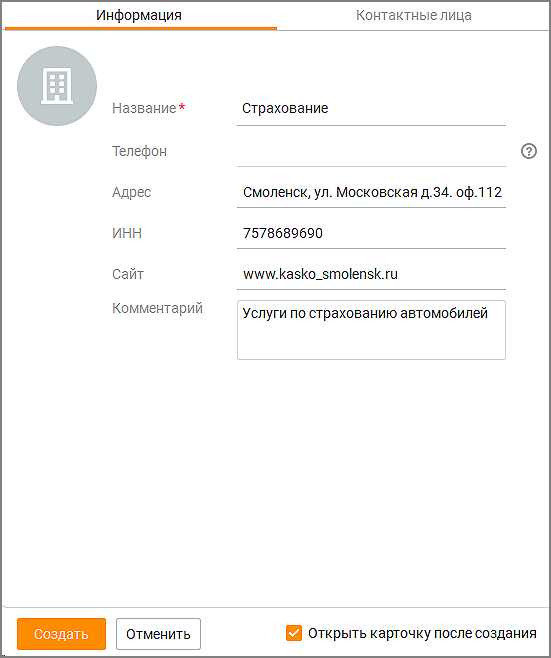
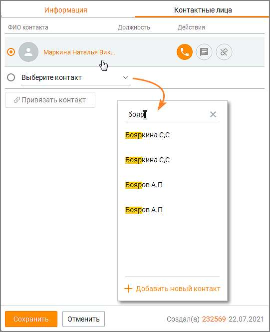

# 10.2. Организации

> Трассировка: PDF §10.2 · сквозные стр. 320-325 · источники: ч.1 `kb/sources/mango-cc-manual/CC_manual_1.26.28.1.pdf` с.320-325.

| Вкладка для просмотра Организаций доступна, если пользователь обладает правом |
| --- |
| "Просматривать контакты" или правом "Просматривать персональные контакты". |

Пользователь может открыть карточку организации из: • списка организаций на вкладке Клиенты/Организации; • списка клиентов на вкладке Клиенты/Контакты; • карточки клиента; • карточки задачи.

Клик по наименованию организации открывает карточку организации. Клик по основному контакту открывает карточку клиента. Чтобы поддерживать в актуальном состоянии список контактных лиц организации, список обновляется при каждом просмотре карточки контакта, привязанного к текущей организации, удаления связи с контактом или привязки нового контакта. Вкладка содержит: Поле поиска - для поиска по организациям необходимо ввести как-минимум один символ и нажать "ввод". Если оставить поле пустым, поиск выдаст полный список имеющихся организаций. Поиск по организациям осуществляется по следующим полям: Название организации, Адрес, ИНН, Сайт, Комментарий, ID организации, ФИО основного привязанного контакта. Список организаций - В списке по умолчанию отображаются следующие колонки: Название, Телефон, Адрес, ИНН, Сайт, Основной контакт, Дата создания карточки организации, Автор. Вы можете самостоятельно выбрать, какие столбцы будут отображаться на панели. Для этого

щелкните левой кнопкой мыши по пиктограмме и установите/снимите флаги напротив наименований столбцов. Кнопка Новая организация – создание новой организации. Кнопка Удалить – удаление организации.

| На данный раздел распространяется возможность скрытия номера клиента. Узнать больше |  |  |
| --- | --- | --- |
|  | здесь. |  |

10.2.1. Создание, редактирование и удаление организаций

| Пользователь может создавать, редактировать организацию или связывать организацию с |
| --- |
| контактом, если он обладает правом "Создавать и редактировать контакты". |

Создание новой организации возможно: • из вкладки Организации кликом по кнопке Новая организация; • из карточки контакта, при заполнении или редактировании поля "Организация". Для создания новой организации кликните по кнопке Новая организация и заполните данные создаваемой организации на вкладке Информация.

Название — поле является обязательным для заполнения. При вводе текста в поле предлагается выбор из выпадающего списка организаций, в название которых входит (в любой части названия) введенный текст; Телефон — поле недоступно для заполнения пользователем. Заполняется данными основного контакта автоматически после привязки контакта на вкладке Контактные лица; Адрес — адрес организации; ИНН — ИНН организации; Сайт — веб-сайт организации; Комментарий — комментарий пользователя; Чекбокс Открыть карточку после создания – если чекбокс проставлен, после клика по кнопке "Создать" карточка организации откроется в режиме просмотра и редактирования. Сохраните внесенные изменения кликом по кнопке Создать. Клик по кнопке Отменить отменяет внесенные изменения.

| Привязка контакта на вкладке Контактные лица при создании новой организации |  |  |
| --- | --- | --- |
|  | невозможна. Следует сначала создать новую организацию, далее открыть карточку |  |
| организации в режиме редактирования. |  |  |

Вкладка Контактные лица содержит: • Кнопку Привязать контакт – при вводе текста в поле предлагается выбор из выпадающего списка контактов , в ФИО которых входит (в любой части ФИО) введенный текст. Одна организация может быть привязана к множеству контактов. Личные контакты других сотрудников в выпадающем списке не отображаются.

Список привязанных контактов – пиктограммой обозначается основной контакт организации. Телефон основного контакта автоматически отображается на вкладке Информация. Клик по ФИО контакта открывает карточку контакта в режиме просмотра и редактирования.

Клик по кнопке "Добавить новый контакт" открывает карточку создания нового контакта. При этом пользователь должен обладать правом "Создавать и редактировать контакты".

Действия с привязанным контактом: – позвонить, – написать сообщение, – отвязать контакт от организации. Установить и удалить связь организации и контакта также можно из карточки контакта.

| Автора (если есть) и дату создания организации – размещается в нижнем правом углу |
| --- |
| карточки организации. Если автор не удален из Контакт-центра, при клике на автора |
| открывается карточка сотрудника, создавшего организацию. |

• Сохранить – клик по кнопке сохраняет внесенные изменения. • Отменить – клик по кнопке отменяет внесенные изменения.

<!-- изображение на стр. 325: байты не извлечены (PyMuPDF недоступен) -->

Пользователь может удалить организацию, если обладает правом "Удалять контакты". Для удаления организации отметьте в списке на вкладке "Организации" требуемые

|  | После подтверждения согласия на удаление |
| --- | --- |
| организация безвозвратно удаляется из адресной книги. При этом все открытые карточки |  |
| организаций закрываются. |  |
