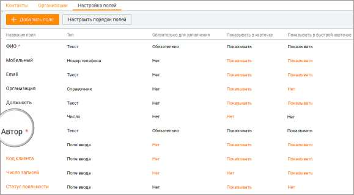

# 10.3. Настройка полей

> Трассировка: PDF §10.3 · сквозные стр. 325-326 · источники: ч.1 `kb/sources/mango-cc-manual/CC_manual_1.26.28.1.pdf` с.325-326.

Кнопка Добавить поле предназначена для добавления пользовательских полей в Контакты. Кнопка Настроить порядок полей позволяет настроить порядок, в котором пользовательские поля будут отображаться в карточке клиента и быстрой карточке в разделе "Мои обращения". По умолчанию отображаются только поля, помеченные как "Обязательно для заполнения".

Поля отмеченные символом *, являются обязательными к заполнению. Если это поле отображается в карточке и быстрой карточке контакта, то оно также отмечено символом * (звездочка). Поля и их настройки, выделенные в таблице черным цветом, недоступны для редактирования. Оранжевый цвет означает возможность редактирования значения. Полю, которое является обязательным для заполнения в карточке клиента или быстрой карточке клиента, невозможно установить статус "Не показывать". Настроенные пользователем поля попадают в: ▪ карточку клиента (зависит от настройки Показывать/Нет); ▪ быструю карточку клиента в разделе "Моих обращения" (зависит от настройки Показывать/Нет); ▪ форму импорта/экспорта в адресной книге; ▪ поле поиска по клиентам – становится доступен поиск по содержимому полей. В списке клиентов на вкладке Контакты пользовательские поля не показываются по

умолчанию. Для их отображения щелкните левой кнопкой мыши по пиктограмме и установите/снимите флаги напротив наименований столбцов. Добавление поля в Контакты (адресную книгу) Для добавления пользовательского поля следует кликнуть по кнопке Добавить поле. Откроется выпадающий список с вариантами типов поля. Доступны следующие типы пользовательских полей: Поле ввода – от 1 до 255 символов, текст. Если необходимо больше символов, используйте поле «Текстовая область». Выпадающий список – количество значений от 1 до 300. Возможно два варианта списка: с единственным или множественным выбором; Адрес – поиск указанного адреса в Google-картах; Число – используется только для ввода целых чисел; Денежный формат – не более 14 знаков, после запятой не более 2 знаков. То есть 999999999999.99 максимально возможное значение; Дата – ввод данных в формате: ДД.ММ.ГГГГ; Флаг – содержит одно из двух значений: Да/Нет, Истина/Ложь или Вкл/Выкл. Ссылка – хранение ссылок на URL-адреса; Текстовая область – от 1 до 1000 символов; Пользователь – список значений, отображающий всех пользователей ВАТС.

| Созданные пользовательские поля применяются для старых и новых сделок всех статусов, |
| --- |
| во всех воронках. |

